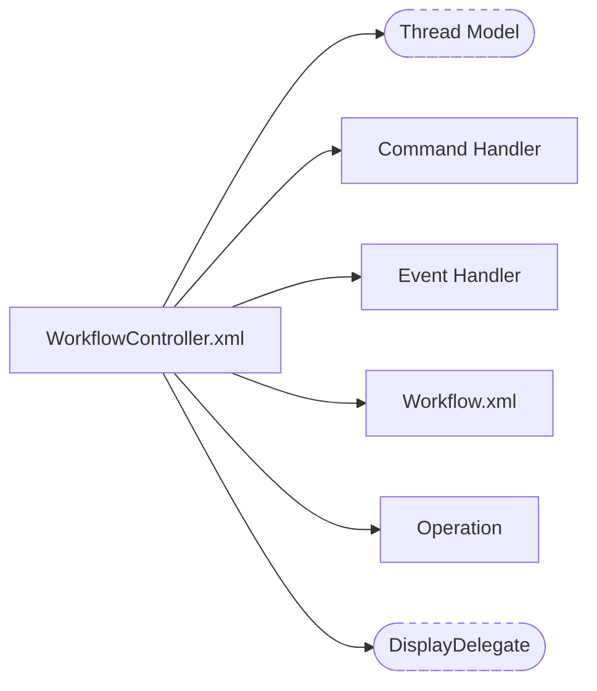
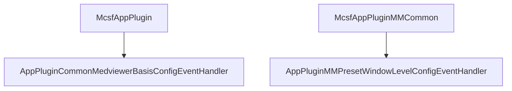
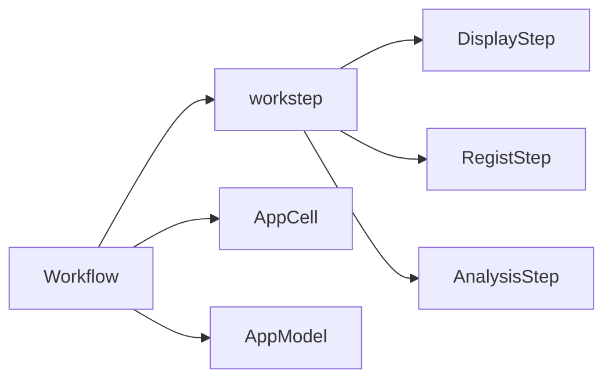
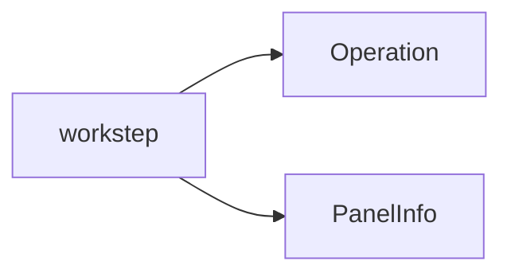

# BE

## 层级


## WorkflowController.xml



### CommandHandler

```xml
  <AppCmdHandler ID="10002">AppPluginCommonCellOperationCmdHandler</AppCmdHandler>
  <AppCmdHandler ID="10003">AppPluginCommonCmdHandlerLoadSeries</AppCmdHandler>
  <AppCmdHandler ID="10004">AppPluginCommonCtrollerOperationCmdHandler</AppCmdHandler>
  <AppCmdHandler ID="12008">AppPluginCommonPanelOperationCmdHandler</AppCmdHandler>
  <AppCmdHandler ID="15107">AppPluginCommonCmdHandlerLoadSeries</AppCmdHandler>
  <AppCmdHandler ID="1416">AppPluginCommonCmdHandlerLoadSeries</AppCmdHandler>
```


### EventHandler

```xml
  <!-- Event handler -->
  <AppEventHandler ChannelID="11"  EventID="20005">AppPluginCommonMedviewerBasisConfigEventHandler</AppEventHandler>
  <AppEventHandler ChannelID="11"  EventID="20007">AppPluginMMPresetWindowLevelConfigEventHandler</AppEventHandler>
  
  <!-- Leave and Enter App Event handler -->
  <AppEventHandler ChannelID="9"   EventID="151001">BrainAnalysisEnterAppEventHandler</AppEventHandler>
  <AppEventHandler ChannelID="9"   EventID="151002">AppPluginCommonLeaveAppEventHandler</AppEventHandler>
```





### Operation


## Workflow



### AppModel

应用后端的数据模型


### AppCell

相当于应用后端的`view`

脑分析将AppCell统一放在`LayoutList.xml`中


### workstep




### 总结

后端框架实际上可以视为采用了MVC模式

**M** (`AppModel`)

**V** (`AppCell`)  `MedViewer`

**C** (`workstep`)


## Diagram


## 线程模型


线程1和线程2，红色方框内的部分，两个线程之间是加锁的；

线程2 在`AppResult Merge`的时候和线程3 `DisplayDelegateInvoke`时，两个线程是加锁的。