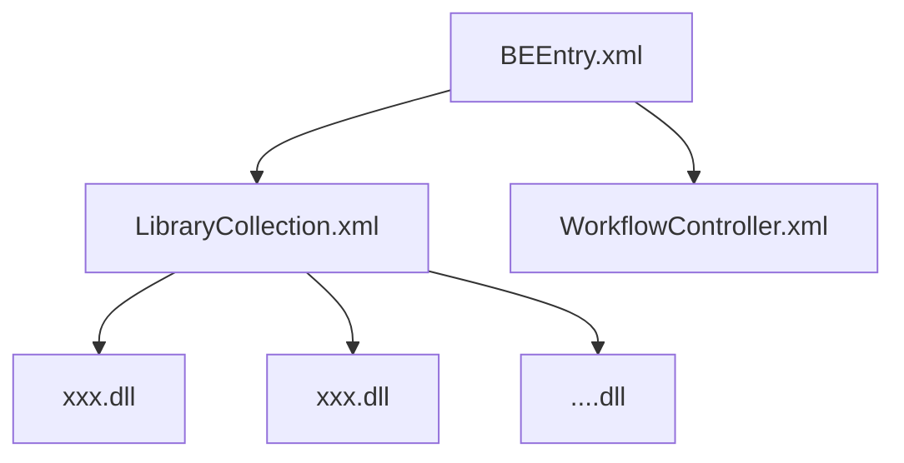

# BE

## 层级

```mermaid
graph TD;
BEEntry[BEEntry.xml]
-->LC[LibraryCollection.xml];
BEEntry[BEEntry.xml]-->WFX[WorkflowController.xml];
LC-->Lib1[xxx.dll];
LC-->Lib2[xxx.dll];
LC-->Lib3[....dll];
```

