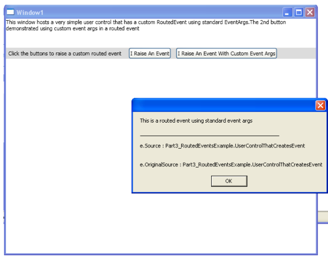

---

WPF: A Beginner's Guide - Part 1，2,3,4,5 of n

---

written by **Sacha Barber**, typeset by **Li Zhe**.


About the Author

[Sacha Barber](http://www.codeproject.com/Members/Sacha-Barber)

 

Software Developer (Senior)

United Kingdom


I currently hold the following qualifications (amongst others, I also studied Music Technology and Electronics, for my sins) 

\- MSc (Passed with distinctions), in Information Technology for E-Commerce 
\- BSc Hons (1st class) in Computer Science & Artificial Intelligence 

Both of these at Sussex University UK. 


**Award(s)**

I am lucky enough to have won a few awards for Zany Crazy code articles over the years

*   Microsoft C# MVP 2015
*   Codeproject MVP 2015
*   Microsoft C# MVP 2014
*   Codeproject MVP 2014
*   Microsoft C# MVP 2013
*   Codeproject MVP 2013
*   Microsoft C# MVP 2012
*   Codeproject MVP 2012
*   Microsoft C# MVP 2011
*   Codeproject MVP 2011
*   Microsoft C# MVP 2010
*   Codeproject MVP 2010
*   Microsoft C# MVP 2009
*   Codeproject MVP 2009
*   Microsoft C# MVP 2008
*   Codeproject MVP 2008
*   And numerous codeproject awards which you can see over at my blog

# WPF: A Beginner's Guide - Part 1 of n

From:

[http://www.codeproject.com/Articles/22980/WPF-A-Beginner-s-Guide-Part-of-n](http://www.codeproject.com/Articles/22980/WPF-A-Beginner-s-Guide-Part-of-n)

*   [Download demo project (C#) - 120 KB](http://www.codeproject.com/KB/WPF/BeginWPF1/WPF_Tour_Beginners_Layout.zip)
*   [Download demo project (VB.NET) - 47 KB](http://www.codeproject.com/KB/WPF/BeginWPF1/WPF_Tour_Beginners_Layout_VB.zip)

## Introduction

Some of you may have come across some of my other articles that I have published here on The Code Project. And if you have, you may have noticed that I have been writing a few on WPF/LINQ/Silverlight/WCF of late. Generally, I try and have fun when I write my articles, and I try to make them interesting for myself; now sometimes, that means that they end up being quite complex, which I like.

However, I remember not so long ago, I had published what I deemed to be an intermediate level WPF article, which due to The Code Project upgrade, got classified as beginner. It was never intended to be a beginner's article, so it got some stick from some folk, for being too complicated and not beginner-esque.

Now, I don't mind getting stick, but this time, it was due to an upgrade problem, not something I had done. It did, however, get me thinking about what one of the forum entries stated: "Where are all the beginner's articles on WPF?"

So I thought about this, and did a search here on The Code Project, and found that generally, WPF writers on The Code Project (me included) are pretty much showing off. Now, don't get me wrong, this is a good thing; I can't tell you how much I've learnt from some of the more showy-offy type articles. But I also thought that there wasn't that much here for beginners with not much time on their hands... so I thought, yeah, perhaps a beginner's series in WPF would be nice. I know Josh Smith did a bang up job with his series [A Guided Tour of WPF](http://www.codeproject.com/KB/WPF/GuidedTourWPF_1.aspx), which I personally recommend you all read if you haven't already.

And there are always books, but I've got three books on WPF and they all have differing information. So I thought, OK, maybe this beginner's series may not be so bad after all. I decided to give it a crack. I don't know how many articles I'll end up doing for this series, but it will probably be something like:

*   Layout (this article)
*   [XAML vs. Code / Markup Extensions and Resources (next article)](http://www.codeproject.com/KB/WPF/BeginWPF2.aspx)
*   [Commands and Events](http://www.codeproject.com/KB/WPF/BeginWPF3.aspx)
*   [Dependency Properties](http://www.codeproject.com/KB/WPF/BeginWPF4.aspx)
*   DataBinding
*   Styles/Templates

Like I say, I think Josh did an excellent job covering a lot of this, but why then did I buy three WPF books, was one not enough? Sometimes, it's just nice to have a different point of view. For example, Josh is a WPF master (a condor if you like... or some equally majestic bird... huge black out in the sun, wing spanned bird), and I am a fledging chick just learning to fly (with tiny little wings) in the WPF world. So I figure it may do some people some good, to hear things from a slightly different angle (A.K.A. crazy fledging chick).

I will, of course, be covering some stuff that you could lift straight out of a book, but I hope there will also be some new stuff that I have picked up whilst taking my own WPF journey.

As this series will be quite a commitment, all I ask is that if you find this article useful, please leave a comment at the bottom and a vote, so I know whether it's worth doing the rest of the series. You know there are 100s of other articles in my reserve (I have a big list), where I could go mad, but I feel that this may be a useful series (basically, tell me in the article's forum that you want more of this), and if that is the case, I will be more than happy to commit myself to making this series as enjoyable as I can.

So without further ado, I guess we should start looking into what we need to get to grips within this article. As it is the first article in this (proposed, if people want more of this) series, it really has to start with layout.

## Layout

Layout is one of the most important parts of any WPF project; the following sub sections will introduce you to the new layout options at your disposal.

## The Importance of Layout

The way I see it, WPF can be used in one of two ways, it can be used in a browser (partial trust) - these are known as XBap, or a full blown application, basically an executable (_*.exe_). Whatever format is chosen is not important for this article's content, as layout is equally important to both formats.

What I mean is that layout is a fundamental building block used when writing any WPF, no matter whether it's an XBap or an application. Using the layout controls in WPF allows developers/designers to create very complex arrangements of pages/controls. Without layout, we probably couldn't achieve anything, apart from a mess. So if you are looking for a mess, just quit reading right here. If, however, you want to know how to use the new layout options in WPF, read on.

## What's New in WPF

If you are a Web developer, probably most (but not all) of what this article is going to cover will be new to you. If you are a WinForms developer, you have undoubtedly come across Panel classes before, and maybe even used some of the more sophisticated Panel sub classes, such as FlowLayoutPanel and TableLayoutPanel. You should also be familiar with WinForms properties such as Anchor and Dock. Sounds familiar? Well, the truth is that some of this knowledge will still be useful, but you will still have to do some learning. For you Web guys, the good news is that the XAML syntax is fairly similar to XHTML, so you shouldn't have any trouble picking up this new way of creating UIs either.

Within WPF (at least the current version), Microsoft has provided a few Layout controls for developers/designers to use, most of which will be new ground to most of you, I imagine. These new layout controls will be the main focus of this article. You are, of course, free to author your own layout controls, if one of the pre-built controls doesn't suit your needs. We will see more on this later.

For the purpose of this article, we will be looking at the following:

*   Canvas
*   StackPanel
*   WrapPanel
*   DockPanel
*   Grid

Please note that I will only be covering the basics of these controls; there are many more resources available for being clever with these controls, should you wish to research that. I however, consider the more advanced usages of these controls to be outside the scope of this article. Remember it's a beginner's series, so I want to keep it at a beginner's level.

## A Brief Detour into the Importance of Margin

One thing that you simply must know, is how important the Margin property is. By using the Margin, we are able to specify how much space the current control (the one we are specifying the Margin property for) wants to have around it. WPF provides a ValueConverter that accepts a string of the format 5,5,5,5, but what does this mean? Well, it's basically saying that we want a Margin of 5 pixels all around the control that is declaring this property. The Margin string is stating Left, Top, Right, Bottom, and is one of three overloaded constructors used by the strangely named Thickness class that is used in the case where we are trying to set the Margin in code-behind.

## Canvas

The Canvas control is one of the easier layout controls to use. It is a simple X/Y position container, where each of the contained (children) controls must specify the following four properties in order to be positioned within the parent Canvas control:

*   Canvas.Left
*   Canvas.Right
*   Canvas.Top
*   Canvas.Bottom

With these four properties in place, the control will be positioned using these values within the parent Canvas control. These properties probably look a little bit odd, where we have a Canvas.Left for example; well, they are a bit odd actually. These are not the normal properties that you used in .NET 2.0 land. These are Dependency/Attached Properties, which I am not going to go into right now, as they will be the subject of a further article in this series.

What else do we need to know about a Canvas control and its children? Well, actually that's almost it; the only other thing to consider is that if the Canvas control is a simple X/Y position container, what's to stop two child controls, overlapping, and which child control should be on top? Well, that's all taken care of by another Dependency/Attached Property of the Canvas control. This is called the Canvas.ZIndex property, and this indicates which control should be on top. Basically, the higher the Canvas.ZIndex value is, the more on top the control that declares this Dependency/Attached Property will be. If no Canvas.ZIndex is declared for any of the child controls, Canvas.ZIndex will be set to the order in which the children are added to the Canvas control.

Let's see an example of this, shall we? The following picture shows a Canvas control with two children, one on top of the other. This is taken from the file called _CanvasDEMO.xaml_ in the attached demo project.


So how does this look in code? Well, in XAML, it is as follows:


```xaml
<Window
    xmlns="http://schemas.microsoft.com/winfx/2006/xaml/presentation"
    xmlns:x="http://schemas.microsoft.com/winfx/2006/xaml"
    x:Class="WPF\_Tour\_Beginners_Layout.CanvasDEMO"
    x:Name="Window"
    Title="CanvasDEMO"
    Width="640" Height="480">
        <Canvas Margin="0,0,0,0" Background="White">
            <Rectangle Fill="Blue"
                Stroke="Blue"
                Width="145"
                Height="126"
                Canvas.Left="124" Canvas.Top="122"/>
            <Ellipse Fill="Green"
                Stroke="Green"
                Width="121" Height="100"
                Panel.ZIndex="1"
                Canvas.Left="195" Canvas.Top="191"/>
        </Canvas>
</Window>
```


And in C#, it would be as follows:

```C#
    Canvas canv = new Canvas();
    //add the Canvas as sole child of Window
    this.Content = canv;
    canv.Margin = new Thickness(0, 0, 0, 0);
    canv.Background = new SolidColorBrush(Colors.White);
    
	//The Rectangle
    Rectangle r = new Rectangle();
    r.Fill = new SolidColorBrush(Colors.Blue);
    r.Stroke = new SolidColorBrush(Colors.Blue);
    r.Width = 145;
    r.Height = 126;
    r.SetValue(Canvas.LeftProperty, (double)124);
    r.SetValue(Canvas.TopProperty, (double)122);
    canv.Children.Add(r);
    
	//The Ellipse
    Ellipse el = new Ellipse();
    el.Fill = new SolidColorBrush(Colors.Green);
    el.Stroke = new SolidColorBrush(Colors.Green);
    el.Width = 121;
    el.Height = 100;
    el.SetValue(Canvas.ZIndexProperty, 1);
    el.SetValue(Canvas.LeftProperty, (double)195);
    el.SetValue(Canvas.TopProperty, (double)191);
    canv.Children.Add(el);
```


Whilst in VB.NET, this would be:

```vb
    Dim canv As New Canvas()
    'add the Canvas as sole child of Window
    Me.Content = canv
    canv.Margin = New Thickness(0, 0, 0, 0)
    canv.Background = New SolidColorBrush(Colors.White)
    
		'The Rectangle
    Dim r As New Rectangle()
    r.Fill = New SolidColorBrush(Colors.Blue)
    r.Stroke = New SolidColorBrush(Colors.Blue)
    r.Width = 145
    r.Height = 126
    r.SetValue(Canvas.LeftProperty, CDbl(124))
    r.SetValue(Canvas.TopProperty, CDbl(122))
    canv.Children.Add(r)
    
		'The Ellipse
    Dim el As New Ellipse()
    el.Fill = New SolidColorBrush(Colors.Green)
    el.Stroke = New SolidColorBrush(Colors.Green)
    el.Width = 121
    el.Height = 100
    el.SetValue(Canvas.ZIndexProperty, 1)
    el.SetValue(Canvas.LeftProperty, CDbl(195))
    el.SetValue(Canvas.TopProperty, CDbl(191))
    canv.Children.Add(el)
```

And that's about all there is to the basic Canvas layout.


## StackPanel

The StackPanel control is also very easy to use. It simply stacks its contents, vertically or horizontally, using a single property called Orientation.

Let's see an example of this, shall we? The following picture shows a StackPanel control with two children, one on top of the other. This is taken from the file called _StackPanelDEMO.xaml_ in the attached demo project.


So how does this look in code? Well in XAML, it is as follows:

```xaml
<Window
    xmlns="http://schemas.microsoft.com/winfx/2006/xaml/presentation"   
    xmlns:x="http://schemas.microsoft.com/winfx/2006/xaml" 
    x:Class="WPF\_Tour\_Beginners_Layout.StackPanelDEMO"
    x:Name="Window"
    Title="StackPanelDEMO"
    WindowStartupLocation="CenterScreen"
    Width="640" Height="480">
      <StackPanel Margin="0,0,0,0"
            Background="White" Orientation="Vertical">
        <Button Content="Im Top of Stack"/>
        <Button Content="Im Bottom Of Stack"/>
     </StackPanel>
</Window>
```


And in C#, this would be as follows:

```c#
    StackPanel sp = new StackPanel();
    //add the StackPanel as sole child of Window
    this.Content = sp;
    sp.Margin = new Thickness(0, 0, 0, 0);
    sp.Background = new SolidColorBrush(Colors.White);
    sp.Orientation = Orientation.Vertical;
    
		//Button1
    Button b1 = new Button();
    b1.Content = "Im Top of Stack";
    sp.Children.Add(b1);
    
		//Button2
    Button b2 = new Button();
    b2.Content = "Im Bottom of Stack";
    sp.Children.Add(b2);
```


Whilst in VB.NET, this would be:

```vb
    Dim sp As New StackPanel()
    'add the StackPanel as sole child of Window
    Me.Content = sp
    sp.Margin = New Thickness(0, 0, 0, 0)
    sp.Background = New SolidColorBrush(Colors.White)
    sp.Orientation = Orientation.Vertical
    
		'Button1
    Dim b1 As New Button()
    b1.Content = "Im Top of Stack"
    sp.Children.Add(b1)
    
		'Button2
    Dim b2 As New Button()
    b2.Content = "Im Bottom of Stack"
    sp.Children.Add(b2)
```

And that's about all there is to the basic StackPanel layout.


## WrapPanel

The WrapPanel control, again, is very easy to use (are you seeing a pattern here? Layout is fairly OK in WPF); it simply wraps its contents.

Let's see an example of this, shall we? The following picture shows a WrapPanel control with 10 children. This is taken from the file called _WrapPanelDEMO.xaml_ in the attached demo project.


So how does this look in code? Well in XAML, it is as follows:


```xaml
<Window
    xmlns="http://schemas.microsoft.com/winfx/2006/xaml/presentation"
    xmlns:x="http://schemas.microsoft.com/winfx/2006/xaml"
    x:Class="WPF\_Tour\_Beginners_Layout.WrapPanelDEMO"
    x:Name="Window"
    Title="WrapPanelDEMO"
    WindowStartupLocation="CenterScreen"
    Width="640" Height="480">
        <WrapPanel Margin="0,0,0,0" Background="White">
            <Rectangle Margin="10,10,10,10"
              Fill ="Blue" Width="60" Height="60"/>
            <Rectangle Margin="10,10,10,10"
              Fill ="Blue" Width="60" Height="60"/>
            <Rectangle Margin="10,10,10,10"
              Fill ="Blue" Width="60" Height="60"/>
            <Rectangle Margin="10,10,10,10"
              Fill ="Blue" Width="60" Height="60"/>
            <Rectangle Margin="10,10,10,10"
              Fill ="Blue" Width="60" Height="60"/>
            <Rectangle Margin="10,10,10,10"
              Fill ="Blue" Width="60" Height="60"/>
            <Rectangle Margin="10,10,10,10"
              Fill ="Blue" Width="60" Height="60"/>
            <Rectangle Margin="10,10,10,10"
              Fill ="Blue" Width="60" Height="60"/>
            <Rectangle Margin="10,10,10,10"
              Fill ="Blue" Width="60" Height="60"/>
            <Rectangle Margin="10,10,10,10"
              Fill ="Blue" Width="60" Height="60"/>
            <Rectangle Margin="10,10,10,10"
              Fill ="Blue" Width="60" Height="60"/>
    </WrapPanel>
</Window>
```


And in C#, this would be as follows:
```C#
    WrapPanel wp = new WrapPanel();
    //add the WrapPanel as sole child of Window
    this.Content = wp;
    wp.Margin = new Thickness(0, 0, 0, 0);
    wp.Background = new SolidColorBrush(Colors.White);
    
	//Add Rectangles
    Rectangle r;
    for (int i = 0; i <= 10; i++)
    {
        r = new Rectangle();   
        r.Fill = new SolidColorBrush(Colors.Blue);
        r.Margin = new Thickness(10, 10, 10, 10);
        r.Width = 60;
        r.Height = 60;
        wp.Children.Add(r);
    }
```


Whilst in VB.NET, this would be:

```VB
    Dim wp As New WrapPanel()
    'add the WrapPanel as sole child of Window
    Me.Content = wp
    wp.Margin = New Thickness(0, 0, 0, 0)
    wp.Background = New SolidColorBrush(Colors.White)
    
		'Add Rectangles
    Dim r As Rectangle
    For i As Integer = 0 To 10
        r = New Rectangle()
        r.Fill = New SolidColorBrush(Colors.Blue)
        r.Margin = New Thickness(10, 10, 10, 10)
        r.Width = 60
        r.Height = 60
        wp.Children.Add(r)
    Next
```

And that's about all there is to the basic WrapPanel layout.


## DockPanel

The DockPanel control is one of the most useful (in my opinion) layout controls. It is the one that we would probably use as the base layout control that any new Window uses. Basically, with a DockPanel control (or two), we can achieve the sort of layout that has been the main layout for most applications we have ever seen. We can basically get a menu docked to the top, then a left/right main content area, and a status strip at the bottom. This is all thanks to a couple of properties on the DockPanel control. Basically, we can control the docking of any of our child controls that is within a parent DockPanel control by the use of the following Dependency/Attached Property.

*   DockPanel.Dock

This property may be set to Left/Right/Top/Bottom. There is one further property exposed as a normal CLR property on the DockPanel control, which is called LastChildFill, which when set to true will make the last child control that was added to the DockPanel control fill the remaining available space. This will override any DockPanel.Dock property that the child control may have already set.

Let's see an example of this, shall we? The following picture shows a DockPanel control with two children, one docked to the top, and the other docked to fill the remaining available area. This is taken from the file called _DockPanelDEMO.xaml_ in the attached demo project.


So how does this look in code? Well in XAML, it is as follows:

```xaml
<Window
    xmlns="http://schemas.microsoft.com/winfx/2006/xaml/presentation"
    xmlns:x="http://schemas.microsoft.com/winfx/2006/xaml"
    x:Class="WPF\_Tour\_Beginners_Layout.DockPanelDEMO"
    x:Name="Window"
    Title="DockPanelDEMO"
    WindowStartupLocation="CenterScreen"
    Width="640" Height="480">
    <DockPanel Width="Auto"
           Height="Auto" LastChildFill="True">
        <Rectangle Fill="CornflowerBlue" Stroke="CornflowerBlue"
            Height="20" DockPanel.Dock="Top"/>
        <Rectangle Fill="Orange" Stroke="Orange"  />
    </DockPanel>
</Window>
```


And in C#, this would be as follows:

```c#
    DockPanel dp = new DockPanel();
    dp.LastChildFill = true;
    //this is the same as Width="Auto" in XAML, as long as its not applied to a GridColumn Width/Height /GridRow Width/Height which has special classes
    dp.Width = Double.NaN;
    dp.Height = Double.NaN;
    //add the WrapPanel as sole child of Window
    this.Content = dp;
    
	//Add Rectangles
    Rectangle rTop = new Rectangle();
    rTop.Fill = new SolidColorBrush(Colors.CornflowerBlue);
    rTop.Stroke = new SolidColorBrush(Colors.CornflowerBlue);
    rTop.Height = 20;
    dp.Children.Add(rTop);
    rTop.SetValue(DockPanel.DockProperty,Dock.Top);
    Rectangle rFill = new Rectangle();
    rFill.Fill = new SolidColorBrush(Colors.Orange);
    rFill.Stroke = new SolidColorBrush(Colors.Orange);
    dp.Children.Add(rFill);
```


Whilst in VB.NET, this would be:

```vb
    Dim dp As New DockPanel()
    dp.LastChildFill = True
    dp.Width = [Double].NaN
    
	'this is the same as Width="Auto" in XAML
    dp.Height = [Double].NaN
    'this is the same as Height="Auto" in XAML
    'add the DockPanel as sole child of Window
    Me.Content = dp
    
	'Add Rectangles
    Dim rTop As New Rectangle()
    rTop.Fill = New SolidColorBrush(Colors.CornflowerBlue)
    rTop.Stroke = New SolidColorBrush(Colors.CornflowerBlue)
    rTop.Height = 20
    dp.Children.Add(rTop)
    rTop.SetValue(DockPanel.DockProperty, Dock.Top)
    Dim rFill As New Rectangle()
    rFill.Fill = New SolidColorBrush(Colors.Orange)
    rFill.Stroke = New SolidColorBrush(Colors.Orange)
    dp.Children.Add(rFill)
```

And that's about all there is to the basic DockPanel layout.


## Grid

The Grid control is by far the most sophisticated WPF layout control there is (at present). It is sort of like an HTML table control, where you can specify rows and columns, and have cells that span multiple rows, or cells that span multiple columns. There is also a strange syntax which may be used for the width/height of columns and rows, which is known as the star "*" notation, which is exposed through the use of the GridLength class. Think of this as being like a percentage of what's left divider. For example, I could have some markup such as:

```xaml
<Grid.ColumnDefinitions>
    <ColumnDefinition Width="40"/>
    <ColumnDefinition Width="*"/>
    <ColumnDefinition Width="2*"/>
</Grid.ColumnDefinitions>
```


Where I have declared three Grid ColumnDefinition controls, where the first ColumnDefinition gets a fixed width of 40 pixels, and the remaining space is divided between the last two ColumnDefinition controls, where the last one gets twice as much as the second last one. This is the same principle for RowDefinition.

In order for child controls of a Grid control to tell the WPF layout system which cell they belong to, we simply use the following Dependency/Attached Properties, which use a 0 based index.

*   Grid.Column
*   Grid.Row

And to specify how many rows or columns a cell should occupy, we simply use the following Dependency/Attached properties, which start at 1.

*   Grid.ColumnSpan
*   Grid.RowSpan

By clever usage of a Grid control, you should almost be able to mimic any of the other layout controls. I'll leave that as an exercise for the reader.

Let's see an example of the Grid control, shall we? The following picture shows a Grid control with three columns and a row, where there are two children. The first child occupies column 1, and the second child occupies columns 2-3 as its Grid.ColumnSpan is set to 2. This is taken from the file called _GridDEMO.xaml_ in the attached demo project.


So how does this look in code? Well, in XAML, it is as follows:

```xaml
<Window
      xmlns="http://schemas.microsoft.com/winfx/2006/xaml/presentation"
      xmlns:x="http://schemas.microsoft.com/winfx/2006/xaml"
      x:Class="WPF\_Tour\_Beginners_Layout.GridDEMO"
      x:Name="Window"
      Title="GridDEMO"
      WindowStartupLocation="CenterScreen"
      Width="640" Height="480">
    <Grid Width="Auto" Height="Auto" >
        <Grid.ColumnDefinitions>
            <ColumnDefinition Width="40"/>
            <ColumnDefinition Width="*"/>
            <ColumnDefinition Width="2*"/>
        </Grid.ColumnDefinitions>
        <Rectangle Fill="Aqua"
          Grid.Column="0" Grid.Row="0"/>
        <Rectangle Fill="Plum"
          Grid.Column="1" Grid.ColumnSpan="2"/>
    </Grid>
</Window>
```


And in C#, this would be as follows:

```c#
    Grid grid = new Grid();
    grid.Width = Double.NaN;
    //this is the same as Width="Auto" in XAML
    //this is the same as Height="Auto" in XAML
    grid.Height = Double.NaN;
    //add the Grid as sole child of Window
    this.Content = grid;
    
	//col1
    ColumnDefinition cd1 = new ColumnDefinition();
    cd1.Width = new GridLength(40);
    grid.ColumnDefinitions.Add(cd1);
    
	//col2
    ColumnDefinition cd2 = new ColumnDefinition();
    cd2.Width = new GridLength(1, GridUnitType.Star);
    grid.ColumnDefinitions.Add(cd2);
    
	//col3
    ColumnDefinition cd3 = new ColumnDefinition();
    cd3.Width = new GridLength(2, GridUnitType.Star);
    grid.ColumnDefinitions.Add(cd3);
    
	//Now add the cells to the grid
    Rectangle r1c1 = new Rectangle();
    r1c1.Fill = new SolidColorBrush(Colors.Aqua);
    r1c1.SetValue(Grid.ColumnProperty, 0);
    r1c1.SetValue(Grid.RowProperty, 0);
    grid.Children.Add(r1c1);
    Rectangle r1c23 = new Rectangle();
    r1c23.Fill = new SolidColorBrush(Colors.Plum);
    r1c23.SetValue(Grid.ColumnProperty, 1);
    r1c23.SetValue(Grid.ColumnSpanProperty, 2);
    grid.Children.Add(r1c23);
```


Whilst in VB.NET, this would be:

```vb
    Dim grid As New Grid()
    grid.Width = \[Double\].NaN
    'this is the same as Width="Auto" in XAML
    grid.Height = \[Double\].NaN
    'this is the same as Height="Auto" in XAML
    'add the Grid as sole child of Window
    Me.Content = grid

    'col1
    Dim cd1 As New ColumnDefinition()
    cd1.Width = New GridLength(40)
    grid.ColumnDefinitions.Add(cd1)

    'col2
    Dim cd2 As New ColumnDefinition()
    cd2.Width = New GridLength(1, GridUnitType.Star)
    grid.ColumnDefinitions.Add(cd2)

    'col3
    Dim cd3 As New ColumnDefinition()
    cd3.Width = New GridLength(2, GridUnitType.Star)
    grid.ColumnDefinitions.Add(cd3)

    'Now add the cells to the grid
    Dim r1c1 As New Rectangle()
    r1c1.Fill = New SolidColorBrush(Colors.Aqua)
    r1c1.SetValue(Grid.ColumnProperty, 0)
    r1c1.SetValue(Grid.RowProperty, 0)
    grid.Children.Add(r1c1)
    Dim r1c23 As New Rectangle()
    r1c23.Fill = New SolidColorBrush(Colors.Plum)
    r1c23.SetValue(Grid.ColumnProperty, 1)
    r1c23.SetValue(Grid.ColumnSpanProperty, 2)
    grid.Children.Add(r1c23)
```


As I say, the Grid control is quite sophisticated, so I urge you to explore this one further. You can do all sorts of things with the Grid such as have GridSplitter controls for resizing columns/rows, and you can set up shared sizes across multiple grids; this is known as SizeGroup. So please explore the Grid control further.


## Putting it all Together

So now we can put all this good knowledge together and we could create something as beautiful as this:


No... only joking, I think the best thing to do here is, let's say I have some hypothetical layout that I want to achieve. Let's say one of the common layouts, favoured for years, where we have a menu bar at the top, followed by a main content area, and a status bar area at the bottom. Let's see a mock up (designed as a simple WinForm) of what we are aiming for:


I think I have given you all the tools you need to carry out designing this sort of layout in WPF. Do you want a hint, I think you will need to use the StackPanel, DockPanel, and Grid controls in order to get the job done.

In case you are wondering (lost **** it), here is how I did it (XAML only this time, sorry folks):

```xaml
<Window x:Class="WPF\_Tour\_Beginners_Layout.PuttingItAllTogether"
      xmlns="http://schemas.microsoft.com/winfx/2006/xaml/presentation"
      xmlns:x="http://schemas.microsoft.com/winfx/2006/xaml"
      WindowStartupLocation="CenterScreen"
      Title="PuttingItAllTogether"
      Width="640" Height="480" >
    <DockPanel Width="Auto"
            Height="Auto" LastChildFill="True">
        <!--Top Menu Area-->
        <Menu Width="Auto" Height="20"
            Background="#FFA9D1F4"
            DockPanel.Dock="Top">
            <!-- File Menu -->
            <MenuItem Header="File">
                <MenuItem Header="Save"/>
                <Separator/>
                <MenuItem Header="Exit"/>
            </MenuItem>
            <!-- About Menu -->
            <MenuItem Header="Help">
                <MenuItem Header="About"/>
            </MenuItem>
        </Menu>
        <!--Bottom Status Bar area, declared before middle section,
        as I want it to fill entire bottom of Window,
        which it wouldn't if there was a Left docked panel before it -->
        <StackPanel Width="Auto"
            Height="31" Background="#FFCAC5C5"
            Orientation="Horizontal" DockPanel.Dock="Bottom">
            <Label Width="155"
              Height="23" Content="Status Bar Message...."
              FontFamily="Arial" FontSize="10"/>
        </StackPanel>
        <!--Left Main Content area-->
        <StackPanel Width="136"
               Height="Auto" Background="White">
            <Button Margin="5,5,5,5" Width="Auto"
              Height="26" Content="button1"/>
            <Button Width="126" Height="26"
              Content="button2" Margin="5,5,5,5"/>
            <Button Width="126" Height="26"
              Content="button3" Margin="5,5,5,5"/>
        </StackPanel>
        <!--Right Main Content area, NOTE HOW this Grid is the 
		last child so takes all the remaining room -->
        <Grid Width="Auto" Height="Auto"
                  Background="#FFCC9393">
            <Grid.ColumnDefinitions>
                <ColumnDefinition Width="*"/>
                <ColumnDefinition Width="*"/>
            </Grid.ColumnDefinitions>
            <Grid.RowDefinitions>
                <RowDefinition Height="*"/>
                <RowDefinition Height="*"/>
            </Grid.RowDefinitions>
            <Rectangle Fill="Aqua" Margin="10,10,10,10"
                  Grid.Row="0" Grid.Column="0"/>
            <Rectangle Fill="Aqua" Margin="10,10,10,10"
                  Grid.Row="0" Grid.Column="1"/>
            <Rectangle Fill="Aqua" Margin="10,10,10,10"
                  Grid.Row="1" Grid.Column="0"/>
            <Rectangle Fill="Aqua" Margin="10,10,10,10"
                  Grid.Row="1" Grid.Column="1"/>
        </Grid>
    </DockPanel>
</Window>
```


Which resulted in the following Window:


There are a couple of tricks here, namely the following:

*   The Grid for the right hand content area must be the last child declared in order for it to take up the remaining space that the parent DockPanel wants to fill, due to LastChildFill="True".
*   The StackPanel used for the status bar must be before any other child that is declared as being DockPanel.Dock="Left" or DockPanel.Dock="Right". As, if there was another element before the status bar StackPanel, the status bar StackPanel would not be able to span the entire width available, as this space would have been stolen by any child that was DockPanel.Dock="Left" or DockPanel.Dock="Right". Try it, you'll see what I mean. Simply move the status bar XAML further down in the XAML file, say to the end.


## Performance Considerations

As some panels can be bound to items (this will be discussed further in the DataBinding article), there may be occasions where the number of child elements displayed in a panel is quite large. For example, if a StackPanel contains a ListBox that is bound to a large database query, there would be lots of items. In this case, it's the ListBox that will have lots of children. However, internally, the ListBox control uses a Vertical StackPanel to render its items by default. Mmmm, that's not so great.

However, all is not that bad. WPF has one further trick up its sleeve to aid in this situation. We can use the Dependency/Attached Property VirtualizingStackPanel.IsVirtualizing on a ListBox, which means that the ListBox control's internal StackPanel rendering its items will now be virtualized. But what the heck is a VirtualizingStackPanel?

When a panel is virtualized, it means that only the visible elements are created. The rest aren't displayed. For example, when creating a ListBox displaying images bound to a database holding 100,000 rows, it would take a long time for the ListBox to load. If you use a virtualize panel, then only the visible images will get created in the UI. When you scroll down, the currently visible items will get destroyed, and the new visible items will get loaded onto the UI. There is only one panel that supports virtualization, and it is the [VirtualizingStackPanel](http://msdn2.microsoft.com/en-us/library/system.windows.controls.virtualizingstackpanel.aspx). If you need to create any new virtualized panels, you will have to write your own.


## Custom Layouts

It's also possible to create your own custom panel which performs all types of custom layouts.

Now I could try and be clever here, and come up with some new spin on how to do this, but Paul Tallet has already done a great job here, with a section in his great [FishEye panel](http://www.codeproject.com/KB/WPF/Panels.aspx) CodeProject article. So this next little section's words are thanks to Paul Tallet:

To get your own custom panel off the ground, you need to derive from System.Windows.Controls.Panel and implement two overrides: MeasureOverride and LayoutOverride. These implement the two-pass layout system where during the Measure phase, you are called by your parent to see how much space you'd like. You normally ask your children how much space they would like, and then pass the result back to the parent. In the second pass, somebody decides on how big everything is going to be, and passes the final size down to your ArrangeOverride method where you tell the children their size and lay them out. Note that every time you do something that affects layout (e.g., resize the window), all this happens again with new sizes.

There is a whole bunch of custom panel links over on Rob Relyea's blog [here](http://rrelyea.spaces.live.com/blog/cns%21167AD7A5AB58D5FE%211887.entry).

**We're Done**

Phew, that was a lot to go through I suppose, but I hope by now you have the basics of layout in WPF.

**But... Like I Said, If You Want More...**

As I stated earlier, this article series is a big commitment for me, so if you want more, please vote, and leave a message so I know that it's worth me doing a whole series like this, at this level.


# WPF: A Beginner's Guide: Part 2 of n


From:

[http://www.codeproject.com/Articles/23047/WPF-A-Beginner-s-Guide-Part-of-n](http://www.codeproject.com/Articles/23047/WPF-A-Beginner-s-Guide-Part-of-n)

*   [Download demo project - 42.8 KB](http://www.codeproject.com/KB/WPF/BeginWPF2/WPF_Tour_Beginners_Part_2.zip)
*   [Download demo project (VB.NET) - 85.2 KB](http://www.codeproject.com/KB/WPF/BeginWPF2/WPF_Tour_Beginners_Part2_VB.zip)


## Introduction


OK, OK, so it seems that from the response to my [WPF: A Beginner's Guide - Part 1 of n](http://www.codeproject.com/KB/WPF/BeginWPF1.aspx) article, there are enough people interested in a "beginner's guide to WPF" to warrant me carrying on with this series, so I will. I have, however, come to a decision, and that is, that this article will actually encompass the following topics:

*   XAML vs. Code
*   Markup Extensions
*   WPF Resources

Just because it makes more sense to have these two combined into one article in my opinion. The proposed schedule for this series will still be roughly as follows:

*   [Layout (previous article)](http://www.codeproject.com/KB/WPF/BeginWPF1.aspx)
*   XAML vs. Code / Markup Extensions and Resources (this article)
*   [Commands and Events](http://www.codeproject.com/KB/WPF/BeginWPF3.aspx)
*   [Dependency Properties](http://www.codeproject.com/KB/WPF/BeginWPF4.aspx)
*   [DataBinding](http://www.codeproject.com/KB/WPF/BeginWPF5.aspx)
*   [Styles/Templates](http://www.codeproject.com/KB/WPF/BeginWPF6.aspx)

But what exactly am I going to talk about in this article? This is a bit of a hard one to nail down actually; it could come across as being a bit vague, but what I'm aiming to cover is a brief introduction into the following:

*   What to do in XAML
*   What to do in code
*   How to reference classes/assemblies from XAML
*   Markup extensions
*   What are resources, and how can they help me
*   How to use resource files

Basically, in a nutshell, that's what this article will be about. I have provided a simple project which doesn't do anything actually apart from show you the syntax. I have decided to give you a really dumb demo app on purpose. I don't want to confuse you with Events/Commands/Databinding and Templates/Styles at this stage. So the demo app is intentionally dumb. If you have a beef with me supplying something that does nothing, sue me. I have an excellent lawyer.

So without futher ado, let's start, shall we?


What To Do In XAML
------------------

_**Caveat: This is only a recommendation, you can do what you want, this is just the way I like to do things.**_

Generally, WPF could be considered a quasi Model View Controller (MVC) type pattern. OK, the Model and the Controller are joined together, but the XAML / code-behind does give you a nice segregation from the View to the code-behind logic, in the same way that ASP.NET does. It is not the classic MVC, but the view is definitely separate, thanks to XAML.

I see this as a good thing, and as such, I would recommend doing the following in XAML:

*   The actual markup that represents the UI
*   Inclusion of the required resource files
*   Inclusion of the local resources (more on this in this article)
*   Possible declaration of Command Bindings (more on this in the next article)

Wow, that was a short list, wasn't it? And to my mind, that is how it should stay. There will obviously be times where exceptions have to made, but to be honest, I think that by abiding by this guideline, you will achieve a quite clean/segregated design.


## What To Do In Code


_**Caveat: This is only a recommendation, you can do what you want, this is just the way I like to do things.**_

The way I see it, the code-behind file (C#|VB .NET) should carry out all the event handling and custom logic to drive the UI. The UI should be fairly dumb. There are a couple of exceptions where it may be useful to do things in XAML that are just a ball ache to do in the code-behind, and of course, if this turns out to be the case, you should use XAML. There is no right answer to this part, you have to make your own best call. But anyway, that said, this is what I would recommend:

*   All event handling (you don't have a choice here, code-behind it must be)
*   Any looping/math/calling of other intermediate non-UI class methods that don't contribute to the UI directly
*   Any validation
*   Any exception handling, which is non-existent in XAML due to its declarative nature
*   Any recursive operations

Basically, the UI (XAML) should just present data, and anything else should be in the code-behind.

Josh Smith recently published a true MVC pattern in WPF at CodeProject which is available right [here](http://www.codeproject.com/KB/WPF/podder1.aspx), if you really can't wait and just want to crack on.

But be warned, it's fairly advanced stuff, but you know, I have high hopes for you lot...and hope that by the end of this series, you will have mastered enough to look at Josh's code and at least get the basics, and go, oh yeah there is a binding, there is a resource, cool.. I get it.

It took me about a 1/2 hour to get what he was up to, and I've been messing with this stuff for a little while now.


## How To Reference Classes/Assemblies From XAML


One thing that you will definitely do at some point (if you wish to develop anything but a single Window application) is reference your own classes/controls and maybe even classes/controls from a different .NET assembly, from XAML. Now, in code-behind, this is a snitch; we just write a:

```c#
using System.Windows.Controls
```


or in VB.NET:

```vb
imports System.Windows.Controls
```


And bada bing, we can reference all the lovely objects in the System.Windows.Controls namespace. Nice and easy in code-behind, but we are talking XAML; how does all that work in XAML? Well, the same rules apply; if we want to use a control from the current namespace, we need someway in XAML for stating we wish to use a control from the current namespace. This is done with a namespace directive at the top of the XAML file where you wish to use the control/class. Yep, that's right, classes can also be instantiated directly in XAML code, provided they are referenced using the correct namespace.

Let's see some examples of this. I'll cover four options here:

1.  Assembly Ref 1: Using a local (same namespace) control in a Window
2.  Assembly Ref 2: Using a local (same namespace) class in a Window
3.  Assembly Ref 3: Using an external (different namespace/assembly) control in a Window
4.  Assembly Ref 4: Using an external (different namespace/assembly) class in a Window

The code that accompanies this article has comments in _Window1.xaml_ that you can use to check these Assembly control references with. I've tried to make it easy for you.

So without further ado, let's carry on, shall we?


### Assembly Ref 1: Using a Local (Same Namespace) Control in a Window

This is the easiest of the four methods to reference classes within XAML. As the class we wish to reference is within the same namespace, we can simply include an xmlns: namespace declaration within the opening tag of our Window (note: I am using Window, but this could be a Frame or any other hosting control for WPF).

Let's say, the current application I am working with has a namespace of "WPF\_Tour\_Beginners\_Part\_2" and that this is also the name of the generated Assembly. And that we have a UserControl called UserConrtrol2 in this namespace:


We can simply use the following xmlns: namespace declaration within the opening tag of our Window.

```xaml
xmlns:local="clr-namespace:WPF\_Tour\_Beginners\_Part\_2;assembly="
```

This then enables us to use the UserConrtrol2 UserControl in the XAML markup as follows:

```xaml

<!-- Assembly Ref 1 : This is how we declare a class      
that is not part of the standard Microsoft namespace.     
The xmlns: at the top of this file may be used      
to reference local (thus the name local:     
same namepspace), or entirely different Dll.      
Its all down to how the xmlns: is defined.     
If the class is in a different assembly,      
the assembly part of the xmlns: is required, otherwise     
only the namespace is required.      
Note the clr-namespace/assembly string IS CASE SENSITIVE     
This control is in the current namespace/assembly-->

<local:UserControl2/>

```


You may ask why I use the word local in the xmlns: declaration within the Window. Well, the answer is that you can use whatever name you want, but local: is used in lots of books and has sort of become the de facto convention for same namespace objects. I guess this stems from the fact that they are indeed local to the current namespace/Assembly.


### Assembly Ref 2: Using a Local (Same Namespace) Class in a Window

This is pretty much the same steps as we just followed for a local UserControl. The only difference is that a UserControl is a visual object in WPF (basically inherits from Visual or Visual3D), which means it can be used as part of the UI. Classes, however, may or may not inherit from Visual or Visual3D, so may or may not be UI type objects. If they do not inherit from Visual or Visual3D, they will not be able to be used in the UI markup, but can still be used as Resources. Now, I know we haven't discussed Resources yet, so I'm sorry about that, but for now, you are just going to have to gloss over this and accept that we can instantiate a class by putting a reference to it in a Resource section or Resource file of a XAML file.

Let's say the current application I am working with has a namespace of "WPF\_Tour\_Beginners\_Part\_2" and that this is also the name of the generated Assembly. And that we have a custom class called LocalClass in this namespace:


As before, we can simply use the following xmlns: namespace declaration within the opening tag of our Window.

```xaml
xmlns:local="clr-namespace:WPF\_Tour\_Beginners\_Part\_2;assembly="
```


This then enables us to use the custom class LocalClass in the XAML markup, as a Resource, as follows:

```xaml
<StackPanel x:Name="sp1" Orientation="Vertical">     
    <!-- I have added this ust to show you that you can          
    add classes to XAML. The ones i've used          
    can't be part of the actual UI, as they          
    aren't UI controls (dont inherit from Visual).         
    So I've put them into a resource Dictionary.-->    
    <StackPanel.Resources>         
        <!-- Assembly Ref 2 : we can also use local             
        (same namespace) classes in XAML, providing the             
        xmlns: at the top of this file is correct -->        
        <local:LocalClass x:Key="localClass1" AnIntProp="5"/>     			</StackPanel.Resources>    
</StackPanel>
```


So what about that? We've instantiated a LocalClass object in XAML now, and set its AnIntProp property to 5. Note that in order to be able to construct a class in XAML, you will need to have a parameterless constructor on the source class being used.

So if we wanted to, we could use the instantiated instance of this LocalClass class in the code-behind; we can simply grab the Resource and use the instantiated object as if it had been created and added to the heap in the code-behind using the new keyword. Let's see this; again, it is a Resource thing (sorry for jumping ahead), but I think it's a fairly useful thing to demonstrate.


### Assembly Ref 3: Using an External (Different Namespace/Assembly) Control in a Window

This is pretty much the same steps as we just followed for a local UserControl. The only difference this time is that the UserControl we are trying to use in the current Window actually lives in a different Assembly (the demo app uses an Assembly called "_SeperateWPFUserControl_Dll_"). So we obviously still need to reference this "_SeperateWPFUserControl_Dll_" assembly. But how do we reference and use it in XAML?

Well, it's not that different from what we saw earlier; the only addition to the xmlns: namespace declaration is the inclusion of the Assembly name.

Let's say the current application I am working with has a namespace of "WPF\_Tour\_Beginners\_Part\_2" and that we are trying to reference a third party Assembly ("_SeperateWPFUserControl_Dll_" in the demo app) and that the third party Assembly contains a UserControl called "UserControl1":


As before, we can simply use the following xmlns: namespace declaration within the opening tag of our Window, but this time, it's fully qualified and included the Assembly name also:

```xaml
xmlns:SeperateWPFUserControlDll=  "clr-namespace:SeperateWPFUserControl\_Dll;assembly=SeperateWPFUserControl\_Dll"
```


This then enables us to use the UserConrtrol1 UserControl in the XAML markup as follows:

```xaml

<!-- Assembly Ref 3 : This is how we declare     
a class that is not part of the standard Microsoft namespace.     
The xmlns: at the top of this file may be used      
to reference local (thus the name local:     
same namepspace), or entirely different Dll.      
Its all down to how the xmlns: is defined.     
If the class is in a different assembly,      
the assembly part of the xmlns: is required, otherwise     
only the namespace is required.      
Note the clr-namespace/assembly string IS CASE SENSITIVE     
This control is in the SeperateWPFUserControl\_Dll namespace     
and SeperateWPFUserControl\_Dll.dll  -->

<SeperateWPFUserControlDll:UserControl1/>

```


As before, you are free to choose whatever name you like for the namespace, though it's probably a good idea to call it the same name as the source Assembly where the item being used resides. This may be easier to fault find, should something go wrong.


### Assembly Ref 4: Using an External (Different Namespace/Assembly) Control in a Window

This is pretty much the same steps as we just followed for a local class. The only difference here is that we will be using classes from some of the core .NET assemblies, but the principle is the same.

Let's say we want to use the following classes in our XAML:

*   System.Collections.Hashtable within _mscorlib.dll_
*   System.Int32 within _mscorlib.dll_

As before, we can simply use the following xmlns: namespace declaration(s) within the opening tag of our Window.

```xaml
xmlns:collections="clr-namespace:System.Collections;assembly=mscorlib"xmlns:sys="clr-namespace:System;assembly=mscorlib"
```


This then enables us to use these classes in the XAML markup, as a Resource, as follows:

```xaml
<StackPanel x:Name="sp1" Orientation="Vertical">     
    <!-- I have added this ust to show you that          
    you can add classes to XAML. The ones i've used          
    can't be part of the actual UI, as they aren't          
    UI controls (dont inherit from Visual).          
    So I've put them into a resource Dictionary. -->    				

    <StackPanel.Resources>         
        <!-- Assembly Ref 4 : we can even use standard System namespace classes in XAML, providing the xmlns: at the top of this file is correct -->        		
        <collections:Hashtable x:Key="ht1">            
    		<sys:Int32 x:Key="key1">1</sys:Int32>            
    		<sys:Int32 x:Key="key2">2</sys:Int32>        			
        </collections:Hashtable>     
    </StackPanel.Resources> 
</StackPanel>
```


That's pretty much the same as we previously saw with the LocalClass example.


## Markup Extensions


Markup extensions enable you to extend the expressability of XAML, where the markup extension string can be evaluated at run time and produce the appropriate object based on a string. Markup extensions are invoked in XAML with an explicit and consistent manner.

Whenever an attribute value is enclosed in {} braces, the XAML compiler/parser treats it as a markup extension value rather than as a literal string.

For example, let's consider the following Rectangle, which simply sets the Background property to null.

```xaml
<Rectangle  Fill="{x:Null}" Stroke="Black" StrokeThickness="2" Height="20"/>
```


As the compiler/parser sees the {} enclosed string, it will know this is a markup extension. However, this is just a parlor trick that the XAML parser knows how to perform. We can declare markup extensions in the same way as we used classes, as previously described, directly in the XAML. This is achieved by using the property-element syntax.


## Property-element syntax

Property-element syntax allows us to expand out any property into a full element of the XAML tree, which allows us to add child elements to it. To best understand this, perhaps an example is needed.

We can imagine that we could declare a markup extension like this:

```xaml
<Binding RelativeSource="{RelativeSource modeEnumValue}" .../>
```


Or possibly like this:

```xaml
<object mode="{Binding RelativeSource={RelativeSource modeEnumValue} ...}" .../>
```


Now, using property element syntax, we are able to treat the mode property as an element in the tree that can have its own child elements, such as this example:

```xaml

<Binding>  
    <Binding.RelativeSource>    
        <RelativeSource Mode="modeEnumValue"/>  			
    </Binding.RelativeSource>
</Binding> 
<!-- or a more complex example -->
<Binding>  
    <Binding.RelativeSource>    
        <RelativeSource 
                        Mode="FindAncestor" 
                        AncestorType="{x:Type typeName}" 
                        AncestorLevel="2"/>  
    </Binding.RelativeSource>
</Binding>

```


We can do quite a lot in XAML; remember, all these objects are just classes, so there is no problem us declaring them like this. The {} braces are really syntactic sugar for what is going on behind the scenes, which is that a whole slew of classes (as just demonstrated) are being created behind the scenes. This property element syntax can be applied to anything. For example, here is another property being used as an element for a Button Background property:

```xaml

<Button Width="auto" Content="Button">    
    <Button.Background>        
        <SolidColorBrush Color="Blue"/>       
    </Button.Background>
</Button>

```


[System.Windows.Markup.MarkupExtension](http://msdn2.microsoft.com/en-us/library/system.windows.markup.markupextension.aspx) is the base class that all markup extensions inherit from. There are the following markup extension classes available as standard:

*   System.Windows.Markup.ArrayExtension
*   System.Windows.Markup.NullExtension
*   System.Windows.Markup.StaticExtension
*   System.Windows.Markup.TypeExtension
*   System.Windows.ResourceKey
*   System.Windows.DynamicResourceExtension
*   System.Windows.ColorConvertedBitmapExtension
*   System.Windows.StaticResourceExtension
*   System.Windows.TemplateBindingExtension
*   System.Windows.ThemeDictionaryExtension
*   System.Windows.Data.BindingBase
*   System.Windows.Data.RelativeSource

The most common markup extensions used in WPF programming are those that support resource references (StaticResource and DynamicResource), and those that support data binding (Binding). Note the absence of the "Extension" suffix. This is implied by the compiler; as {} indicates a markup extension, the "Extension" suffix is **not** required.

*   **StaticResource** provides a value for a XAML property by substituting the value of an already defined resource. For details, see StaticResource Markup Extension.
*   **DynamicResource** provides a value for a XAML property by deferring that value to be a run-time reference to a resource. A dynamic resource reference forces a new lookup each time such a resource is accessed. For details, see DynamicResource Markup Extension.
*   **Binding** provides a data bound value for a property, per the data context that applies to the element. This markup extension is relatively complex, because it enables a substantial inline syntax for specifying a data binding. For details, see Binding Markup Extension.
*   **RelativeSource** provides source information for a Binding that can navigate several possible relationships in the run-time element tree. This provides specialized sourcing for bindings that are created in multi-use templates, or created in code without full knowledge of the surrounding element tree. For details, see RelativeSource MarkupExtension.

There are also several other markup extensions (as shown above) that are not specific to the WPF application of XAML, but are instead part of the specification and namespace of XAML as a language. These are typically identifiable by the x: prefix. The WPF implementation for these uses the same MarkupExtension base class to provide the implementation.

*   **x:Type** supplies the Type object for the named type. This is used most frequently in styles and templates. For details, see x:Type Markup Extension.
*   **x:Static** produces static values from value-type code entities that are not directly the type of a property's value, but can be evaluated to that type.
*   **x:Null** specifies null as a value for a XAML property.
*   **x:Array** provides support for creation of general arrays in XAML syntax, for cases where the collection support provided by base elements and control models is deliberately not used.

Don't worry if you think the Binding and RelativeSource extensions look weird; we will be revisiting these in the binding article.

**Note**: You can also create your own markup extensions; for example, you can check out Tomer Shamam's excellent post: [WPF Control State Persistency](http://www.codeproject.com/KB/WPF/WPF_Control_State_Persist.aspx), where he creates a markup extension to persist WPF elements' state to file.

I would recommend you also look at this MSDN article: [Markup Extensions and XAML](http://msdn2.microsoft.com/en-us/library/ms747254.aspx), which goes into some more detail about markup extensions.


## What Are Resources, And How Can They Help Me


Resources are re-usable objects that may be declared in various places:

*   Within the application _App.xaml_ file (or whatever your application file is called). Which means that the declared resource will have global application scope.
*   Within the Resources property of the current Window (assuming we are working with a Window). Which means that the declared resource will have Window level scope. All UI elements that are part of the resource declaring Window will have access to the declared resource.
*   Within the Resources property of any FrameworkElement or FrameworkContentElement.
*   Separate loose XAML resource file.

You can think of a resource as a single object that is stored in a Dctionary of resource objects. And as such, each resource **must** have a key that enables the safe and unique retrieval of the resource from the ResourceDictionary.

When you define resources in markup, you assign the unique key through the x:Key attribute. Typically, the key is a string; however, you can also set it to other object types by using the appropriate markup extensions. Non-string keys for resources are used by certain feature areas in WPF, notably for styles, component resources, and data styling. But we'll see more on this in subsequent articles in this article series.

Every framework-level element (FrameworkElement or FrameworkContentElement) has a Resources property, which is the property that contains the resources (as a ResourceDictionary) that a resource defines. You can define resources on any element. However, resources are most commonly defined on the root element, which would normally be Window.

So once you declare a resource, you are free to use it on an element. For example, the following XAML declares a new SolidColorBrush resource on a Window, which is then used for the Background of two Button objects within the Window.

```xaml
<Window x:Class="WPF_Tour_Beginners_Part_2.Window1"

    xmlns="http://schemas.microsoft.com/winfx/2006/xaml/presentation"

    xmlns:x="http://schemas.microsoft.com/winfx/2006/xaml"

    xmlns:SeperateWPFUserControlDll=
      "clr-namespace:SeperateWPFUserControl_Dll;
       assembly=SeperateWPFUserControl_Dll"

    xmlns:local="clr-namespace:WPF_Tour_Beginners_Part_2;assembly="

    xmlns:collections="clr-namespace:System.Collections;assembly=mscorlib"

    xmlns:sys="clr-namespace:System;assembly=mscorlib"

    Title="Window1" Height="300" Width="600"

    WindowStartupLocation="CenterScreen">
    
    <Window.Resources>
        <SolidColorBrush x:Key="windowLevelResourceBlueBrush" 

                     Color="Blue"/>   
    </Window.Resources>
    
    <StackPanel x:Name="sp1" Orientation="Vertical">

        <!-- Declare 2 Buttons that use the Window.windowLevelResourceBlueBrush resource -->
        <Button Width="auto" 

          Content="1st Button : I use the resourceBrushBlue Window Resource" 

          Background="{StaticResource windowLevelResourceBlueBrush}"/>
        <Button Width="auto" 

          Content="2nd Button : I use the resourceBrushBlue Window Resource" 

          Background="{StaticResource windowLevelResourceBlueBrush}"/>

    </StackPanel>
</Window>
```


This simple use of resources means that the two Button objects will have a Blue SolidColorBrush used for their backgrounds. (Note: As we say nothing about how to deal with what the button looks like when the mouse is over the Blue SolidColorBrush used for their Background, it only applies when the mouse is not over the Button. We will be covering this, in the Styles/Templates article in this series.)

One thing to note is that we are actually using the StaticResourceExtension (remember, we can omit the "Extension" suffix), but what the heck is a StaticResourceExtension, and what does it do for us? Well, there are actually two types of resources that we can use.

A resource can be referenced as either a static resource or a dynamic resource. This is done by using either the StaticResourceExtension Markup Extension or the DynamicResourceExtension Markup Extension.

According to the [MSDN Resources (WPF)](http://msdn2.microsoft.com/en-us/library/ms742538.aspx) section, these are the guidelines as and when to use static/dynamic resources.


### Static Resources

Static resource references work best for the following circumstances:

*   You have no intention of changing the value of the resource after it is referenced the first time.
*   Your application design concentrates most of all of its resources into page or application level resource dictionaries. Static resource references are not reevaluated based on runtime behaviors such as reloading a page, and therefore there can be some performance benefit to avoiding large numbers of dynamic resource references when they are not necessary per your resource and application design.
*   You are setting the value of a property that is not on a DependancyObject or a Freezable (that's immutable object really).
*   You are creating a resource dictionary that will be compiled into a DLL, and packaged as part of the application or shared between applications.
*   You are creating a theme for a custom control, and are defining resources that are used within the themes. For this case, you typically do not want the dynamic resource reference lookup behavior; you instead want the static resource reference behavior so that the lookup is predictable and self-contained to the theme. With a dynamic resource reference, even a reference within a theme is left unevaluated until runtime, and there is a chance that when the theme is applied, some local element will redefine a key that your theme is trying to reference, and the local element will fall prior to the theme itself in the lookup. If that happens, your theme will not behave in an expected manner.
*   You are using resources to set large numbers of dependency properties. Dependency properties have effective value caching as enabled by the property system, so if you provide a value for a dependency property that can be evaluated at load time, the dependency property does not have to check for a reevaluated expression and can return the last effective value. This technique can be a performance benefit.

### Dynamic Resources

Dynamic resources work best for the following circumstances:

*   The value of the resource depends on conditions that are not known until runtime. This includes system resources, or resources that are otherwise user settable. For example, you can create setter values that refer to system properties, as exposed by SystemColors, SystemFonts, or SystemParameters. These values are truly dynamic because they ultimately come from the runtime environment of the user and Operating System. You might also have application-level themes that can change, where page-level resource access must also capture the change.
*   You are creating or referencing theme styles for a custom control.
*   You intend to adjust the contents of a ResourceDictionary during an application lifetime.
*   You have a complicated resource structure that has interdependencies, where a forward reference may be required. Static resource references do not support forward references, but dynamic resource references do support them because the resource does not need to be evaluated until runtime, and forward references are therefore not a relevant concept.
*   You are referencing a resource that is particularly large from the perspective of a compile or working set, and the resource might not be used immediately when the page loads. Static resource references always load from XAML when the page loads; however, a dynamic resource reference does not load until it is actually used.
*   You are creating a style where setter values might come from other values that are influenced by themes or other user settings.
*   You are applying resources to elements that might be re-parented in the logical tree during the application lifetime. Changing the parent also potentially changes the resource lookup scope, so if you want the resource for a re-parented element to be reevaluated based on the new scope, always use a dynamic resource reference.

Your Resource Options
---------------------

OK, so that was a brief (yes, there is a whole lot more to resources; as with all this stuff, I can't tell you everything, you'll have to read around these topics) introduction into Resources.

What we are going to do now is see how to define some of these different resources. Let's see the following types of resources:

1.  Application level resource (global resource)
2.  Window level resource
3.  FrameworkElement level resource
4.  Separate loose XAML resource

### Application Level Resource

To create a global application scope resource, we simply add a Resources section to the _App.xaml_ file (or whatever your application file is called). Let's see an example.

```xaml

<Application x:Class="WPF\_Tour\_Beginners\_Part\_2.App"  xmlns="http://schemas.microsoft.com/winfx/2006/xaml/presentation"  xmlns:x="http://schemas.microsoft.com/winfx/2006/xaml"  StartupUri="Window1.xaml">    
    <Application.Resources>        
        <SolidColorBrush x:Key="appLevelResourceGreenBrush" Color="Green"/>    
    </Application.Resources>
</Application>

```


This means that any object within the present application can now use this resource. In the attached demo application, I have created a single Button within _Window1.xaml_ that uses this application level resource.

```xaml

<!-- Declare 1 Button that use the Application level appLevelResourceGreenBrush resource -->
<Button Width="auto"   
        Content="1st Button : I use the appLevelResourceGreenBrush Application level Resource"   
        Background="{StaticResource appLevelResourceGreenBrush}"/>

```


### Window Level Resource

```xaml

<Window x:Class="WPF\_Tour\_Beginners\_Part\_2.Window1"    xmlns="http://schemas.microsoft.com/winfx/2006/xaml/presentation"    xmlns:x="http://schemas.microsoft.com/winfx/2006/xaml"    xmlns:SeperateWPFUserControlDll=      "clr-namespace:SeperateWPFUserControl\_Dll;assembly=SeperateWPFUserControl\_Dll"    
 xmlns:local="clr-namespace:WPF\_Tour\_Beginners\_Part\_2;assembly="    xmlns:collections="clr-namespace:System.Collections;assembly=mscorlib"  xmlns:sys="clr-namespace:System;assembly=mscorlib"    
 Title="Window1" Height="300" Width="600"    WindowStartupLocation="CenterScreen">        	
    <Window.Resources>        
    	<SolidColorBrush x:Key="windowLevelResourceBlueBrush" Color="Blue"/>       
    </Window.Resources>        
    <StackPanel x:Name="sp1" Orientation="Vertical">                 
        <!-- Declare 2 Buttons that use the 			
		Window.windowLevelResourceBlueBrush resource -->        
        <Button Width="auto"            
                Content="1st Button : I use the resourceBrushBlue Window 					Resource"            
                Background="{StaticResource 					
                            windowLevelResourceBlueBrush}"/>        
        <Button Width="auto"            
                Content="2nd Button : I use the resourceBrushBlue Window 
                         Resource"            
                Background="{StaticResource 
                            windowLevelResourceBlueBrush}"/>     
    </StackPanel>
</Window>

```


I simply use the resource "windowLevelResourceBlueBrush" on the two Button objects.


### Framework Element Level Resource

As I stated earlier, each FrameworkElement or FrameworkContentElement has a Resources property. Which means that you can create a local (think, only available to the current element and its children) resource.

```xaml
<Window x:Class="WPF_Tour_Beginners_Part_2.Window1"

    xmlns="http://schemas.microsoft.com/winfx/2006/xaml/presentation"

    xmlns:x="http://schemas.microsoft.com/winfx/2006/xaml"

    xmlns:SeperateWPFUserControlDll=
      "clr-namespace:SeperateWPFUserControl_Dll;
       assembly=SeperateWPFUserControl_Dll"

    xmlns:local="clr-namespace:WPF_Tour_Beginners_Part_2;assembly="

    xmlns:collections="clr-namespace:System.Collections;assembly=mscorlib"

    xmlns:sys="clr-namespace:System;assembly=mscorlib"

    Title="Window1" Height="300" Width="600"

    WindowStartupLocation="CenterScreen">
    
    .....
    .....
    
    <StackPanel x:Name="sp1" Orientation="Vertical">

        <!-- I have added this ust to show you that you 
             can add classes to XAML. The ones i've used 
             can't be part of the actual UI, as they 
             aren't UI controls (dont inherit from Visual). 
             So I've put them into a resource Dictionary.
             -->
        <StackPanel.Resources>


            <SolidColorBrush x:Key="parentLevelResourceOrangeBrush" 

                  Color="Orange"/>

        </StackPanel.Resources>

          ......
          ......

        <!-- Declare 1 Button that use the parent (the StackPanel) 
             level parentLevelResourceOrangeBrush resource -->
        <Button Width="auto" 

          Content="Button : I use the parentLevelResourceOrangeBrush 
                   parent (the StackPanel) level Resource" 

          Background="{StaticResource parentLevelResourceOrangeBrush}"/>

    </StackPanel>
</Window>
```


This means that any object in the actual FrameworkElement that declares the resource or its children are free to use the resource. Any other attempt to use a resource declared in this manner will cause an Exception to be thrown.

### Separate Loose XAML Resources

Windows Presentation Foundation (WPF) resources support a merged resource dictionary feature. This feature provides a way to define the resources portion of a WPF application outside of the compiled XAML application. Resources can then be shared across applications, and are also more conveniently isolated for localization.

Note that the ResourceDictionary element does not have an x:Key Attribute, which is generally required for all items in a resource collection. But another ResourceDictionary reference within the MergedDictionaries collection is a special case, reserved for this merged resource dictionary scenario. The ResourceDictionary that introduces a merged resource dictionary cannot have an x:Key Attribute. Typically, each ResourceDictionary within the MergedDictionaries collection specifies a Source attribute. The value of Source should be a Uniform Resource Identifier (URI) that resolves to the location of the resources file to be merged. The destination of that URI must be another XAML file, with ResourceDictionary as its root element. Let's see an example of this, shall we?

Let's start with how to define the actual loose XAML file:

```xaml

<ResourceDictionary                      xmlns="http://schemas.microsoft.com/winfx/2006/xaml/presentation"        xmlns:x="http://schemas.microsoft.com/winfx/2006/xaml">    
    <SolidColorBrush x:Key="seperateResourceFilePinkBrush"                      Color="Pink"/>
</ResourceDictionary>

```


That's enough. The only other thing to ensure is that the "Build Action" is set to Resource or Page in Visual Studio.

So how do we then use this? Let's say we want to use this loose XAML file on a Button resources property; we can do something like the following:

```xaml

<!-- Declare 1 Button that uses a seperate loose XAML level Resource,namely the seperateResourceFilePinkBrush resource -->
<Button Width="auto"         
        Content="Button : Uses a seperate loose XAML level Resource,namely the seperateResourceFilePinkBrush resource">    
    <Button.Resources>        
        <ResourceDictionary>            
            <ResourceDictionary.MergedDictionaries>                
                <ResourceDictionary Source="SeperateResourceDictionary1.xaml"/>            
            </ResourceDictionary.MergedDictionaries>        
        </ResourceDictionary>    
    </Button.Resources>    
    <Button.Background>        
        <StaticResourceExtension ResourceKey="seperateResourceFilePinkBrush"/>    
    </Button.Background>
</Button>

```


In this example, as the Button declares the MergedDictionaries, we can use **all** of the resources declared in the referenced loose XAML file as if they were locally (local to the Button) declared resources.

**We're Done**


As I mentioned earlier, I don't think this particular article of the series is that bad; not too much to digest here, was there? Rest assured from here on in, it does get harder though.


# WPF: A Beginner's guide: Part 3 of n

From:

[http://www.codeproject.com/Articles/23301/WPF-A-Beginner-s-guide-Part-of-n](http://www.codeproject.com/Articles/23301/WPF-A-Beginner-s-guide-Part-of-n)

*   [Download demo project (C#) - 101 KB](http://www.codeproject.com/KB/WPF/BeginWPF3/Part3_RoutedEvent_And_Commands.zip)
*   [Download demo project (VB.NET) - 130 KB](http://www.codeproject.com/KB/WPF/BeginWPF3/Part3_RoutedEvent_And_Commands_VB.zip)

## Preface and Thanks

I am a .NET programmer, but a busy one; I do VB.NET and C#, ASP.NET / WinForms / WPF / WCF, Flash, Silverlight, the lot. Basically, I keep my toe in. But when I started writing this article series, I naturally chose my favourite language (which happens to be C#). I since got an email from an individual who requested that I publish this series with source code in VB.NET and C#. I simply stated I didn't have time. So this individual (Robert Ranck) volunteered to help out and do the translation to VB.NET based on my original C# projects.

So for that and the subsequent VB.NET projects that you will find here, I ask you to thank Robert Ranck. Cheers Robert, your contributions will surely make this series more open to all .NET developers.

## Introduction

This article is the third in my series of beginner's articles for WPF. In this article, we will discuss two important parts of WPF development, RoutedEvents and RoutedCommands. The proposed schedule for this series will still be roughly as follows:

*   [_Layout_](http://www.codeproject.com/KB/WPF/BeginWPF1.aspx)
*   [_XAML vs. Code / Markup Extensions and Resources (previous article)_](http://www.codeproject.com/KB/WPF/BeginWPF2.aspx)
*   _Commands and Events (this article)_
*   [_Dependancy Properties_](http://www.codeproject.com/KB/WPF/BeginWPF4.aspx)
*   [_DataBinding_](http://www.codeproject.com/KB/WPF/BeginWPF5.aspx)
*   [_Styles/Templates_](http://www.codeproject.com/KB/WPF/BeginWPF6.aspx)

In this article, I'm aiming to cover a brief introduction into the following:

*   RoutedEvents; what they are, how they work, how to consume/create them
*   RoutedCommands; what they are, how they work, how to consume/create them
*   Automation Peers
*   Demo Applications

## RoutedEvents

### What they are

Routed events are a new concept to most developers. In good old fashioned .NET 1.x/2.0, we all probably used some custom events or hooked some delegates onto some existing event, such as:

```c#

private System.Web.Forms.Button button1;
button1.click += new EventHandler(button1_Click);
...
private void button1_Click(object sender, EventArge e){    
    //Click Event seen, so something about it
}

```


This is all well and good, right? The System.Web.Forms.Button exposes an OnClick event, which we subscribe to using a standard EventHandler delegate, and we receive the event when the System.Web.Forms.Button raises its internal OnClick event. From here on in, this type of event subscription/notification will be referred to as CLR events. In WPF, things are a little different. There are three types of event notification methods, namely:

*   Bubbling: Allows events to bubble up the VisualTree (the tree of Visual UI Elements), to the root element.
*   Tunneling: Allows events to tunnel down the VisualTree.
*   Direct: Works just like the old .NET 1.x/2.0 CLR events. Only the subscriber gets to see the event.

What actually happens is that when an event is raised, it travels up and down the VisualTree, invoking any handlers that are subscribed to the RoutedEvent. This traversal of the VisualTree will not be the entire tree, but rather the portion of the tree that is directly related to the element that raised the event. Josh smith has an excellent blog entry about this, which you can read right [here](http://joshsmithonwpf.wordpress.com/2007/06/22/overview-of-routed-events-in-wpf/), should you prefer to look at other resources.

It is fairly common for one logical event to be represented by two actual events, one Tunneling and one Bubbling. There is a naming convention in place to aid in determining how these events were created. Tunneling events usually start with "PreviewXXX" and Bubbling events are usually just XXX. For example, PreviewKeyDown (Tunneling) and KeyDown (Bubbling).

### How they work

In order to understand them further, I have provided as part of the overall demo solution (at the top of this article) a project entitled "Part3_RoutedEventViewer" which is a standard WPF application, that when run can be used to examine WPF commands. When the application is launched, it should resemble something like the following:


This little demo application should give you a better understanding of how routed events work. But before I show you a few more screenshots, let's just familiarise ourselves with the application's XAML code, as this is fairly important before I can discuss the routed events, that you'll see.

```xaml
<Window x:Class="Part3_RoutedEventViewer.Window1"

      xmlns="http://schemas.microsoft.com/winfx/2006/xaml/presentation"

      xmlns:x="http://schemas.microsoft.com/winfx/2006/xaml"

      Title="Examining Routed Events" 

      Height="300" Width="300"

      WindowState="Maximized">
    <Grid x:Name="gridMain">

        <Grid.Resources>
         //Ommiited for clarity    
        </Grid.Resources>

        <Grid.RowDefinitions>

            <RowDefinition Height="auto"/>
            <RowDefinition Height="auto"/>
            <RowDefinition Height="100*"/>
       </Grid.RowDefinitions>

        <StackPanel Orientation="Horizontal" 

                  HorizontalAlignment="Left">
            <Button x:Name="btnTop" Margin="10" Padding="2" 

                Content="Examining Routed Events" Height="auto"/>
            <Button x:Name="btnClearItems" Margin="10" Padding="2" 

                Content="Clear Items" Height="auto" 

                Click="btnClearItems_Click"/>

        </StackPanel>

        <ListView x:Name="lvResults" Margin="0,0,0,0" 

                IsSynchronizedWithCurrentItem="True" Grid.Row="2" >
                <ListView.View>
                    <GridView ColumnHeaderContainerStyle=
                                    "{StaticResource headerContainerStyle}" >
                        <GridViewColumn  Header="RoutedEventName" Width="150" 

                          CellTemplate="{StaticResource RoutedEventNameTemplate}"/>
                        <GridViewColumn  Header="SenderName" Width="100" 

                          CellTemplate="{StaticResource SenderNameTemplate}"/>
                        <GridViewColumn  Header="ArgsSource" Width="100" 

                          CellTemplate="{StaticResource ArgsSourceTemplate}"/>
                        <GridViewColumn  Header="OriginalSource" Width="100" 

                          CellTemplate="{StaticResource OriginalSourceTemplate}"/>
                </GridView>
                </ListView.View>
        </ListView>
    </Grid>
</Window>
```


And the C# code-behind is very simple; it basically just subscribes to a whole bunch of Tunneling and Bubbling RoutedEvents.

```c#
using System;
using System.Collections.Generic;
using System.Linq;
using System.Text;
using System.Windows;
using System.Windows.Controls;
using System.Windows.Data;
using System.Windows.Documents;
using System.Windows.Input;
using System.Windows.Media;
using System.Windows.Media.Imaging;
using System.Windows.Navigation;
using System.Windows.Shapes;

namespace Part3_RoutedEventViewer
{
    /// <summary>
    /// Demo application that displays some data about the events 
    /// that were recieved by a users actions. Which allows users
    /// to see the difference between tunneling/routed events
    /// </summary>
    public partial class Window1 : Window
    {
        #region Ctor
        /// <summary>
        /// Wires up several of the standard <see cref="FrameworkElement">
        /// FrameworkElement</see> Tunneling/Bubbling
        ///    <see cref="RoutedEvent">RoutedEvents</see>.
        /// This demo also displays some data
        /// about the events that were recieved by
        /// a users actions.
        /// </summary>
        public Window1()
        {
            InitializeComponent();
            UIElement[] els = { this, gridMain, btnTop, lvResults };
            foreach (UIElement el in els)
            {
                //keyboard
                el.PreviewKeyDown += GenericHandler;
                el.PreviewKeyUp += GenericHandler;
                el.PreviewTextInput += GenericHandler;
                el.KeyDown += GenericHandler;
                el.KeyUp += GenericHandler;
                el.TextInput += GenericHandler;

                //Mouse
                el.MouseDown += GenericHandler;
                el.MouseUp += GenericHandler;
                el.PreviewMouseDown += GenericHandler;
                el.PreviewMouseUp += GenericHandler;

                //Stylus
                el.StylusDown += GenericHandler;
                el.StylusUp += GenericHandler;
                el.PreviewStylusDown += GenericHandler;
                el.PreviewStylusUp += GenericHandler;

                el.AddHandler(Button.ClickEvent, 
                              new RoutedEventHandler(GenericHandler));
            }
        }
        #endregion

        #region Private Methods
        /// <summary>
        /// Creates a new <see cref="EventDemoClass">EventDemoClass</see>
        /// to represent the <see cref="RoutedEvent">RoutedEvent</see>.
        /// And adds this new EventDemoClass to the listbox
        /// </summary>
        private void GenericHandler(object sender, RoutedEventArgs e)
        {

            lvResults.Items.Add(new EventDemoClass()
            {
                RoutedEventName = e.RoutedEvent.Name,
                SenderName = typeWithoutNamespace(sender),
                ArgsSource = typeWithoutNamespace(e.Source),
                OriginalSource = typeWithoutNamespace(e.OriginalSource)
            });

        }
        /// <summary>
        /// Returns the type name without the namespace portion
        /// </summary>
        private string typeWithoutNamespace(object obj)
        {
            string[] astr = obj.GetType().ToString().Split('.');
            return astr[astr.Length - 1];
        }

        /// <summary>
        /// Clears the listbox of events
        /// </summary>
        private void btnClearItems_Click(object sender, RoutedEventArgs e)
        {
            lvResults.Items.Clear();
        }
        #endregion
    }

    #region EventDemoClass CLASS
    /// <summary>
    /// A simpy data class that is used to display event data
    /// </summary>
    public class EventDemoClass
    {
        public string RoutedEventName { get; set; }
        public string SenderName { get; set; }
        public string ArgsSource { get; set; }
        public string OriginalSource { get; set; }
    }
    #endregion
}
```

And here's the VB.NET version:

```vb
Imports System
Imports System.Collections.Generic
Imports System.Linq
Imports System.Text
Imports System.Windows
Imports System.Windows.Controls
Imports System.Windows.Data
Imports System.Windows.Documents
Imports System.Windows.Input
Imports System.Windows.Media
Imports System.Windows.Media.Imaging
Imports System.Windows.Navigation
Imports System.Windows.Shapes

    ''' <summary> 
    ''' Demo application that displays some data about the events 
    ''' that were recieved by a users actions. Which allows users 
    ''' to see the difference between tunneling/routed events 
    ''' </summary> 
    Partial Public Class Window1
        Inherits Window
#Region "Ctor"
        ''' <summary> 
        ''' Wires up several of the standard <see cref="FrameworkElement"> 
        ''' FrameworkElement</see> Tunneling/Bubbling
        '''    <see cref="RoutedEvent">RoutedEvents</see>. 
        ''' This demo also displays some data about the events that were recieved by 
        ''' a users actions. 
        ''' </summary> 
        Public Sub New()
            InitializeComponent()
            Dim els As UIElement() = {Me, gridMain, btnTop, lvResults}
            For Each el As UIElement In els

            'key board
            AddHandler el.PreviewKeyDown, AddressOf GenericHandler
            AddHandler el.PreviewKeyUp, AddressOf GenericHandler
            AddHandler el.PreviewTextInput, AddressOf GenericHandler
            AddHandler el.KeyDown, AddressOf GenericHandler
            AddHandler el.KeyUp, AddressOf GenericHandler
            AddHandler el.TextInput, AddressOf GenericHandler

            'mouse
            AddHandler el.MouseDown, AddressOf GenericHandler
            AddHandler el.MouseUp, AddressOf GenericHandler
            AddHandler el.PreviewMouseDown, AddressOf GenericHandler
            AddHandler el.PreviewMouseUp, AddressOf GenericHandler

            'stylus
            AddHandler el.StylusDown, AddressOf GenericHandler
            AddHandler el.StylusUp, AddressOf GenericHandler
            AddHandler el.PreviewStylusDown, AddressOf GenericHandler
            AddHandler el.PreviewStylusUp, AddressOf GenericHandler

            el.AddHandler(Button.ClickEvent, _
                          New RoutedEventHandler(AddressOf GenericHandler))
        Next
        End Sub
#End Region

#Region "Private Methods"
        ''' <summary> 
        ''' Creates a new <see cref="EventDemoClass">EventDemoClass</see> 
        ''' to represent the <see cref="RoutedEvent">RoutedEvent</see>. 
        ''' And adds this new EventDemoClass to the listbox 
        ''' </summary> 
        Private Sub GenericHandler(ByVal sender As Object, ByVal e As RoutedEventArgs)

        Dim eventClass As New EventDemoClass()
        eventClass.RoutedEventName = e.RoutedEvent.Name
        eventClass.SenderName = typeWithoutNamespace(sender)
        eventClass.ArgsSource = typeWithoutNamespace(e.Source)
        eventClass.OriginalSource = typeWithoutNamespace(e.OriginalSource)
        lvResults.Items.Add(eventClass)
    End Sub
    ''' <summary> 
    ''' Returns the type name without the namespace portion
    ''' </summary> 
    Private Function typeWithoutNamespace(ByVal obj As Object) As String
        Dim astr As String() = obj.GetType().ToString().Split(".")
        Return astr(astr.Length - 1)
    End Function
    ''' <summary> 
    ''' Clears the listbox of events
    ''' </summary> 
    Private Sub btnClearItems_Click(ByVal sender As System.Object, _
                                    ByVal e As System.Windows.RoutedEventArgs)
        lvResults.Items.Clear()
    End Sub
#End Region
End Class

#Region "EventDemoClass CLASS"
 '' <summary> 
''' A simpy data class that is used to display event data 
''' </summary> 
Public Class EventDemoClass


#Region "Instance Fields"
    Private newRoutedEventName As String
    Private newSenderName As String
    Private newArgsSource As String
    Private newOriginalSource As String
#End Region

#Region "Propeties"
 ublic Property RoutedEventName() As String
    Get
        Return newRoutedEventName
    End Get
    Set(ByVal value As String)
        newRoutedEventName = value
    End Set
End Property


Public Property SenderName() As String
    Get
        Return newSenderName
    End Get
    Set(ByVal value As String)
        newSenderName = value
    End Set
End Property

Public Property ArgsSource() As String
    Get
        Return newArgsSource
    End Get
    Set(ByVal value As String)
        newArgsSource = value
    End Set
End Property

Public Property OriginalSource() As String
    Get
        Return newOriginalSource
    End Get
    Set(ByVal value As String)
        newOriginalSource = value
    End Set
End Property
#End Region
End Class
#End Region
```


It can be seen that this _Window1.xaml_ has a VisualTree, which is as follows:


So with this in mind, let me now show you some example screenshots that were generated using this demo project "Part3_RoutedEventViewer".

If we click the Window, we can observe the following events are seen. We only see Window level events; this is due to the Window being the root element in the Visual Tree.


But if we click the actual button (on the left), we can observe the following events are seen, as the Button is a sibling of the Grid, which in turn is a sibling of Window1.


I hope this helps you better understand how RoutedEvents traverse the Visual Tree.

### How to consume them

Consuming RoutedEvents is the same as it always was; we can do it in XAML like:

```xaml
<Button x:Name="btnClearItems"    Content="Clear Items" Click="btnClearItems_Click"/>
```


Of course, you need to have a section of code entitled "btnClearItems_Click" in the code behind, so that the event handler has an actual delegate to a real method.

Alternatively, you can simply subscribe to a RoutedEvent as follows in the code-behind:

```c#

Button btn = new Button();
btn.Click += new RoutedEventHandler(btn_Click);
............
void btn_Click(object sender, RoutedEventArgs e)
{    
  //seen event do something
}

```


And the VB.NET version:

```vb

btn.AddHandler(Button.ClickEvent, New RoutedEventHandler(AddressOf btn_Click))
...............
Private Sub GenericHandler(ByVal sender As Object, ByVal e As RoutedEventArgs)    
  //seen event do something
End Sub

```


Or even like this (if you like anonymous delegates):

```C#
Button btn = new Button();
btn.Click += delegate(object sender, RoutedEventArgs e) 
{
    //seen event do something  
};
```


And we can even add directly to the handlers of a UI Element, such as:

```C#
Button btn = new Button();
btn.AddHandler(Button.ClickEvent, new RoutedEventHandler(GenericHandler));
```


Or in VB.NET:

```vb
btn.AddHandler(Button.ClickEvent, New RoutedEventHandler(AddressOf GenericHandler))
```


### How to create them

I have attached another demo project (entitled "Part3_RoutedEventsExample") which is part of the overall solution at the top of this article. Within this project, there are two things covered.

1.  How to create and consume a RoutedEvent that uses standard RoutedEventArgs
2.  How to create and consume a RoutedEvent that uses custom RoutedEventArgs

When this application is run, it looks like the following figure:



Where there is a single UserControl placed Window1. The UserControl is responsible for raising two events that Window1 subscribes to. We just discussed the different manners in which to subscribe to RoutedEvents, so I won't dwell on that, but shall instead show you how to raise your own RoutedEvent.

#### Firstly using standard RoutedEventArgs

The first step is to create and register the event with the EventManager, which is done like this. Note that this is one possible constructor for a RoutedEvent; you should consult the [MSDN documentation](http://msdn2.microsoft.com/en-us/library/system.windows.routedevent.aspx) for others.

```c#

//The actual event routing
public static readonly RoutedEvent CustomClickEvent = 
    EventManager.RegisterRoutedEvent(
    "CustomClick", RoutingStrategy.Bubble, 
    typeof(RoutedEventHandler), 
    typeof(UserControlThatCreatesEvent));

```


And here is the VB.NET version:

```vb

Public Shared ReadOnly CustomClickEvent As RoutedEvent = _
  EventManager.RegisterRoutedEvent("CustomClick", _
  RoutingStrategy.Bubble, GetType(RoutedEventHandler), _
  GetType(UserControlThatCreatesEvent))

```


What is important is that in the RoutedEvent declaration, we tell the EventManager what sort of event strategy we will be using for the event "Tunneling", "Bubbling", or "Direct", as previously discussed. And we must also specify the owning Type that created the event, along with some other meta data. Next, we must create a handlers section (this should be the only code here, don't add any more) for the actual event, which will be used when subscribers hook/unhook to the RoutedEvent.

```c#
//add remove handlers
public event RoutedEventHandler CustomClick
{
    add { AddHandler(CustomClickEvent, value); }
    remove { RemoveHandler(CustomClickEvent, value); }
}
```


And here is the VB.NET version:

```vb
'using standard event args
Public Custom Event CustomClick As RoutedEventHandler
    AddHandler(ByVal value As RoutedEventHandler)
        Me.AddHandler(CustomClickEvent, value)
    End AddHandler

    RemoveHandler(ByVal value As RoutedEventHandler)
        Me.RemoveHandler(CustomClickEvent, value)
    End RemoveHandler

    RaiseEvent(ByVal sender As Object, ByVal e As RoutedEventArgs)
        Me.RaiseEvent(e)
    End RaiseEvent
End Event
```


And finally, we must raise the event; this is achieved as follows (the VB code will be different, so please see the attached project):

```c#
//raise our custom CustomClickEvent event
RoutedEventArgs args = new RoutedEventArgs(CustomClickEvent);
RaiseEvent(args);
```


And here is the VB.NET version:

```vb

Dim args As New RoutedEventArgs(CustomClickEvent)MyBase.RaiseEvent(args)

```


It can be seen that we use the RaiseEvent() method to raise the actual RoutedEvent. Every FrameworkElement exposes this method, that can be used for raising any RoutedEvent. But as we will find out later, we may not always want to use this; but more on this later.

#### Second using custom RoutedEventArgs

As before, we need to register the event with the EventManager, which is done like this (VB code will be different, so please see the attached project). As before, this is one possible constructor for a RoutedEvent; you should consult the [MSDN documentation](http://msdn2.microsoft.com/en-us/library/system.windows.routedevent.aspx) for others.

```C#
//The actual event routing
public static readonly RoutedEvent CustomClickWithCustomArgsEvent = 
    EventManager.RegisterRoutedEvent(
    "CustomClickWithCustomArgs", RoutingStrategy.Bubble, 
    typeof(CustomClickWithCustomArgsEventHandler), 
    typeof(UserControlThatCreatesEvent));
```


And here is the VB.NET version:

```vb
Public Shared ReadOnly CustomClickWithCustomArgsEvent _
  As RoutedEvent = EventManager.RegisterRoutedEvent("CustomClickWithCustomArgs", _
  RoutingStrategy.Bubble, GetType(CustomClickWithCustomArgsEventHandler), _
  GetType(UserControlThatCreatesEvent))
```


What's important this time is that we specify a new delegate type for the event handler; in this case, this is CustomClickWithCustomArgsEventHandler, which is declared in the code-behind as follows:

```C#
public delegate void CustomClickWithCustomArgsEventHandler(object sender, _
                                                       CustomEventArgs e);
```


And here is the VB.NET version:

```vb
Public Delegate Sub CustomClickWithCustomArgsEventHandler(ByVal sender _
                    As Object, ByVal e As CustomEventArgs)
```


And as before, we must declare the event handler section, such that subscribers to the RoutedEvent are added and removed as requested.

```c#
//add remove handlers
public event CustomClickWithCustomArgsEventHandler CustomClickWithCustomArgs
{
    add { AddHandler(CustomClickWithCustomArgsEvent, value); }
    remove { RemoveHandler(CustomClickWithCustomArgsEvent, value); }
}
```


And here is the VB.NET version:

```vb
'using custom event args
Public Custom Event CustomClickWithCustomArgs As CustomClickWithCustomArgsEventHandler
    AddHandler(ByVal value As CustomClickWithCustomArgsEventHandler)
        Me.AddHandler(CustomClickWithCustomArgsEvent, value)
    End AddHandler

    RemoveHandler(ByVal value As CustomClickWithCustomArgsEventHandler)
        Me.RemoveHandler(CustomClickWithCustomArgsEvent, value)
    End RemoveHandler

    RaiseEvent(ByVal sender As Object, ByVal e As CustomEventArgs)
        Me.RaiseEvent(e)
    End RaiseEvent
End Event
```


And finally, we must raise the event using our custom RoutedEventArgs. This is achieved as follows (VB code will be different, so please see the attached project):

```C#
//raise our custom CustomClickWithCustomArgs event
CustomEventArgs args = _
  new CustomEventArgs(CustomClickWithCustomArgsEvent, ++clickedCount);
RaiseEvent(args);
```


Where we are using these custom RoutedEventArgs for our CustomClickWithCustomArgsEvent RoutedEvent.

```C#
/// <summary>
/// CustomEventArgs : a custom event argument class
/// which simply holds an int value representing 
/// how many times the associated event has been fired
/// </summary>
public class CustomEventArgs : RoutedEventArgs
{
    #region Instance fields
    public int SomeNumber { get; private set; }
    #endregion

    #region Ctor
    /// <summary>
    /// Constructs a new CustomEventArgs object
    /// using the parameters provided
    /// </summary>
    /// <param name="someNumber">the
    ///    value for the events args</param>
    public CustomEventArgs(RoutedEvent routedEvent,
        int someNumber)
        : base(routedEvent)
    {
        this.SomeNumber = someNumber;
    }
    #endregion
}
```


And here is the VB.NET version:

```vb
'Me.RaiseCustomClickWithCustomArgsEvent()
'raise our custom CustomClickWithCustomArgs event
ClickedCount = ClickedCount + 1
Dim args As New CustomEventArgs(CustomClickWithCustomArgsEvent, ClickedCount)
MyBase.RaiseEvent(args)
```


Where we are using these custom RoutedEventArgs for our CustomClickWithCustomArgsEvent RoutedEvent:

```vb
Imports System
Imports System.Windows

''' <summary>
''' CustomEventArgs : a custom event argument class
''' which simply holds an int value representing 
''' how many times the associated event has been fired
''' </summary>
Public Class CustomEventArgs
    Inherits System.Windows.RoutedEventArgs

#Region "Instance Fields"
    Private newSomeNumber As Integer
#End Region

#Region "Properties"
    Public Property SomeNumber() As Integer
        Get
            Return newSomeNumber
        End Get
        Set(ByVal value As Integer)
            newSomeNumber = value
        End Set
    End Property
#End Region

#Region "Ctor"
    ''' <summary>
    ''' Constructs a new CustomEventArgs object
    '''using the parameters provided
    '''</summary>
    '''<param name="someNumber">the value for the events args</param>
    Public Sub New(ByVal routedEvent As System.Windows.RoutedEvent, _
                   ByVal someNumber As Integer)
        MyBase.New(routedEvent)
        Me.SomeNumber = someNumber
    End Sub
#End Region
End Class
```


And that concludes my brief introduction/rant on RoutedEvents. I hope it gave you an inkling as to how they work.


## RoutedCommands

#### What are Commands

The commanding system in WPF is based around the `RoutedCommand` and the `RoutedEvent`. What makes commands different from a simple event handler attached to a button or a timer is that commands separate the semantics and the originator of an action from its logic. This allows for multiple and disparate sources to invoke the same command logic, and allows the command logic to be customized for different targets. Examples of commands are the editing operations Copy, Cut, and Paste, which are found on many applications. The semantics of the command are consistent across applications and classes, but the logic of the action is specific to the particular object acted upon. The key combination CTRL+C invokes the Cut command in text classes, image classes, and web browsers, but the actual logic for performing the Cut operation is defined by the object or the application on which the cut is occurring, and not on the source that invoked the command. A text object may cut the selected text into the clipboard, while an image object may cut the selected image, but the same command source, a KeyGesture or a ToolBar Button, can be used to invoke the command on both classes. There are a number of existing commands that exist within the .NET 3.0/3.5 Frameworks that may be leveraged to perform commonly occurring tasks. For example, there are these commands already existing:

- [`ApplicationCommands`](http://msdn2.microsoft.com/en-us/library/system.windows.input.applicationcommands.aspx), which contains things like Cut/Copy/Paste. A full list of the commands available within the `ApplicationCommands` is available [here](http://msdn2.microsoft.com/en-us/library/system.windows.input.applicationcommands_members.aspx).
- [`MediaCommands`](http://msdn2.microsoft.com/en-us/library/system.windows.input.mediacommands.aspx), which contains things like BoostBass/ChannelUp/ChannelDown/MuteVolume. A full list of the commands available within the `MediaCommands` is available [here](http://msdn2.microsoft.com/en-us/library/system.windows.input.mediacommands_members.aspx).
- [`NavigationCommands`](http://msdn2.microsoft.com/en-us/library/system.windows.input.navigationcommands.aspx), which contains things like BrowseBack/BrowseForward/Favorites. A full list of the commands available within the `NavigationCommands` is available [here](http://msdn2.microsoft.com/en-us/library/system.windows.input.navigationcommands_members.aspx).
- [`ComponentCommands`](http://msdn2.microsoft.com/en-us/library/system.windows.input.componentcommands.aspx), which contains things like MoveDown/MoveFocusPageUp/MoveToEnd. A full list of the commands available within the `ComponentCommands` is available [here](http://msdn2.microsoft.com/en-us/library/system.windows.input.componentcommands_members.aspx).
- [`EditingCommands`](http://msdn2.microsoft.com/en-us/library/system.windows.documents.editingcommands.aspx), which contains things like AlignCenter/Backspace/Delete. A full list of the commands available within the `EditingCommands` is available [here](http://msdn2.microsoft.com/en-us/library/system.windows.documents.editingcommands_members.aspx).
- [`EditingCommands`](http://msdn2.microsoft.com/en-us/library/system.windows.documents.editingcommands.aspx), which contains things like AlignCenter/Backspace/Delete. A full list of the commands available within the `EditingCommands` is available [here](http://msdn2.microsoft.com/en-us/library/system.windows.documents.editingcommands_members.aspx).

Using these inbuilt Commands, it is possible to construct some pretty elaborate functionality, with absolutely no procedural code at all. For example, let's have a look at one of the projects supplied within the overall solution at the top of this article. This is a small project entitled "Part3_Using_Built_In_Commands" which simply uses the inbuilt [`EditingCommands`](http://msdn2.microsoft.com/en-us/library/system.windows.documents.editingcommands.aspx) to create a small text editor with Cut/Paste/Copy/Undo/Redo functionality. Here is the code; this is all of it, it's just XAML:

```xaml
<Window x:Class="Part3_Using_Built_In_Commands.Window1"

      xmlns="http://schemas.microsoft.com/winfx/2006/xaml/presentation"

      xmlns:x="http://schemas.microsoft.com/winfx/2006/xaml"

      Title="Simple use of Built In ApplicationCommands" 

      Height="500" Width="500"

      ResizeMode="NoResize"   

      WindowStartupLocation="CenterScreen">

    <StackPanel Orientation="Vertical" Width="auto">
        <StackPanel Orientation="Horizontal" 

                 Background="Gainsboro" Margin="10" 

                 Height="40">
            <Button Command="ApplicationCommands.Cut" 

               CommandTarget="{Binding ElementName=textBox}" 

               Margin="5,5,5,5" Content ="ApplicationCommands.Cut"/>
            <Button Command="Copy" 

               CommandTarget="{Binding ElementName=textBox}" 

               Margin="5,5,5,5" Content="ApplicationCommands.Copy"/>
            <Button Command="Paste" 

                CommandTarget="{Binding ElementName=textBox}" 

                Margin="5,5,5,5" Content="ApplicationCommands.Paste"/>
            <Button Command="Undo" 

                CommandTarget="{Binding ElementName=textBox}" 

                Margin="5,5,5,5" Content="ApplicationCommands.Undo"/>
            <Button Command="Redo" 

              CommandTarget="{Binding ElementName=textBox}" 

              Margin="5,5,5,5" Content="ApplicationCommands.Redo"/>
        </StackPanel>
        <TextBlock HorizontalAlignment="Left" Margin="5,5,5,5" 

           Text="This window demonstrates built in commands (standard ones), 
                 with no procedual code at all......that's pretty neat I think. 
                 Type into the text box and use the buttons provided to see 
                 what it does" TextWrapping="Wrap" Height="auto"/>
        <Label Content="Type in the textbox, maybe try selecting some text...
                     Watch the buttons become enabled"/>
        <TextBox x:Name="textBox" HorizontalAlignment="Left" 

           Margin="5,5,5,5" MaxLines="60" 

           Height="300" Width="470" 

           Background="#FFF1FFB2"/>
    </StackPanel>
</Window>
```


See how all we need to do is on the `Button`s, provide a Command, such as Cut. And that's enough to get the Cut functionality with the currently focused item. This is what this small demo application looks like:


Well, that's pretty cool, right? I think so. But what about if we want to create our own commands? How do we go about doing that? What plumbing do we need to do? Well, it kind of goes like this.

- Declare a `RoutedCommand`
- Create a `CommandBinding` for where the `RoutedCommand` sinks are used
- Create and use `RoutedCommand` on some input control

As previously stated, Commands also build upon the Routed strategy that we saw with `RoutedEvent`s, so this means we can separate out the command declaration from the CommandBinding/Command sinks from the input `UIElement` that uses the Command. This is pretty cool when you think about it. This strategy means that we could author some pretty slick skinnable applications. As long as the UI contains a reference to the correct command and lives in the same window that has the CommandBinding/Command sinks, all the background logic will still work correctly. I'm not going to dwell on this too much, as I think this may end up being the subject of an article by Josh Smith, for his excellent Podder article series. So I don't want to steal his thunder.

OK, so as I've just stated, there are several steps required in creating and using your own `RoutedCommand`s. To aid with this process, the solution at the top of this article contains a project entitled "Part3_Using_Our_Own_Commands", which contains an implementation of rolling out your own `RoutedCommand`s. To better understand this demo project, let's consider the following diagram:


As can be seen from this diagram, there are three different classes involved. So let's have a look at some code for each of these three classes now, shall we?

#### Step 1: Declare a RoutedCommand

The first step is to define a `RoutedCommand`. This is done as follows:

```C#
using System;
using System.Collections.Generic;
using System.Linq;
using System.Text;
using System.Windows.Input; //for the 

namespace Part3_Using_Our_Own_Commands
{

    /// <summary>
    /// Declare a new <see cref="RoutedCommand">RoutedCommand</see> that
    /// is used by the <see cref="Window1">Window1</see> class where the 
    /// Command bindings and Command Sink events are declared. The Actual
    /// Comman is used on a Button within the
    ///   <see cref="UserControlThatUsesCustomCommand">
    /// UserControlThatUsesCustomCommand</see> UserControl
    /// </summary>
    public class CustomCommands
    {
        #region Instance Fields
        public static readonly RoutedCommand simpleCommand = 
        new RoutedCommand("simpleCommand",typeof(CustomCommands));
        #endregion
    }
}
```

And in VB.NET:

```vb
Imports System
Imports System.Collections.Generic
Imports System.Linq
Imports System.Text
Imports System.Windows.Input

''' <summary> 
''' Declare a new <see cref="RoutedCommand">RoutedCommand</see> that 
''' is used by the <see cref="Window1">Window1</see> class where the 
''' Command bindings and Command Sink events are declared. The Actual 
''' Comman is used on a Button within
''' the <see cref="UserControlThatUsesCustomCommand"> 
''' UserControlThatUsesCustomCommand</see> UserControl 
''' </summary> 
Public Class CustomCommands
    Public Sub New()
    End Sub
#Region "Instance Fields"
    Public Shared ReadOnly simpleCommand 
    As New RoutedCommand("simpleCommand", 
    GetType(CustomCommands))
#End Region
End Class
```

`RoutedCommand`s are normally declared as static; again, you should check the MSDN for other constructor overloads, as this is only one of several constructors.

#### Step 2: Create a CommandBinding, for where the RoutedCommand sinks are used

A `CommandBinding` enables command handling of a specific command for this element, and declares the linkage between a command, its events, and the handlers attached by this element. This is typically done in XAML, though can also be done in code, but for this example, I'll be using XAML only. Let's see:

```xaml
<Window.CommandBindings>
    <CommandBinding Command="{x:Static local:CustomCommands.simpleCommand}" 

        CanExecute="simpleCommand_CanExecute" 

        Executed="simpleCommand_Executed" 

    />
</Window.CommandBindings>
```

This `CommandBinding` sets up the command sinks (events) that the `RoutedCommand` will use to determine if it is allowed to execute, and what to do when it does execute. This is done by the use of two routed events, `CanExecute` and `Executed`, which in this case are wired to two code-behind methods. Let's see that.

```c#
private void simpleCommand_CanExecute(object sender, CanExecuteRoutedEventArgs e)
{
    e.CanExecute = !(string.IsNullOrEmpty(txtCantBeEmpty.Text));
}

private void simpleCommand_Executed(object sender, ExecutedRoutedEventArgs e)
{
    MessageBox.Show(txtCantBeEmpty.Text);
}
```

And in VB.NET, we have the following:

```vb
Private Sub simpleCommand_CanExecute(ByVal sender As Object, _
            ByVal e As CanExecuteRoutedEventArgs)
    e.CanExecute = Not (String.IsNullOrEmpty(txtCantBeEmpty.Text))
End Sub

Private Sub simpleCommand_Executed(ByVal sender As Object, _
            ByVal e As ExecutedRoutedEventArgs)
    MessageBox.Show(txtCantBeEmpty.Text)
End Sub
```

These two events are enough to enable/disable the `UIElement` that is using this `RoutedCommand`. Let's have a look at the last step now, shall we? Which is to simply use the `RoutedCommand` on some `UIElement`. As the previous diagram shows, I am using a custom `UserControl` called "`UserControlThatUsesCustomCommand`", that is placed in `Window1`. Let's see the section of code, shall we?

```xaml
<UserControl x:Class="Part3_Using_Our_Own_Commands.UserControlThatUsesCustomCommand"

    xmlns="http://schemas.microsoft.com/winfx/2006/xaml/presentation"

    xmlns:x="http://schemas.microsoft.com/winfx/2006/xaml"

    xmlns:local="clr-namespace:Part3_Using_Our_Own_Commands"  

    Height="auto" Width="auto">

    <Button Margin="5,5,5,5" 

      Command="{x:Static local:CustomCommands.simpleCommand}" 

      Content="Click me if you can"/>

</UserControl>
```

So this `Button` has the "`simpleCommand`" `RoutedCommand` associated with an event, but no Click `RoutedEvent`. How does that work? Well, as it's using the same `RoutedCommand` that the `Window1` set up `CommandBinding`s for, when the `Button` is clicked, the `simpleCommand_Executed(..)` method within `Window1` is called. Similarly if the `TextBox` "`txtCantBeEmpty`" is empty, the `Button` will be disabled, thanks to the `simpleCommand_CanExecute(..)` method within `Window1`.

And that's how `RoutedCommand`s work for us.

## Automation Peers

Recall earlier in our discussion about `RoutedEvent`s, I stated that every `FrameworkElement` exposes a `RaiseEvent()` method. Now, imagine that occasionally we would also like to be able to raise a button's click event programmatically. As we talked about, we could simply raise a `RoutedEvent`, such as a `Button.Click`. In the old way of WinForms, we would simply call a `Button`'s `PerformClick()` method.

But now you know that a `Button` can actually have a `RoutedCommand` associated with it, and may not have any code against the `Click RoutedEvent` at all.

So in this case, if we use the `RaiseEvent()` method of a `Button`, this would not actually do anything with the attached `RoutedCommand`. So we need to look for an alternative approach. Luckily (although somewhat obscure), .NET does provide a method of simulating a `Button.Click` (just as we had the `Button`'s `PerformClick()` method in WinForms), and that is by the use of the two namespaces and an assembly reference. Namely:

#### Namespaces

- `System.Windows.Automation.Peers`
- `System.Windows.Automation.Provider`

**Assembly**

- UIAutomationProvider

The `System.Windows.Automation.Peers` namespace has many automation peers, one of which is a `ButtonAutomationPeer` which can be used to simulate a real button click. Josh Smith has an excellent blog entry about this. Though god knows where he found enough information to write that original post, there ain't much out there folks.

I have changed Josh's code slightly, to use the `UIElementAutomationPeer.CreatePeerForElement` to return a generic `AutomationPeer`. Where as Josh used a `ButtonAutomationPeer`. Either way, what I want you to understand is that by using this automation peer stuff, we are able to properly simulate a button click occurring. So it doesn't matter if the button is using a `RoutedCommand,` or a `RoutedEvent` for its click, we will get the desired result. As by using this code, it will be the same as the actual button being clicked.

Here is a code snippet to illustrate how to programmatically click a button using the automation peers:

```c#
AutomationPeer peer = UIElementAutomationPeer.CreatePeerForElement(start);
IInvokeProvider invokeProv = 
  peer.GetPattern(PatternInterface.Invoke) as IInvokeProvider;
invokeProv.Invoke();
```

I did say it was fairly obscure. For example, what is this `GetPattern` thing all about? Well, like I also said, there are many automation peers, all of which relate to different UI elements, so the `PatternInterface` enumeration contains values that are used across these different UI elements. For example, a `PatternInterface.Scroll` will most likely not be used with `Button`, but rather a scrollable control. The image below shows all the possible values for the `PatternInterface` enumeration:


And this image displays some of the available automation peers, though I urge you to explore this further, as it's quite strange stuff.


## The Demo Apps

These will have already been discussed in the text above, but just a quick recap.

There are four demo applications included within the attached solution. I just thought I would go through what each of them does in a bit more detail so that you can explore them for yourself.

- Part3_RoutedEventViewer: A simple application, to allow you to view Tunneling/Bubbling events
- Part3_RoutedEventsExample: A simple application, which consumes our own custom `RoutedEvent`s, with some standard `RoutedEventArg`s and custom `RoutedEventArg`s
- Part3_Using_Built_In_Commands: A simple text editor which shows how to use the inbuilt `ApplicationCommand`s
- Part3_Using_Our_Own_Commands: A very simple application which demonstrates using custom `RoutedCommand`s

## References

- [MSDN documentation: RoutedEvents](http://msdn2.microsoft.com/en-us/library/system.windows.routedevent.aspx)
- [MSDN documentation: RoutedCommands](http://msdn2.microsoft.com/en-us/library/system.windows.input.routedcommand.aspx)
- [MSDN documentation: RoutedCommands](http://msdn2.microsoft.com/en-us/library/ms752308.aspx)
- [MSDN documentation: CommandBindings](http://msdn2.microsoft.com/en-us/library/system.windows.uielement.commandbindings.aspx)
- [MSDN documentation: Automation Peers](http://msdn2.microsoft.com/en-us/library/ms747327.aspx)
- [MSDN documentation: ButtonAutomationPeer](http://msdn2.microsoft.com/en-us/library/system.windows.automation.peers.buttonautomationpeer(VS.85).aspx)
- [Josh Smith on WPF: How to programmatically click a button](http://joshsmithonwpf.wordpress.com/2007/03/09/how-to-programmatically-click-a-button/)


# WPF: A Beginner's Guide - Part 4 of n

## Preface and Thanks

I am a .NET programmer, but a busy one. I do VB.NET and C#, ASP.NET / WinForms / WPF / WCF, Flash, Silverlight, the lot. Basically, I keep my toe in. But when I started writing this article series, I naturally chose my favourite language (which happens to be C#). I since got an email from an individual who requested that I publish this series with source code in VB.NET and C#. I simply stated I didn't have time. So this individual (Robert Ranck) volunteered to help out, and do the translation to VB.NET based on my original C# projects.

So for that and the subsequent VB.NET projects that you will find here, I ask you to thank Robert Ranck. Cheers Robert, your contributions will surely make this series more open to all .NET developers.

And another thanks goes out to [Karl Shifflett](https://www.codeproject.com/KB/WPF/MemberArticles.aspx) (A.K.A. the blog/article machine, also known as the Molenator) for answering my dumb VB.NET questions. And I'd also like to mention that Karl has just started a more advanced series of WPF articles (which at present will be in VB.NET, but will hopefully appear in C# as well). Karl's new series is excellent, and I urge you all to encourage Karl on this series. It's not easy obligating oneself to write an entire series in one language let alone two. Karl's first article is located [right here](https://www.codeproject.com/KB/WPF/WPFBusinessAppsPartOne.aspx); have a look for yourself. Personally I love it.

## Introduction

This article is the fourth in my series of beginner's articles for WPF. In this article, we will discuss Dependency Properties. The proposed schedule for this series will still be roughly as follows:

- *[Layout](https://www.codeproject.com/KB/WPF/BeginWPF1.aspx)*
- *[XAML vs. Code / Markup Extensions and Resources](https://www.codeproject.com/KB/WPF/BeginWPF2.aspx)*
- *[Commands and Events (previous article)](https://www.codeproject.com/KB/WPF/BeginWPF3.aspx)*
- *Dependency Properties (this article)*
- *[Databinding](https://www.codeproject.com/KB/WPF/BeginWPF5.aspx)*
- *[Styles/Templates](https://www.codeproject.com/KB/WPF/BeginWPF6.aspx)*

In this article, I'm aiming to cover a brief introduction into the following:

- [The difference between CLR properties and Dependency Properties (DPs from here on in)](https://www.codeproject.com/Articles/23537/WPF-A-Beginner-s-Guide-Part-4-of-n#diff)
- [Dependency Properties](https://www.codeproject.com/Articles/23537/WPF-A-Beginner-s-Guide-Part-4-of-n#DPs)
- [Dependency Property value precedence](https://www.codeproject.com/Articles/23537/WPF-A-Beginner-s-Guide-Part-4-of-n#DPvalprec)
- [dependency Property value inheritance](https://www.codeproject.com/Articles/23537/WPF-A-Beginner-s-Guide-Part-4-of-n#DPvalinh)
- [Attached Properties](https://www.codeproject.com/Articles/23537/WPF-A-Beginner-s-Guide-Part-4-of-n#APs)
- [Dependency Property value metadata](https://www.codeproject.com/Articles/23537/WPF-A-Beginner-s-Guide-Part-4-of-n#DPmeta)
- [Dependency Property callbacks/validation and Coerce values](https://www.codeproject.com/Articles/23537/WPF-A-Beginner-s-Guide-Part-4-of-n#DPcb)

## The difference between CLR properties and Dependency Properties


**Note**: What I mean by this picture is that a CLR property is fairly cool, but is fairly weak when compared with the awesome might of the Hulk. My boss looked at this and went, "man Spiderman is cool and elegant, the Hulk is retarded and can't even speak and breaks stuff. Really bad analogy man". But I like it, so it stays. I hope you see what my point was. Anyways, I like the Hulk, he is well cool in my opinion. I mean, being able to smash a tank with your bear hands, I would call that elegant. Truly I would.

To be honest, the picture probably isn't that wrong. The difference between what a normal CLR property with its simple get/set arrangement to be able to retrieve and update a `private` member, and what DPs offer is quite staggering.

CLR properties are really just safe wrappers around a `private` member variable, such that the correct access modifiers can be applied to the property, so we could have a Read or a Read/Write or just a Write property. But basically, that's it. This is all CLR properties really do for us.

For those of you that are not familiar with CLR properties, they are defined like this:

```c#
private int x;
public int X
{
    get { return x; }
    set { x = value; }
}
```

And the VB.NET equivalent would be:

```vb
Private x As Integer

Public Property X() As Integer
Get
    Return x
End Get

Set(ByVal Value As Integer)
    x = value
End Set
End Property
```

Easy enough. Now with DPs, the story changes (more than a lot). With DPs, we can do a whole lot more than just provide get/set wrapper arrangement.

The following table illustrates some of the things that can be achieved by the use of DPs:

| Achievable items thanks to DPs   |
| -------------------------------- |
| Change notification              |
| Callbacks                        |
| Property value validation        |
| Property value inheritance *     |
| Participation in animations *    |
| Participation in Styles *        |
| Participation in Templates *     |
| Databinding                      |
| Layout changes *                 |
| Overriding default data values * |

So as you can see, DPs are more than just simple CLR properties. They are like Josh Smith once said "Properties On Steroids".

**Note**: The items marked with a "*" would not be possible at all if it were not for DPs. A CLR property would not cut the mustard, and besides which, Visual Studio or whatever IDE you use would probably throw an Exception if you tried to use a CLR property instead of a DP for these items.

## Dependency Properties

Like I just stated, DPs are beefed up versions of their small, weaker CLR property cousins. But why do they exist? Why do we need them? Well, during the development of WPF, the Microsoft WPF team decided that the property system needed to be changed to allow things like change notification / value validation / value inheritance / participation in binding / participation in animation / participation in Styles / participation in Templates.

Much the same way as there is a `RoutedEvent`s sub system in WPF, there is also a `DependencyProperty` sub system, and simliar to the `RoutedEvent`s sub system, there are a number of stages that go with defining your own Dependency Properties. The steps are basically as follows:

- Declare a `DependencyProperty` (always `public static readonly`)
- Initialise the `DependencyProperty`, either using `DependencyProperty.RegisterAttached`/ `DependencyProperty.Register`/ `DependencyProperty.RegisterReadOnly`/ `DependencyProperty.RegisterAttachedReadOnly`
- Declare get/set property wrappers (see note below)

That's the most basic pattern you will see for declaring DPs. However, in order to provide all these different options, there is a fair bit of DP syntax to get to grips with, so we will be looking at each of these areas individually in the sub-sections below. But before we do that, it's important to understand what value precedence is all about. So we will look at that first.

### Very important note... Be aware

*"Although the XAML compiler depends on the wrapper at compile time, at run time, WPF calls the underlying `GetValue` and `SetValue` methods directly! Therefore, to maintain parity between setting a property in XAML and procedural code, it's crucial that property wrappers **do not** contain any logic in addition to the `GetValue`/`SetValue` calls. If you want to add custom logic, that's what the registered callbacks are for. All of WPF's built in property wrappers abide by this rule, so this warning is for anyone writing a custom class with its own Dependency Properties."*

\- Windows Presentation Foundation Unleashed. Adam Nathan. Sams. 2007

## Dependency Property value precedence

One of the side effects of the new WPF property system that has been developed to work with DPs, is that a value for a DP can actually come from many different places. For example, there could be a default value for the current DP, but then there could be an animation also applied to the current DP. What value should the DP take? The answer to this is defined by DP value precedence ordering, which is defined as follows:

In order of precedence, highest first:

1. Property system coercion. Say from an active animation or base type coercion (where a DP may have be defined with a `CoerceValueCallback` (we will be covering this in the [Dependency Property callbacks](https://www.codeproject.com/Articles/23537/WPF-A-Beginner-s-Guide-Part-4-of-n#DPcb) section), which will even overwrite a running animation.

2. Active animations, or animations with a Hold behavior (where they should stay at the last animated value).

3. Local value. A local value might be set through the convenience of the "wrapper" property, which also equates to setting as an attribute or property element in XAML, or by a call to the `SetValue()` method.

4. `TemplatedParent` template properties. An element has a `TemplatedParent` if it was created as part of a template (a `ControlTemplate` or `DataTemplate`). Within the template, the following precedence applies:

5. - Triggers from the `TemplatedParent` template.
   - Property sets (typically through XAML attributes) in the `TemplatedParent` template.

6. Implicit style.

7. Style triggers.

8. Template triggers. Any trigger from a template within a style, or a directly applied template.

9. Style setters.

10. Default (theme) style. Within a default style, the following order of precedence applies:

11. - Active triggers in the theme style.
    - Setters in the theme style.

12. Inheritance. A few Dependency Properties inherit their values from parent element to child elements, such that they need not be set specifically on each element throughout an application. See [Dependency Property value inheritance](https://www.codeproject.com/Articles/23537/WPF-A-Beginner-s-Guide-Part-4-of-n#DPvalinh).

13. Default value from Dependency Property metadata. Any given Dependency Property may have a default value as established by the property system registration of that particular property. See [Dependency Property metadata](https://www.codeproject.com/Articles/23537/WPF-A-Beginner-s-Guide-Part-4-of-n#DPmeta).

Now don't worry if you don't get some of these, we will be covering some of these in this article, and some more of these in subsequent articles in this WPF beginner's guide series.

## Dependency Property value inheritance

Using DPs, it is also possible to inherit values from a DP that is declared on a completely different element. In order to understand this a bit better, I have included in the attached demo application (at the top of this article) a project entitled "Using_Inhertied_DPs", which when run looks like the following image:


And if you look at the XAML code (this is all the code there is for this project), we can see something like the following figure:


So it can be seen that if we declare a `TextElement.FontSize` property at `Window` level, any `Control` that doesn't declare its own version of the `TextElement.FontSize` will inherit the `TextElement.FontSize` property value that is declared by the `Window`. But how can this be? `TextElement` isn't a `Window` or a `Label`, so how the heck does that all work? Well, the WPF property sub system is a tricky beast, and actually allows DPs to be declared in a manner which means they can actually be used on other classes that are not the same as where the DP is being declared. These are known as Attached Properties. Don't worry, we will be covering those in more detail in the [Attached Properties](https://www.codeproject.com/Articles/23537/WPF-A-Beginner-s-Guide-Part-4-of-n#APs) section.

So that's half the mystery solved, the `Window` class in this example is using an Attached Property. Fine. But what about the inheritance part? How does that work? Well, that's another thing that the WPF property subsystem allows us to to do when we declare a DP. I think to fully understand this, we need to look at some shots from the excellent .NET de-compiler [Reflector](http://www.aisto.com/roeder/dotnet/). So let's do that now, shall we? We will trawl through the classes that we are using in this example to keep things in context.

We will start out with the source of the `TextElement.FontSize` property, which is actually `System.Windows.Documents.TextElement` within *PresentationFramework.dll*. This is where the `FontSize` DP is first declared. Notice that it is declared as Attached. That means that other classes can now refer to this DP using the syntax `TextElement.FontSize`, even though they have nothing to do with the `TextElement` class.


And if we check out the [MSDN page](http://msdn2.microsoft.com/en-us/library/system.windows.documents.textelement.fontsize.aspx) for the `TextElement.FontSize` property, we can see it's actually declared with the `Inherits` metadata, which allows controls that have this Attached Property used to inherit a value from further up the Visual Tree event if they do not declare a new value for this property.


In order to understand this further, let's continue our investigation. We now know that the `TextElement` does indeed declare a DP called `FontSize`, and that this is an Attached Property, and that it's marked as `Inherits`. So what about controls that may use this Attached Property" Like `System.Windows.Controls.Label`, as in our example. Well, let's have a look, shall we?

As it turns out, `System.Windows.Controls.Label` doesn't actually declare a DP for `FontSize`. We have to trawl the OO inheritance tree until we get to `System.Windows.Controls.Control`, which is where we find the declaration for `FontSize`. So let's see that.


The reason that the third `System.Windows.Controls.Label` in the screenshot of the demo project has a different `FontSize` is that it opts out of the property inheritance (the one coming from the `TextElement.FontSize` property being set by `Window1`), by explicitly declaring its own value, therefore overriding the inherited value it would have received from `Window1`.

So that's how the `TextElement.FontSize` property is implemented. But let's take a look at implementing our own inherited property. It just so happens that I have created another demo project, as part of the overall solution (available at the top of this article). The project is entitled "DP_Custom_Inherited_Properties", and when run, simply looks like this:


Not that's exciting, right?

But that's what you want when you are trying to learn something new, a small digestible chunk of information. So this demo app should do quite nicely. Let's start the dissection. There are two important parts to this application: the code-behind, where we actually declare the inherited DP, and the actual UI which uses the DP. Let's start with the code-behind:

```c#
using System;
using System.Collections.Generic;
using System.Linq;
using System.Text;
using System.Windows;
using System.Windows.Controls;
using System.Windows.Data;
using System.Windows.Documents;
using System.Windows.Input;
using System.Windows.Media;
using System.Windows.Media.Imaging;
using System.Windows.Navigation;
using System.Windows.Shapes;

namespace Custom_Inherited_DPs
{
    /// <summary>
    /// This is a simple Button subclass that inherits the MinDate DP
    /// </summary>
    public class MyCustomButton : Button
    {

        /// <summary>
        /// Constructs a new MyCustomButton object, and adds the MyCustomButton
        /// class as a child of the MyStackPanel.MinDate DP
        /// </summary>
        static MyCustomButton()
        {
            MinDateProperty = 
              MyStackPanel.MinDateProperty.AddOwner(typeof(MyCustomButton),
              new FrameworkPropertyMetadata(DateTime.MinValue, 
              FrameworkPropertyMetadataOptions.Inherits));
        }

        #region Inherited DP declaration
        /// <summary>
        /// MinDate DP declaration
        /// </summary>
        public static readonly DependencyProperty MinDateProperty;

        public DateTime MinDate
        {
            get { return (DateTime)GetValue(MinDateProperty); }
            set { SetValue(MinDateProperty, value); }
        }
        #endregion
    }

    /// <summary>
    /// This is a simple StackPanel subclass that is the source for the 
    /// inherited MinDate DP
    /// </summary>
    public class MyStackPanel : StackPanel
    {
        /// <summary>
        /// Constructs a new MyStackPanel object, and registers the MinDate DP
        /// </summary>
        static MyStackPanel()
        {
            MinDateProperty = DependencyProperty.Register("MinDate",
            typeof(DateTime),
            typeof(MyStackPanel),
            new FrameworkPropertyMetadata(DateTime.MinValue, 
            FrameworkPropertyMetadataOptions.Inherits));
        }

        #region Source for Inherited MinDate DP declaration
        /// <summary>
        /// MinDate DP declaration
        /// </summary>
        public static readonly DependencyProperty MinDateProperty;

        public DateTime MinDate
        {
            get { return (DateTime)GetValue(MinDateProperty); }
            set { SetValue(MinDateProperty, value); }
        }
        #endregion
    }
}
```

And the VB.NET version of this is as follows:

```vb
Imports System
Imports System.Collections.Generic
Imports System.Linq
Imports System.Text
Imports System.Windows
Imports System.Windows.Controls
Imports System.Windows.Data
Imports System.Windows.Documents
Imports System.Windows.Input
Imports System.Windows.Media
Imports System.Windows.Media.Imaging
Imports System.Windows.Navigation
Imports System.Windows.Shapes

    ''' <summary> 
    ''' This is a simple Button subclass that inherits the MinDate DP 
    ''' </summary> 
    Public Class MyCustomButton
        Inherits Button

        ''' <summary> 
        ''' Constructs a new MyCustomButton object, and adds the MyCustomButton 
        ''' class as a child of the MyStackPanel.MinDate DP 
        ''' </summary> 
        Shared Sub New()
            MinDateProperty = _
             MyStackPanel.MinDateProperty.AddOwner(GetType(MyCustomButton), _
             New FrameworkPropertyMetadata(DateTime.MinValue, _
             FrameworkPropertyMetadataOptions.[Inherits]))
        End Sub

#Region "Inherited DP declaration"
        ''' <summary> 
        ''' MinDate DP declaration 
        ''' </summary> 
        Public Shared ReadOnly MinDateProperty As DependencyProperty

        Public Property MinDate() As DateTime
            Get
                Return DirectCast(GetValue(MinDateProperty), DateTime)
            End Get
            Set(ByVal value As DateTime)
                SetValue(MinDateProperty, value)
            End Set
        End Property
#End Region
    End Class

    ''' <summary> 
    ''' This is a simple StackPanel subclass that is the source for the 
    ''' inherited MinDate DP 
    ''' </summary> 
    Public Class MyStackPanel
        Inherits StackPanel
        ''' <summary> 
        ''' Constructs a new MyStackPanel object, and registers the MinDate DP 
        ''' </summary> 
        Shared Sub New()
            MinDateProperty = DependencyProperty.Register("MinDate", _ 
             GetType(DateTime), GetType(MyStackPanel), _
             New FrameworkPropertyMetadata(DateTime.MinValue, _
             FrameworkPropertyMetadataOptions.[Inherits]))
        End Sub

#Region "Source for Inherited MinDate DP declaration"
        ''' <summary> 
        ''' MinDate DP declaration 
        ''' </summary> 
        Public Shared ReadOnly MinDateProperty As DependencyProperty

        Public Property MinDate() As DateTime
            Get
                Return DirectCast(GetValue(MinDateProperty), DateTime)
            End Get
            Set(ByVal value As DateTime)
                SetValue(MinDateProperty, value)
            End Set
        End Property
#End Region
End Class
```

So from here, we can see that I have declared two classes: one is a subclass of a `StackPanel` called `MyStackPanel`, which actually provides the source for the inherited DP `MinDate`. The other class is a subclass of `Button` called `MyButton`, which declares the inherited property. The important thing to note is how the `MyButton` class declares the DP. Let's have another quick look at that.

```c#
MinDateProperty = MyStackPanel.MinDateProperty.AddOwner(typeof(MyCustomButton),
  new FrameworkPropertyMetadata(DateTime.MinValue, 
  FrameworkPropertyMetadataOptions.Inherits));
```

And in VB.NET:

```vb
MinDateProperty = MyStackPanel.MinDateProperty.AddOwner(GetType(MyCustomButton), _
  New FrameworkPropertyMetadata(DateTime.MinValue, _
  FrameworkPropertyMetadataOptions.[Inherits]))
```

What can be seen is that the `MyStackPanel`'s own `MinDate` DP is actually used to add an owner of type `MyButton`.

OK, so that's the code side of things. Let's see the XAML markup now:

```xaml
<Window x:Class="Custom_Inherited_DPs.Window1"

    xmlns="http://schemas.microsoft.com/winfx/2006/xaml/presentation"

    xmlns:x="http://schemas.microsoft.com/winfx/2006/xaml"

    xmlns:local="clr-namespace:Custom_Inherited_DPs" 

    xmlns:sys="clr-namespace:System;assembly=mscorlib"   

    WindowStartupLocation="CenterScreen" 

    Title="Using custom inherited DPs" 

    Height="400" Width="400">
   <Grid>
        <local:MyStackPanel x:Name="myStackPanel" 

                  MinDate="{x:Static sys:DateTime.Now}">
            <!-- Show a Content Presenter which uses the myStackPanel.MinDate DP -->
            <ContentPresenter Content="{Binding Path=MinDate, ElementName=myStackPanel}"/>
            <!-- Show a Button which uses the inherited myStackPanel.MinDate DP -->
            <local:MyCustomButton 

                    Content="{Binding RelativeSource={x:Static RelativeSource.Self},
                    Path=MinDate}" 

                Height="20"/>
        </local:MyStackPanel>
   </Grid>
</Window>
```

It can be seen that we only actually ever set the `MinDate` DP on the `MyStackPanel` instance, using the line:

```xaml
<local:MyStackPanel x:Name="myStackPanel" MinDate="{x:Static sys:DateTime.Now}">
```

And as the `MyCustomButton`s `MinDate` DP inherits this value (thanks to the way we declared the `MyCustomButton`s `MinDate` DP), we don't need to declare it at all. It simply inherits from the `MyStackPanel` `MinDate` DP. And we display it by using a RelativeSource databinding as follows:

```xaml
<local:MyCustomButton 

    Content="{Binding RelativeSource={x:Static RelativeSource.Self},
    Path=MinDate}" 

    Height="20"/>
```

I hope this little whirlwind tour helps you understand how property value inheritance actually works.

## Attached Properties

Attached Properties are just another strain of DPs. Using Attached Properties, we are able to use DPs from classes that are outside of the current class. Recall `Canvas.Left` (from [Part 1](https://www.codeproject.com/KB/WPF/BeginWPF1.aspx) of this series)? Well, that is an Attached Property. So why would we want to do this? Well, it would be to generally provide some common place to carry out something. For example, by using `Canvas.Left`, we ensure that the element that has this property applied will have its left position set as specified by the value specified.

That's all good, but we can think of many uses for Attached Properties. For example, here are some ideas/links that other folks have come up with:

- [Determining what sort of treeview icon to show using an Attached Property](http://joshsmithonwpf.wordpress.com/2007/11/09/reaction-to-a-simple-wpf-explorer-tree/)
- [Adding Glass Effect to WPF using Attached Properties](https://www.codeproject.com/KB/WPF/WPFGlass.aspx)
- [ListBox Drag and Drop using Attached Properties](https://www.codeproject.com/KB/WPF/WPFDragDrop.aspx)

And of course, I'm going to throw another idea/solution your way. The idea is this: "Imagine we want all our windows in our application to have the same common look and feel, say use a top banner and a content area". Kind of like inheriting from a partially constructed form, or like using Master Pages in ASP.NET. That is what we are trying to do. So to do this, let's see what we need to do:

1. Create an Attached DP
2. For all windows that want the common look, set the Attached Property accordingly

That's it. Shall we see some code? This is taken from the "Attached_Properties_DPs" project (which is part of the solution at the top of this article).

This is what it looks like with the Attached DP inactive (DP set to false):


This is what it looks like with the Attached DP active (DP set to true):


So here is the XAML markup:

```xaml
<Window x:Class="Attached_Properties_DPs.Window1"

    xmlns="http://schemas.microsoft.com/winfx/2006/xaml/presentation"

    xmlns:x="http://schemas.microsoft.com/winfx/2006/xaml"

    xmlns:local="clr-namespace:Attached_Properties_DPs" 

    local:AttachedPropertyChildAdder.IsMasterHeaderApplied="true"

    WindowStartupLocation="CenterScreen" 

    Title="Attached_Properties_DPs" 

    Height="400" Width="600">
        <!-- Extra content will be added here at runtime if the 
             local:AttachedPropertyChildAdder.IsMasterHeaderApplied="true" 
             is set to true try changing the value of this in 
             the top of this file, set it false and run me.
             See that there is no header applied if its false, 
             and there is if its true -->
        <Button x:Name="btn1" Content="click me" 

           Margin="10,10,10,10" Click="btn1_Click"/>
</Window>
```

The important line is `local:AttachedPropertyChildAdder.IsMasterHeaderApplied="true"` which ensures the Attached DP value is active/inactive. So now the code-behind:

```c#
using System;
using System.Collections.Generic;
using System.Linq;
using System.Text;
using System.Windows;
using System.Windows.Controls;
using System.Windows.Shapes;
using System.Windows.Media;
using System.Windows.Media.Imaging;

namespace Attached_Properties_DPs
{
    /// <summary>
    /// A simply show case, to demonstrate a usage of an attached DP property.
    /// This example lets Windows add a header portion to the their default content
    /// with some new Contents. Kind of like using Master Pages in ASP .NET
    /// </summary>
    public class AttachedPropertyChildAdder
    {
        #region Register IsMasterHeaderApplied DP
        public static readonly DependencyProperty IsMasterHeaderAppliedProperty =
            DependencyProperty.RegisterAttached("IsMasterHeaderApplied",
                typeof(Boolean),
                typeof(AttachedPropertyChildAdder),
                new FrameworkPropertyMetadata(IsMasterHeaderAppliedChanged));

        public static void SetIsMasterHeaderApplied(
                      DependencyObject element, Boolean value)
        {
            element.SetValue(IsMasterHeaderAppliedProperty, value);
        }
        public static Boolean GetIsMasterHeaderApplied(DependencyObject element)
        {
            return (Boolean)element.GetValue(IsMasterHeaderAppliedProperty);
        }
        #endregion

        #region PropertyChanged callback

        /// <summary>
        /// Is called whenever a user of the IsMasterHeaderApplied Attached DP changes
        /// the IsMasterHeaderApplied DP value 
        /// </summary>
        /// <param name="obj"></param>
        /// <param name="args"></param>
        public static void IsMasterHeaderAppliedChanged(DependencyObject obj, 
                           DependencyPropertyChangedEventArgs args)
        {
            if ((bool)args.NewValue)
            {
                if (obj is Window)
                {
                    Window wnd = (Window)obj;
                    wnd.Loaded += new RoutedEventHandler(wnd_Loaded);
                }
            }
        }

        /// <summary>
        /// Hook into the Window load event to replace the Content of the Window
        /// with some custom Content, to show case exactly how cool DPs are.
        /// 
        /// In this example we are going to create a header for the Window.
        /// 
        /// So setting the IsMasterHeaderApplied will make sure the Window
        /// gets a header applied. 
        /// 
        /// Kind of like Master Pages in ASP .NET
        /// </summary>
        public static void wnd_Loaded(object sender, RoutedEventArgs e)
        {
            try
            {
                DockPanel dp = new DockPanel();
                dp.LastChildFill = true;
                StackPanel sp = new StackPanel();
                dp.Children.Add(sp);
                sp.Background = new SolidColorBrush(Colors.CornflowerBlue);
                sp.Orientation = Orientation.Vertical;
                sp.SetValue(DockPanel.DockProperty, Dock.Top);
                BitmapImage bitmap = new BitmapImage(
                  new Uri("Images/Header.png", UriKind.Relative));
                Image image = new Image();
                image.Source = bitmap;
                sp.Children.Add(image);
                UIElement el = _
                  ((DependencyObject)sender as Window).Content as UIElement;
                el.SetValue(DockPanel.DockProperty, Dock.Bottom);
                ((DependencyObject)sender as Window).Content = null;
                dp.Children.Add(el);
               ((DependencyObject)sender as Window).Content = dp;
            }
            catch (Exception ex) 
            { 
                System.Diagnostics.Debug.WriteLine(
                   string.Format("Exception : {}",ex.Message));  
            }
        }
        #endregion
    }
}
```

And in VB.NET:

```vb
Imports System
Imports System.Collections.Generic
Imports System.Linq
Imports System.Text
Imports System.Windows
Imports System.Windows.Controls
Imports System.Windows.Shapes
Imports System.Windows.Media
Imports System.Windows.Media.Imaging

    ''' <summary> 
    ''' A simply show case, to demonstrate a usage of an attached DP property. 
    ''' This example lets Windows add
    ''' a header portion to the their default content 
    ''' with some new Contents. Kind of like
    ''' using Master Pages in ASP .NET 
    ''' </summary> 
    Public Class AttachedPropertyChildAdder
#Region "Register IsMasterHeaderApplied DP"
    Public Shared ReadOnly IsMasterHeaderAppliedProperty As DependencyProperty = _
      DependencyProperty.RegisterAttached("IsMasterHeaderApplied", _
      GetType(Boolean), GetType(AttachedPropertyChildAdder), _
      New FrameworkPropertyMetadata((AddressOf IsMasterHeaderAppliedChanged)))


    Public Shared Sub SetIsMasterHeaderApplied(ByVal element As DependencyObject, 
        ByVal value As Boolean)
        element.SetValue(IsMasterHeaderAppliedProperty, value)
    End Sub
    Public Shared Function GetIsMasterHeaderApplied(ByVal element _
                           As DependencyObject) As Boolean
        Return CBool(element.GetValue(IsMasterHeaderAppliedProperty))
    End Function
#End Region

#Region "PropertyChanged callback"
 
        ''' <summary> 
        ''' Is called whenever a user
        ''' of the IsMasterHeaderApplied Attached DP changes 
        ''' the IsMasterHeaderApplied DP value 
        ''' </summary> 
        ''' <param name="obj"></param> 
        ''' <param name="args"></param> 
        Public Shared Sub IsMasterHeaderAppliedChanged(ByVal obj _
               As DependencyObject, ByVal args As DependencyPropertyChangedEventArgs)
            If CBool(args.NewValue) Then
                If TypeOf obj Is Window Then
                    Dim wnd As Window = DirectCast(obj, Window)
                    AddHandler wnd.Loaded, AddressOf wnd_Loaded
                End If
            End If
        End Sub

        ''' <summary> 
        ''' Hook into the Window load event to replace the Content of the Window 
        ''' with some custom Content, to show case exactly how cool DPs are. 
        ''' 
        ''' In this example we are going to create a header for the Window. 
        ''' 
        ''' So setting the IsMasterHeaderApplied will make sure the Window 
        ''' gets a header applied. 
        ''' 
        ''' Kind of like Master Pages in ASP .NET 
        ''' </summary> 
        Public Shared Sub wnd_Loaded(ByVal sender As Object, _
                                     ByVal e As RoutedEventArgs)
            Try
                Dim dp As New DockPanel()
                dp.LastChildFill = True
                Dim sp As New StackPanel()
                dp.Children.Add(sp)
                sp.Background = New SolidColorBrush(Colors.CornflowerBlue)
                sp.Orientation = Orientation.Vertical
                sp.SetValue(DockPanel.DockProperty, Dock.Top)
                Dim bitmap As New BitmapImage(New Uri("Images/Header.png", _
                                                      UriKind.Relative))
                Dim image As New Image()
                image.Source = bitmap
                sp.Children.Add(image)
                Dim el As UIElement = TryCast(TryCast(
                    DirectCast(sender, DependencyObject), Window).Content, UIElement)
                el.SetValue(DockPanel.DockProperty, Dock.Bottom)
                TryCast(DirectCast(sender, DependencyObject), Window).Content = Nothing
                dp.Children.Add(el)
                TryCast(DirectCast(sender, DependencyObject), Window).Content = dp
            Catch ex As Exception
                System.Diagnostics.Debug.WriteLine(String.Format("Exception : {}", _
                                                   ex.Message))
            End Try
        End Sub
#End Region
End Class
```

I think that's pretty neat. In one line of code within any `Window`, we can decide if we want it to be styled with a header or not. Of course, this is a very simple example, but using some of our previous `RoutedCommand`s knowledge (as seen in [Part3](https://www.codeproject.com/KB/WPF/BeginWPF3.aspx)), we could imagine that this header also contains all the menus used by the application, and we can get all the windows to have the same menu system by setting one property.

## Dependency Property metadata

The `FrameworkPropertyMetadata` class derives from `PropertyMetadata`, and for most WPF framework-level application development purposes, `FrameworkPropertyMetadata` is the type used for Dependency Property metadata, rather than the base metadata type's `PropertyMetadata` or `UIPropertyMetadata`. This is true both for existing Dependency Properties and for most custom Dependency Property scenarios.

But what does this class actually do for us? Well, the answer is that whenever we define Register/Add or Attach a `DependencyProperty`, we need to supply a `FrameworkPropertyMetadata` instance. By supplying a `FrameworkPropertyMetadata` instance, we are able to instruct the WPF property system to do special things with the DP that is using the `FrameworkPropertyMetadata`. For example, if we examine the constructors for the `FrameworkPropertyMetadata` class, it may become clearer as to its purpose in the scheme of the property system (sorry for the small image), but if you want a bigger picture, you can go to [the MSDN documentation](http://msdn2.microsoft.com/en-us/library/system.windows.frameworkpropertymetadata.frameworkpropertymetadata.aspx).


So it can be seen that by using `FrameworkPropertyMetadata`, we are able to provide information to the property system such as:

- Default values
- Provide one of the `FrameworkPropertyMetadataOptions` values, such as `AffectsMeasure`/ `AffectsArrange`/ `AffectsRender`/ `Inherits` etc.
- Property changed callback delegates
- Coercion values
- Make a property un-animatable
- Provide one of the `UpdateSourceTrigger`, such as `PropertyChanged`/ `LostFocus`/ `Explicit` etc.

By the use of a single `FrameworkPropertyMetadata` instance, we have very tight control about a lot of metadata for a `DependencyProperty`. We are now going to see some of this in action below, where we discuss callbacks and validation.

## Dependency Property callbacks/validation and Coerce values

As I think you may be gathering, DPs are fairly complicated and powerful (Hulk like even). But the story isn't over yet, we have some more principles to go through. Which are the the principles of:

- Callbacks, for when the DP changes
- CoerceValue, to alter the DP value if it is deemed unacceptable
- ValidateValue, to determine if a DP value is valid

Most of these are achieved though the use of delegates when you register the DP in the first place. As part of the attached solution (at the top of this article), there is a project entitled "Callback_Validation_DPs" which demonstrates these principles. Essentially, there is a class called `Gauge` which inherits from `Control` which has three DPs:

- `CurrentReading`
- `MinReading`
- `MaxReading`

Each of the three DPs check for validity, and the `CurrentReading` value is checked against both `MinReading` and the `MaxReading` DPs, and Coerced if necessary. Let's see an example of each of these being applied.

The demo application when run, looks as follows:


### Callbacks/Coerce, for when the DP changes

The `CurrentReading` DP is declared as follows:

```c#
public static readonly DependencyProperty CurrentReadingProperty = 
    DependencyProperty.Register(
    "CurrentReading",
    typeof(double),
    typeof(Gauge),
    new FrameworkPropertyMetadata(
        Double.NaN,
        FrameworkPropertyMetadataOptions.None,
        new PropertyChangedCallback(OnCurrentReadingChanged),
        new CoerceValueCallback(CoerceCurrentReading)
    ),
    new ValidateValueCallback(IsValidReading)
);
```

And in VB.NET:

```vb
Public Shared ReadOnly CurrentReadingProperty As DependencyProperty = 
    DependencyProperty.Register("CurrentReading", 
    GetType(Double), 
    GetType(Gauge), 
    New FrameworkPropertyMetadata([Double].NaN, 
    FrameworkPropertyMetadataOptions.None, 
    New PropertyChangedCallback(AddressOf OnCurrentReadingChanged), 
    New CoerceValueCallback(AddressOf CoerceCurrentReading)), 
    New ValidateValueCallback(AddressOf IsValidReading))
```

Notice how it declares a `CoerceValueCallback` object which has a delegate which points to the `CoerceCurrentReading` method, which is declared as follows, where `CurrentReading` is checked against the Min/Max DPs and coerced if required. Also note that `PropertyChangedCallback` that was declared has a delegate which points to the `OnCurrentReadingChanged` method, which in turn ensures that the Min/Max DPs are also coerced if required. Basically ensuring Min DP is actually below Max. And likewise for the Max DP. In this example, the Min/Max DPs are never actually changed, so there isn't much point doing these extra coercions, but I just wanted to show you how to do it, should you need to.

```c#
private static void OnCurrentReadingChanged(DependencyObject d, 
                    DependencyPropertyChangedEventArgs e)
{
    d.CoerceValue(MinReadingProperty);
    //invokes the CoerceValueCallback delegate ("CoerceMinReading")
    
    d.CoerceValue(MaxReadingProperty);
    //invokes the CoerceValueCallback delegate ("CoerceMaxReading")
}
...
...
...
/// <summary>
/// Coerce CurrentReading value if not within limits
/// </summary>
private static object CoerceCurrentReading(DependencyObject d, object value)
{
    Gauge g = (Gauge)d;
    double current = (double)value;
    if (current < g.MinReading) current = g.MinReading;
    if (current > g.MaxReading) current = g.MaxReading;
    return current;
}
```

And in VB.NET:

```vb
Private Shared Function CoerceCurrentReading(ByVal d As _
               DependencyObject, ByVal value As Object) As Object
    Dim g As Gauge = DirectCast(d, Gauge)
    Dim current As Double = CDbl(value)
    If current < g.MinReading Then
        current = g.MinReading
    End If
    If current > g.MaxReading Then
        current = g.MaxReading
    End If
    Return current
End Function

''' <summary>
''' Coerce CurrentReading value if not within limits
''' </summary>
Private Shared Sub OnCurrentReadingChanged(ByVal d As DependencyObject, 
    ByVal e As DependencyPropertyChangedEventArgs)
    d.CoerceValue(MinReadingProperty)
    'invokes the CoerceValueCallback delegate ("CoerceMinReading") 
    d.CoerceValue(MaxReadingProperty)
    'invokes the CoerceValueCallback delegate ("CoerceMaxReading") 
End Sub
```

What this does is ensure that the `CurrentReading` DP value is Coerced between the `MinReading` and `MaxReading` DPs, and also that Min < Max, and that Max > Min. So we should never get out of bounds values for any of the three DPs.

### ValidateValue, to determine if a DP value is valid

Recall that the `CurrentReading` DP was declared as follows:

```c#
public static readonly DependencyProperty 
              CurrentReadingProperty = DependencyProperty.Register(
    "CurrentReading",
    typeof(double),
    typeof(Gauge),
    new FrameworkPropertyMetadata(
        Double.NaN,
        FrameworkPropertyMetadataOptions.None,
        new PropertyChangedCallback(OnCurrentReadingChanged),
        new CoerceValueCallback(CoerceCurrentReading)
    ),
    new ValidateValueCallback(IsValidReading)
);
```

And in VB.NET:

```vb
Public Shared ReadOnly CurrentReadingProperty As DependencyProperty = 
    DependencyProperty.Register("CurrentReading", 
    GetType(Double), 
    GetType(Gauge), 
    New FrameworkPropertyMetadata([Double].NaN, 
    FrameworkPropertyMetadataOptions.None, 
    New PropertyChangedCallback(AddressOf OnCurrentReadingChanged), 
    New CoerceValueCallback(AddressOf CoerceCurrentReading)), 
    New ValidateValueCallback(AddressOf IsValidReading))
```

Well, one of the values is to do with determining if the DP contains a valid value; this is achieved using a `ValidateValueCallback` delegate (`IsValidReading(object value)`, in this case), which ensures that only valid values may be applied to the DP. Let's see this method:

```c#
public static bool IsValidReading(object value)
{
    Double v = (Double)value;
    return (!v.Equals(Double.NegativeInfinity) && 
            !v.Equals(Double.PositiveInfinity));
}
```

And in VB.NET:

```vb
Public Shared Function IsValidReading(ByVal value As Object) As Boolean
    Dim v As Double = CDbl(value)
    Return (Not v.Equals([Double].NegativeInfinity) 
    AndAlso Not v.Equals([Double].PositiveInfinity))
End Function
```

## We're done

There is more to DPs, but this is the basics, and that's about it for this article. Hope you enjoyed it. If you liked it, please vote for it and leave a comment, and maybe read the next article in this series. Thanks!

## References

- [Property value inheritance](http://en.csharp-online.net/WPF_Concepts—Property_Value_Inheritance)
- [MSDN: Properties](http://msdn2.microsoft.com/en-us/library/ms753192.aspx)
- [MSDN: Dependency Property Class](http://msdn2.microsoft.com/en-us/library/system.workflow.componentmodel.dependencyproperty.aspx)
- [MSDN: PropertyChanged and CoerceValue Callbacks Sample](http://msdn2.microsoft.com/en-us/library/aa972161.aspx)


# WPF: A Beginner's Guide - Part 5 of n

## Preface and Thanks

I am a .NET programmer, but a busy one. I do VB.NET and C#, ASP.NET / WinForms / WPF / WCF, Flash, Silverlight, the lot. Basically, I keep my toe in. But when I started writing this article series, I naturally chose my favourite language (which happens to be C#). I since got an email from an individual who requested that I publish this series with source code in VB.NET and C#. I simply stated I didn't have time. So this individual (Robert Ranck) volunteered to help out, and do the translation to VB.NET, based on my original C# projects.

So for that and the subsequent VB.NET projects that you will find here, I ask you to thank Robert Ranck. Cheers Robert, your contributions will surely make this series more open to all .NET developers.

And thanks also go out to [Karl Shifflett](https://www.codeproject.com/KB/WPF/MemberArticles.aspx) (A.K.A. the blog/article machine, also known as the Molenator) for answering my dumb VB .NET questions. And I'd also like to mention that Karl has just started a more advanced series of WPF articles (which at present will be in VB.NET, but will hopefully appear in C# as well). Karl's new series is excellent, and I urge you all to encourage Karl on this series. It's not easy obligating oneself to write an entire series in one language, let alone two. Karl's first article is located [right here](https://www.codeproject.com/KB/WPF/WPFBusinessAppsPartOne.aspx), have a look for yourself. Personally, I love it.

## Introduction

This article is the fifth in my series of beginner's articles for WPF. In this article, we will discuss databinding. The proposed schedule for this series will still be roughly as follows:

- *[Layout](https://www.codeproject.com/KB/WPF/BeginWPF1.aspx)*
- *[XAML vs. Code / Markup Extensions and Resources](https://www.codeproject.com/KB/WPF/BeginWPF2.aspx)*
- *[Commands and Events](https://www.codeproject.com/KB/WPF/BeginWPF3.aspx)*
- *[Dependency Properties (previous article)](https://www.codeproject.com/KB/WPF/BeginWPF4.aspx)*
- *DataBinding (this article)*
- *[Styles/Templates](https://www.codeproject.com/KB/WPF/BeginWPF6.aspx)*

In this article, I'm aiming to cover a brief introduction into the following:

- [The general idea behind databinding](https://www.codeproject.com/Articles/23772/WPF-A-Beginner-s-Guide-Part-5-of-n#TheDbIdea)
- [DataContext](https://www.codeproject.com/Articles/23772/WPF-A-Beginner-s-Guide-Part-5-of-n#dc)
- [Basic databinding concepts](https://www.codeproject.com/Articles/23772/WPF-A-Beginner-s-Guide-Part-5-of-n#TheDbConcepts)
- [Databinding syntax](https://www.codeproject.com/Articles/23772/WPF-A-Beginner-s-Guide-Part-5-of-n#dbSyntax)
- [Databinding to UI elements](https://www.codeproject.com/Articles/23772/WPF-A-Beginner-s-Guide-Part-5-of-n#dbToElements)
- [Databinding to XML](https://www.codeproject.com/Articles/23772/WPF-A-Beginner-s-Guide-Part-5-of-n#dbToXML)
- [Databinding to collections](https://www.codeproject.com/Articles/23772/WPF-A-Beginner-s-Guide-Part-5-of-n#dbToCollections)
- [Databinding value convertors](https://www.codeproject.com/Articles/23772/WPF-A-Beginner-s-Guide-Part-5-of-n#dbValueConvertors)
- [Databinding validation](https://www.codeproject.com/Articles/23772/WPF-A-Beginner-s-Guide-Part-5-of-n#dbValidation)

I will **not** be covering the following collection based binding areas, so if you want to know more about these, you'll have to do a bit of extra research using the links provided (see I'm 1/2 OK, at least I researched the correct links for you):

- [Sorting](http://msdn2.microsoft.com/en-us/library/ms752347.aspx#sorting)
- [Filtering](http://msdn2.microsoft.com/en-us/library/ms752347.aspx#filtering)
- [Grouping](http://msdn2.microsoft.com/en-us/library/ms752347.aspx#grouping)
- [Record Manipulation](http://msdn2.microsoft.com/en-us/library/ms752347.aspx#current_record_pointers)
- [Master/Detail](http://msdn2.microsoft.com/en-us/library/ms752347.aspx#master_detail_scenario)

## The General Idea Behind Databinding

Databinding is actually not that new (OK, how it's done in WPF is new), but we have had binding in ASP.NET and WinForms for some time now. WPF has borrowed from both of these to create a really, really good binding framework. But what is this binding stuff, for those of you have never heard of it.

Well, basically, binding allows UI Elements to obtain their data either from other UI Elements or business logic objects/classes. So in theory, it's very simply, we have a source that provides a value, and we have a target that wants to use the source's value, and we kind of glue them together using binding.

A typical binding arrangement is as follows:


Typically, each binding has these four components: a binding target object, a target property, a binding source, and a path to the value in the binding source to use.

The target property must be a [Dependency Property](https://www.codeproject.com/KB/WPF/BeginWPF4.aspx) (which I've just covered). Most UIElement properties are Dependency Properties, and most Dependency Properties, except read-only ones, support data binding by default.

That's a very simplified version of what's going on in binding.

Of course, to facilitate these binding operations, there are many separate considerations and bits of syntax that need to be considered. In the following sub sections, you will look at some (no, not all, I'd be here all year) of the binding syntax and ideas/approaches to creating happy bindings.

## DataContext

There is one important thing to know before we get into the ins and outs of Databinding, and that is the `DataContext` property that every `FrameworkElement` has. `DataContext` is a concept that allows elements to inherit information from their parent elements about the data source that is used for binding, as well as other characteristics of the binding, such as the path. `DataContext` can be set directly to a Common Language Runtime (CLR) object, with the bindings evaluating to properties of that object. Alternatively, you can set the data context to a `DataSourceProvider` object.

This Dependency Property inherits property values. If there are child elements without other values for `DataContext` established through local values or styles, then the property system will set the value to be the `DataContext` value of the nearest parent element with this value assigned.

In XAML, `DataContext` is most typically set as a Binding declaration. You can use either property element syntax or attribute syntax. And is normally set something like this:

```xaml
<Window.Resources>
  <src:LeagueList x:Key="MyList" />
...
...
</Window.Resources>
...
...
<DockPanel DataContext="{Binding Source={StaticResource MyList}}">
```

You can also use code to set the `DataContext`, simply by using the `<someElement>.DataContext = <someValue>` format.

Another thing to note is that if some object that inherits from a parent's `DataContext` omits which fields it will use to bind to, such as:

```xaml
<MenuItem Tag="{Binding}">
```

This means that the entire object that is used as its parent's `DataContext` will be used to assign to the `Tag` property.

## Basic Databinding Concepts

Before we can proceed onto looking at the nitty griity of databinding, there are several key areas which we need to cover first. Namely:

- Direction of the data flow
- What triggers source updates

So we'll just spend a little bit of time on these two subjects:

### Direction of the Data Flow

As shown above in the [The General Idea Behind Databinding](https://www.codeproject.com/Articles/23772/WPF-A-Beginner-s-Guide-Part-5-of-n#TheDbIdea) section, flow of binding could be two-way. There are several possibilities that can be configured when using databinding. These are controlled using the [`Binding.Mode`](http://msdn2.microsoft.com/en-us/library/system.windows.data.binding.mode.aspx) values:

- `OneWay` binding causes changes to the source property to automatically update the target property, but changes to the target property are not propagated back to the source property. This type of binding is appropriate if the control being bound is implicitly read-only.
- `TwoWay` binding causes changes to either the source property or the target property to automatically update the other. This type of binding is appropriate for editable forms or other fully-interactive UI scenarios.
- `OneTime` causes the source property to initialize the target property, but subsequent changes do not propagate. This means that if the data context undergoes a change or the object in the data context changes, then the change is reflected in the target property. This type of binding is appropriate if you are using data where either a snapshot of the current state is appropriate to use or the data is truly static.
- `OneWayToSource` is the reverse of `OneWay` binding; it updates the source property when the target property changes.
- `Default` causes the default `Mode` value of the target property to be used.

Use the [`Binding.Mode`](http://msdn2.microsoft.com/en-us/library/system.windows.data.binding.mode.aspx) property to specify the direction of the data flow. To detect source changes in one-way or two-way bindings, the source must implement a suitable property change notification mechanism such as [`INotifyPropertyChanged`](http://msdn2.microsoft.com/en-us/library/system.componentmodel.inotifypropertychanged.aspx). For an example, see: How to: Implement Property Change Notification.

Change notification is such an important lesson to learn in databinding that we need to look at it right now. So, let's have a look at an example of using the interface [`INotifyPropertyChanged`](http://msdn2.microsoft.com/en-us/library/system.componentmodel.inotifypropertychanged.aspx).

To support `OneWay` or `TwoWay` binding to enable your binding target properties to automatically reflect the dynamic changes of the binding source, your class needs to provide the proper property changed notifications; this is where [`INotifyPropertyChanged`](http://msdn2.microsoft.com/en-us/library/system.componentmodel.inotifypropertychanged.aspx) is used.

```c#
using System.ComponentModel;

namespace SDKSample
{
  // This class implements INotifyPropertyChanged
  // to support one-way and two-way bindings
  // (such that the UI element updates when the source
  // has been changed dynamically)
  public class Person : INotifyPropertyChanged
  {
      private string name;
      // Declare the event
      public event PropertyChangedEventHandler PropertyChanged;

      public Person()
      {
      }

      public Person(string value)
      {
          this.name = value;
      }

      public string PersonName
      {
          get { return name; }
          set
          {
              name = value;
              // Call OnPropertyChanged whenever the property is updated
              OnPropertyChanged("PersonName");
          }
      }

      // Create the OnPropertyChanged method to raise the event
      protected void OnPropertyChanged(string name)
      {
          PropertyChangedEventHandler handler = PropertyChanged;
          if (handler != null)
          {
              handler(this, new PropertyChangedEventArgs(name));
          }
      }
  }
}
```

And here's the VB.NET version:

```vb
Imports System.ComponentModel

' This class implements INotifyPropertyChanged
' to support one-way and two-way bindings
' (such that the UI element updates when the source
' has been changed dynamically)
Public Class Person
    Implements INotifyPropertyChanged

    Private personName As String

    Sub New()
    End Sub

    Sub New(ByVal Name As String)
        Me.personName = Name
    End Sub

    ' Declare the event
    Public Event PropertyChanged As PropertyChangedEventHandler 
        Implements INotifyPropertyChanged.PropertyChanged

    Public Property Name() As String
        Get
            Return personName
        End Get
        Set(ByVal value As String)
            personName = value
            ' Call OnPropertyChanged whenever the property is updated
            OnPropertyChanged("Name")
        End Set
    End Property

    ' Create the OnPropertyChanged method to raise the event
    Protected Sub OnPropertyChanged(ByVal name As String)
        RaiseEvent PropertyChanged(Me, New PropertyChangedEventArgs(name))
    End Sub

End Class
```

To implement [`INotifyPropertyChanged`](http://msdn2.microsoft.com/en-us/library/system.componentmodel.inotifypropertychanged.aspx), you need to declare the `PropertyChanged` event and create the `OnPropertyChanged` method. Then, for each property you want change notifications for, you call `OnPropertyChanged` whenever the property is updated.

I can not tell you how important the [`INotifyPropertyChanged`](http://msdn2.microsoft.com/en-us/library/system.componentmodel.inotifypropertychanged.aspx) interface is, but believe me, it's very, very important, and if you plan to use Binding in WPF, just get used to using the [`INotifyPropertyChanged`](http://msdn2.microsoft.com/en-us/library/system.componentmodel.inotifypropertychanged.aspx) interface.

### What Triggers Source Updates

Bindings that are `TwoWay` or `OneWayToSource` listen for changes in the target property and propagate them back to the source. This is known as updating the source. For example, you may edit the text of a `TextBox` to change the underlying source value. As described in the last section, the direction of the data flow is determined by the value of the [`Binding.Mode`](http://msdn2.microsoft.com/en-us/library/system.windows.data.binding.mode.aspx) property of the binding.

However, does your source value get updated while you are editing the text or after you finish editing the text and point your mouse away from the `TextBox`? The [`Binding.UpdateSourceTrigger`](http://msdn2.microsoft.com/en-us/library/system.windows.data.binding.updatesourcetrigger.aspx) property of the binding determines what triggers the update of the source. The options available are as follows:

The following table provides an example scenario for each [`Binding.UpdateSourceTrigger`](http://msdn2.microsoft.com/en-us/library/system.windows.data.binding.updatesourcetrigger.aspx) value using the `TextBox` as an example:

| UpdateSourceTrigger value                | When the Source Value Gets Updated        |
| ---------------------------------------- | ----------------------------------------- |
| `LostFocus` (default for `TextBox.Text`) | When the `TextBox` control loses focus    |
| `PropertyChanged`                        | As you type into the `TextBox`            |
| `Explicit`                               | When the application calls `UpdateSource` |

## Basic Databinding Syntax

There are many properties that may be used within the [`Binding` class](http://msdn2.microsoft.com/en-us/library/system.windows.data.binding.aspx), as such, I will not have time to cover all of them, though I shall attempt to go through the most common buts of syntax. As most binding will usually be set in XAML, I will be concentrating on the XAML syntax, though it should be noted that anything that can be done in XAML can also be done in C#/VB.NET code behind.

OK, so let's have a look at the basic syntax (we will cover more advanced stuff in the sections below).

The most basic form of binding is to create a binding that binds to a value of an existing element (this is covered in more detail below). I just wanted to introduce the syntax and go back and show you how to do the [`Binding.Mode`](http://msdn2.microsoft.com/en-us/library/system.windows.data.binding.mode.aspx) and [`Binding.UpdateSourceTrigger`](http://msdn2.microsoft.com/en-us/library/system.windows.data.binding.updatesourcetrigger.aspx) stuff first.

So here is probably one of the simplest Bindings that you will see. This example has two buttons: the first button (`btnSource`) has a Yellow `Background` property. The second button uses the first button (`btnSource`) as the source for a `Binding` where the first button (`btnSource`) `Background` value is being used to set the second button's `Background`.

```xaml
<Button x:Name="btnSource" Background="Yellow" 

    Width="150" Height="30">Yellow BUtton</Button>
<Button Background="{Binding ElementName=btnSource, Path=Background}" 

          Width="150"

          Height="30">I am bound to be Yellow Background</Button>
```

That's fairly simple, right? But I just wanted to go back and have a quick look at how we could also use the [`Binding.Mode`](http://msdn2.microsoft.com/en-us/library/system.windows.data.binding.mode.aspx) and [`Binding.UpdateSourceTrigger`](http://msdn2.microsoft.com/en-us/library/system.windows.data.binding.updatesourcetrigger.aspx) properties within the binding syntax.

Well, as it turns out, it's fairly easy. We just add the extra property and its desired value into the binding expression, such as:

```xaml
<TextBox x:Name="txtSource" Width="150" Height="30"/>
<TextBox Width="150" Height="30" Text="{Binding ElementName=txtSource, 
    Path=Text, Mode=TwoWay, UpdateSourceTrigger=LostFocus }"/>
```

#### An Important Note

Recall from [Part 2](https://www.codeproject.com/KB/WPF/BeginWPF2.aspx) that I mentioned that `Binding` was a markup [`MarkupExtension`](http://msdn2.microsoft.com/en-us/library/system.windows.markup.markupextension.aspx). As such, the XAML parser knows how to treat the { } sections. But really, this is just shorthand, that can (if you prefer) be expressed using the longer, more verbose, syntax as shown below:

```xaml
<Button Margin="10,0,0,0" Content="Im bound to btnSource, using long Binding syntax">
    <Button.Background>
        <Binding ElementName="btnSource" Path="Background"/>
    </Button.Background>
</Button>
```

This is a decision you will have to make yourself; me, personally, I prefer the { } syntax, though you don't get any intellisense help within Visual Studio if you do use the {} syntax.

## Databinding to UI Elements

When you set out to set up a Binding, there are several different things you need to consider:

1. What property do I want to bind to?
2. What property should we bind from?
3. Does it need to be `OneWay` or `TwoWay` etc.? If it needs to be a `TwoWay`/`OneWayToSource` Binding, was the source property a Dependency Property? It has to be to carry out a `TwoWay`/`OneWayToSource` Binding.

Once you know or have considered all this, it's really as easy as ABC. As part of the demo solution, you will find a project entitled "BindingToUIElements" which, when run, will look like the following:


This simple demo application shows three different Bindings going on. I will briefly discuss each of these now.

### 1. Simple Element Binding (Default Mode)

This simple example uses the first button's `Background` as the source value for the other two `Button`s' `Background`.

The code for which is as follows:

```xaml
<!-- Simple Element Binding-->
<Label Content="Simple Element Binding" 

   Margin="5,0,0,0" FontSize="14" FontWeight="Bold" />
<StackPanel Orientation="Horizontal" 

  Margin="10,10,10,10" Background="Gainsboro">
    <Label Content="Simple Element Binding"/>
    <Button x:Name="btnSource" Margin="10,0,0,0" 

       Background="Pink" Content="Im btnSource"/>
    <Button Margin="10,0,0,0" Background="{Binding ElementName=btnSource, 
        Path=Background}" Content="Im bound to btnSource"/>
    <Button Margin="10,0,0,0" 

          Content="Im bound to btnSource, using long Binding syntax">
        <Button.Background>
            <Binding ElementName="btnSource" Path="Background"/>
        </Button.Background>
    </Button>
</StackPanel>
```

### 2. More Elaborate Binding (Default Mode)

This simple example uses the `SelectedItem.Content` of a `ComboBox` as the source for a Binding. Where the `Background` of a `Button` is changed dependant on the `SelectedItem.Content` of the `ComboBox`.

The code for which is as follows:

```xaml
<Label Content="More Elaborate Binding" 

  Margin="5,0,0,0" FontSize="14" FontWeight="Bold" />
<StackPanel Orientation="Horizontal" 

         Margin="10,10,10,10" Background="Gainsboro">
    <Label Content="Choose a color"/>
    <ComboBox Name="cmbColor" SelectedIndex="0">
        <ComboBoxItem>Green</ComboBoxItem>
        <ComboBoxItem>Blue</ComboBoxItem>
        <ComboBoxItem>Red</ComboBoxItem>
    </ComboBox>
    <Button Margin="10,0,0,0" Background="{Binding ElementName=cmbColor, 
        Path=SelectedItem.Content}" Content="Im bound to btnSource"/>
</StackPanel>
```

### 3. TwoWay Binding Using UpdateSourceTrigger

This simple example uses two `TextBox`es, where there is a `TwoWay` `Binding.Mode` applied, and the `Binding.UpdateSourceTrigger` is set to `PropertyChanged`, which means that the source of the Binding will be updated when the second `TextBox`'s value changes.

The code for which is as follows:

```xaml
<!-- Using UpdateSourceTrigger/Mode-->
<Label Content="Using UpdateSourceTrigger/Mode" 

   Margin="5,0,0,0" FontSize="14" FontWeight="Bold" />
<StackPanel Orientation="Horizontal" 

          Margin="10,10,10,10" Background="Gainsboro">
    <TextBlock TextWrapping="Wrap" 

        Text="This uses TwoWay Binding and 
              UpdateSourceTrigger=PropertyChanged.Type 
              in one textbox then the other,
              and see them update each other" 

        Width="400"/>
    <TextBox x:Name="txtSource" Width="50" 

        Height="25" Margin="5,0,0,0"/>
    <TextBox Width="50" Height="25" Margin="5,0,0,0" 

            Text="{Binding ElementName=txtSource, 
                  Path=Text, Mode=TwoWay, 
                  UpdateSourceTrigger=PropertyChanged }"/>
</StackPanel>
```

## Databinding to XML

XML is used a lot these days, both for configuration information and data exchange, and indeed even for UI design. Remember, XAML is an XML derivative.

But that's not all we can use XML data for. We can in fact bind to XML data. This is fairly easy to do in XAML. We can either have the XAML hold the XML data (though this is probably not the norm), or use external XML files.

Either way, the normal proceeding is to use an `XmlDataProvider` within the XAML/code. Like I said earlier, I think most Bindings will be done in XAML, and I will stick to that.

As part of the demo solution, you will find a project entitled "BindingToXML" which, when run, will look like the following:


The top two sections of this demo app use XAML held XML data, and the bottom two use an external XML file.

### XmlDataProvider Using XAML Held Data (Inline XML Data)

It is entirely possible to hold all the XML data within the XAML file, and use this data as a source for Binding. Let's see an example of this:

```xaml
<Window x:Class="BindingToXML.Window1"

        xmlns="http://schemas.microsoft.com/winfx/2006/xaml/presentation"

        xmlns:x="http://schemas.microsoft.com/winfx/2006/xaml"

        WindowStartupLocation="CenterScreen"

        Title="Window1" Height="800" Width="800">
    <Window.Resources>
        <!-- inline XML data-->
        <XmlDataProvider x:Key="xmlData" XPath="Films">
            <x:XData>
                <Films xmlns="">
                    <Film Type="Horror" Year="1987">
                        <Director>Sam Raimi</Director>
                        <Title>Evil Dead II</Title>
                    </Film>
                    <Film Type="Murder" Year="1991">
                        <Director>Jonathan Demme</Director>
                        <Title>Silence Of The Lambs</Title>
                    </Film>
                    <Film Type="Sc" Year="1979">
                        <Director>Ridley Scott</Director>
                        <Title>Alien</Title>
                    </Film>
                </Films>
            </x:XData>
        </XmlDataProvider>
    </Window.Resources>
    <ScrollViewer>
        <StackPanel Orientation="Vertical">
            <!-- Simple XPath Binding using inline XML data-->
            <Label Content="Show all Films (using inline XML data)" 

                    Margin="5,0,0,0" FontSize="14" FontWeight="Bold" />
            <StackPanel Orientation="Horizontal" Margin="10,10,10,10" 

                    Background="Gainsboro">
                <ListBox ItemsSource="{Binding Source={StaticResource xmlData}, 
                    XPath=Film/Title}"/>
            </StackPanel>
            <!-- More Complicated XPath Binding using inline XML data-->
            <Label Content="Show Only Films After 1991 (using inline XML data)" 

                    Margin="5,0,0,0" FontSize="14" FontWeight="Bold" />
            <StackPanel Orientation="Horizontal" Margin="10,10,10,10" 

                    Background="Gainsboro">
                <ListBox ItemsSource="{Binding Source={StaticResource xmlData}, 
                    XPath=*[@Year>\=1991]}"/>
            </StackPanel>
           </StackPanel>  
    </ScrollViewer>
</Window>
```

It can be seen from this example that we use an inline (in the XAML) XML dataset for the `XmlDataProvider`. And that we use the `XmlDataProvider` as the `BindingSource` for the `ListBox`. In this example, the first `ListBox` shows all Films/Titles as we are just fetching the Film/Title nodeset using the `Binding.XPath=Film/Title`, so we get all Titles shown.

The second `ListBox` is a bit fussier, and uses a bit of XPath notation to traverse the attribute axis and only fetches those nodes that have Year > 1991, so we get less nodes returned.

### XmlDataProvider Using External XML File

As I say, it's going to be more common to use external XML files with the `XmlDataProvider`, which can be done as follows. Where the `XmlDataProvider`'s `Source` property is set to the external XML file.

```xaml
<XmlDataProvider x:Key="xmlDataSeperateFile" 

   XPath="Resteraunts" Source="XMLFile1.xml">
</XmlDataProvider>
```

Using this arrangement is much the same as we saw before where we can use XPath to fetch all the nodes or use XPath to only match those nodes where the attribute matches the requirements. In this example, the second `ListBox` only shows "Mexican" restaurants from the XML file, using the following XPath:

```xaml
<ListBox ItemsSource="{Binding Source={StaticResource 
           xmlDataSeperateFile}, XPath=*[@Type\=\'Mexican\']}"/>
```

And here is the full example:

```xaml
<Window x:Class="BindingToXML.Window1"

        xmlns="http://schemas.microsoft.com/winfx/2006/xaml/presentation"

        xmlns:x="http://schemas.microsoft.com/winfx/2006/xaml"

        WindowStartupLocation="CenterScreen"

        Title="Window1" Height="800" Width="800">
    <Window.Resources>
        <!-- external XML data-->
        <XmlDataProvider x:Key="xmlDataSeperateFile" XPath="Resteraunts" 

            Source="XMLFile1.xml">
        </XmlDataProvider>
    </Window.Resources>
    <ScrollViewer>
        <StackPanel Orientation="Vertical">
              <!-- Simple XPath Binding using seperate XML data-->
            <Label Content="Show all Resteraunts (using seperate XML data)" 

                Margin="5,0,0,0" FontSize="14" FontWeight="Bold" />
            <StackPanel Orientation="Horizontal" Margin="10,10,10,10" 

                    Background="Gainsboro">
                <ListBox ItemsSource="{Binding Source=
                    {StaticResource xmlDataSeperateFile}, 
                    XPath=Resteraunt/Name}"/>
            </StackPanel>
            <!-- More Complicated XPath Binding using seperate XML data-->
            <Label Content="Show Only Mexican Resteraunts (using inline XML data)" 

                    Margin="5,0,0,0" FontSize="14" FontWeight="Bold" />
            <StackPanel Orientation="Horizontal" Margin="10,10,10,10" 

                    Background="Gainsboro">
                <ListBox ItemsSource="{Binding Source={StaticResource xmlDataSeperateFile}, 
                    XPath=*[@Type\=\'Mexican\']}"/>
            </StackPanel>

        </StackPanel>  
    </ScrollViewer>
</Window>
```

And here's the associated XML file (should you be curious about its structure):

```xaml
<?xml version="1.0" encoding="utf-8" ?>
<Resteraunts xmlns="">
  <Resteraunt Type="Meat">
    <Name>The MeatHouse</Name>
    <Phone>01237 78516</Phone>
    <email>yada@here.com</email>
  </Resteraunt>
  <Resteraunt Type="Veggie">
    <Name>VegHead</Name>
    <Phone>99999</Phone>
    <email>mmm-vegies@here.com</email>
  </Resteraunt>
  <Resteraunt Type="Mexican">
    <Name>Mexican't (El Mariachi)</Name>
    <Phone>464654654</Phone>
    <email>mex@here.com</email>
  </Resteraunt>  
</Resteraunts>
```

**Note**: Using XML to provide Binding values is fine, but don't expect that you will be able to update XML simply by using a `Binding.Mode` set to `TwoWay`. That won't work. XML data binding is a simple one-way/not-updatable type of arrangement.

### Binding to XLINQ

Although I'm not going to go into this, Beatriz The Binding Queen Costa has a good blog entry right [here](http://www.beacosta.com/blog/?p=50) if you are curious.

## Databinding to Collections

Typically, WPF development will more than likely involve binding to an entire collection at some point. Now, this is very, very easy to do in WPF. As with most things, there are many ways to do this. I'll outline two possible ways, but of course, there will be more. I just like these ways, that's all.

One important thing to **always** keep in mind is change notification. Recall, we addressed that for individual classes by using the [`INotifyPropertyChanged`](http://msdn2.microsoft.com/en-us/library/system.componentmodel.inotifypropertychanged.aspx) interface. But what about Collections that will hold objects, what should we do about them?

Well, as luck would have it, these days, there is a nice `ObserverableCollection` that fills this spot quite nicely. This collection takes care of notifying the UI every time an element in the collection is added/removed. We still need to make sure that each of the held objects does its own change notification using the [`INotifyPropertyChanged`](http://msdn2.microsoft.com/en-us/library/system.componentmodel.inotifypropertychanged.aspx) interface. But by using `ObserverableCollection` and classes that implement [`INotifyPropertyChanged`](http://msdn2.microsoft.com/en-us/library/system.componentmodel.inotifypropertychanged.aspx), we are sitting pretty, no change will pass us by.

As part of the demo solution, you will find a project entitled "BindingToCollections" which, when run, will look like the following:


So binding to such a collection becomes a snap. Here are two possible ways to do this using `ListBox`es:

### Binding to Collections in Code-Behind

The first `ListBox` has its `ItemSource` set in code-behind as follows:

```c#
using System;
using System.Collections.Generic;
using System.Linq;
using System.Text;
using System.Windows;
using System.Windows.Controls;
using System.Windows.Data;
using System.Windows.Documents;
using System.Windows.Input;
using System.Windows.Media;
using System.Windows.Media.Imaging;
using System.Windows.Navigation;
using System.Windows.Shapes;
using System.Collections.ObjectModel;

namespace BindingToCollections
{
    /// <summary>
    /// Interaction logic for Window1.xaml
    /// </summary>
    public partial class Window1 : Window
    {
        private People people = new People();

        public Window1()
        {
            InitializeComponent();
            people.Add(new Person { PersonName = "Judge Mental" });
            people.Add(new Person { PersonName = "Office Rocker" });
            people.Add(new Person { PersonName = "Sir Real" });
            this.lstBox1.ItemsSource = people;
        }
    }
}
```

And in VB.NET:

```vb
Imports System
Imports System.Collections.Generic
Imports System.Linq
Imports System.Text
Imports System.Windows
Imports System.Windows.Controls
Imports System.Windows.Data
Imports System.Windows.Documents
Imports System.Windows.Input
Imports System.Windows.Media
Imports System.Windows.Media.Imaging
Imports System.Windows.Navigation
Imports System.Windows.Shapes
Imports System.Collections.ObjectModel

    ''' <summary> 
    ''' Interaction logic for Window1.xaml 
    ''' </summary> 
    Partial Public Class Window1
        Inherits Window

        Private people As New People()

        Public Sub New()
        InitializeComponent()

        Dim _Person As New Person
        _Person.PersonName = "Judge Mental"
        people.Add(_Person)
        _Person.PersonName = "Office Rocker"
        people.Add(_Person)
        _Person.PersonName = "Sir Real"
        people.Add(_Person)

        lstBox1.ItemsSource = people
        End Sub
    End Class
```

And the matching XAML for this Binding is as follows:

```xaml
<Window x:Class="BindingToCollections.Window1"

    xmlns="http://schemas.microsoft.com/winfx/2006/xaml/presentation"

    xmlns:x="http://schemas.microsoft.com/winfx/2006/xaml"

    xmlns:local="clr-namespace:BindingToCollections"

    WindowStartupLocation="CenterScreen"

    Title="Window1" Height="800" Width="800">
    
    <ScrollViewer HorizontalScrollBarVisibility="Auto" 

                VerticalScrollBarVisibility="Auto">
        <StackPanel Orientation="Vertical">
            <!-- ListBox Source Set In Code Behind-->
            <StackPanel Orientation="Vertical">
                <Label Content="ListBox Source Set In Code Behind" 

                    Margin="5,0,0,0" FontSize="14" 

                    FontWeight="Bold" />
                <ListBox x:Name="lstBox1"/>
            </StackPanel>
        </StackPanel>
    </ScrollViewer>
</Window>
```

### Binding to Collections in XAML

The second `ListBox` has its `ItemSource` set in XAML as follows:

```xaml
<Window x:Class="BindingToCollections.Window1"

    xmlns="http://schemas.microsoft.com/winfx/2006/xaml/presentation"

    xmlns:x="http://schemas.microsoft.com/winfx/2006/xaml"

    xmlns:local="clr-namespace:BindingToCollections"

    WindowStartupLocation="CenterScreen"

    Title="Window1" Height="800" 

    Width="800">
    
    <Window.Resources>
        <local:People x:Key="people">
            <local:Person PersonName="Freddy Star"/>
            <local:Person PersonName="Stick Head"/>
        </local:People>
    </Window.Resources>
    
    <ScrollViewer HorizontalScrollBarVisibility="Auto" 

               VerticalScrollBarVisibility="Auto">
        <StackPanel Orientation="Vertical">
            <!-- ListBox Source Set By Using Resources -->
            <StackPanel Orientation="Vertical">
                <Label Content="ListBox Source Set By Using Resources" 

                    Margin="5,0,0,0" FontSize="14" 

                    FontWeight="Bold" />
                <ListBox x:Name="lstBox2" 

                    ItemsSource="{Binding Source={StaticResource people}}"/>
            </StackPanel>
        </StackPanel>
    </ScrollViewer>
</Window>
```

You can see that we have an instance of the `People` object directly in the XAML, within a resources section, and that the declared `People` object has several children of type `Person`. This is all thanks to the XAML parser which knows that children should be added using the `Add()` method of the `ObserverableCollection`.

I should point out that these examples are merely demonstrating how to Bind to collections. In a production system, the collection would probably be part of a BAL layer/ or maybe part of a Model within a MVC/MVVM pattern. I am going for quick and dirty to get the point across.

One other thing that I would like to bring your attention to is the rendering of the items within the `ListBox`. See how they simply show "BindingToCollection.Persons" as plain text.


This is obviously not the desired effect, but happens because WPF does not know what properties to show and how they should be shown for a `Person` object. This will be the subject of my next article on Templates. I won't write any more about this, but just know that we can change the way a data item looks using a `DataTemplate`. If you really can't wait, you can have a look at these links:

- [MSDN: DataTemplating](http://msdn2.microsoft.com/en-us/library/system.windows.datatemplate.aspx)
- [Josh Smith: A Guided Tour of WPF - Part 4 (Data Templates and Triggers)](https://www.codeproject.com/KB/WPF/GuidedTourWPF_4.aspx)

**Note**: As I stated earlier, I do not cover grouping/sorting/filtering etc., and if you really want to know more about these, please use the links provided at the start of this article.

## Databinding Value Convertors

Imagine a situation where we have a bound data value that we wish to format in some way, say by using a short date format instead of a long date format. Up until now, we have simply used the raw Binding value. This wouldn't be possible, and we would have to make sure the bound value has what we want to display. Luckily, WPF has a trick up its sleeve. We can use a class that implements the [`IValueConverter`](http://msdn2.microsoft.com/en-us/library/system.windows.data.ivalueconverter.aspx) interface to provide a new value for the binding.

ValueConverters are like the *sprintf* of the WPF world. You can use a ValueConverter to literally provide a new object to a Binding. This may be an object of the same type as the original object, or a totally new object. For example, in WPF, there is a principle of a [Freezable Object](http://msdn2.microsoft.com/en-us/library/ms750509.aspx) which is an immutable object. If you try and animate a Frozen object, you will have problems. I have in the past circumnavigated this issue with using a Clone ValueConverter to provide a cloned object to a Binding which is then used in an animation.

But more typically, you may use ValueConverters for small formatting changes.


ValueConverters sit between the source value and the bound target property, and their sole purpose is to take a value and supply a different value.

The [`IValueConverter`](http://msdn2.microsoft.com/en-us/library/system.windows.data.ivalueconverter.aspx) interface contains the following methods that must be implemented:

```c#
object Convert(object value, Type targetType, object parameter, CultureInfo culture)
```

Which is used to convert from the source object into the new value which will be used by the target

```c#
object ConvertBack(object value, Type targetType, object parameter, CultureInfo culture)
```

Which is used to convert from the target object back to the source. This will be used where a Bindings [`Binding.Mode`](http://msdn2.microsoft.com/en-us/library/system.windows.data.binding.mode.aspx) has been set to `TwoWay` or `OneWayToSource`. More often than not, this will not be used, and will simply throw an exception.

So how do we use these ValueConverters in our code? Well, quite simply, we use the normal Bindings expression, but we also state which converter to use for the `Binding.Converter` property. Let's see an example, shall we?

As part of the demo solution, you will find a project entitled "ValueConverters" which, when run, will look like the following:


This small example actually uses two ValueConverters, the top one converts from words to a `Brush` that is used to color a `Rectangle`. The second value converter uses an explicitly set `DataContext` in the code-behind where two `Label`s have their `DataContext` set to a new `DateTime`. Let's see the code:

First, the XAML:

```xaml
<Window x:Class="ValueConverters.Window1"

    xmlns="http://schemas.microsoft.com/winfx/2006/xaml/presentation"

    xmlns:x="http://schemas.microsoft.com/winfx/2006/xaml"

    xmlns:local="clr-namespace:ValueConverters"

    WindowStartupLocation="CenterScreen"

    Title="Window1" Height="800" Width="800">
    
    <Window.Resources>
        <local:WordToColorConverter x:Key="wordToColorConv"/>
        <local:DateConverter x:Key="dateConv"/>
    </Window.Resources>
    
    <ScrollViewer HorizontalScrollBarVisibility="Auto" 

         VerticalScrollBarVisibility="Auto">
        <StackPanel Orientation="Vertical">
            <!-- Using Vaue Converter To Convert Text Into Colors -->
            <Label Content="Using Vaue Converter To Convert Text To Fill Color" 

                    Margin="5,0,0,0" FontSize="14" 

                    FontWeight="Bold" />
            <StackPanel Orientation="Horizontal" 

                   Margin="10,10,10,10" Background="Gainsboro">
                <TextBlock TextWrapping="Wrap" 

                   Text="Using Vaue Converter. Type 'hot' or 'cold' 
                         into the textbox and watch the rectangle change color" 

                   Width="400"/>
                <TextBox x:Name="txtSource" Width="50" 

                    Height="25" Margin="5,0,0,0"/>
                <Rectangle Width="50" 

                    Height="25" Margin="5,0,0,0" 

                    Fill="{Binding ElementName=txtSource, Path=Text, 
                    Converter={StaticResource wordToColorConv}}" />
            </StackPanel>
            <!-- Using Vaue Converter To Convert Date To Short Date -->
            <Label Content="Using Vaue Converter To Convert Date To Short Date" 

                    Margin="5,0,0,0" FontSize="14" FontWeight="Bold" />
            <StackPanel Orientation="Vertical" 

                   Margin="10,10,10,10" Background="Gainsboro">
                <StackPanel Orientation="Horizontal">
                    <Label Content="LongDate"/>
                    <Label x:Name="lblLongDate" Content="{Binding Path=Now}"/>
                </StackPanel>
                <StackPanel Orientation="Horizontal">
                    <Label Content="ShortDate thanks to value converter"/>
                    <Label x:Name="lblShortDate" Content="{Binding Path=Now, 
                        Converter={StaticResource dateConv}}"/>
                </StackPanel>
            </StackPanel>
        </StackPanel>
    </ScrollViewer>
</Window>
```

And here is the code-behind for this `Window`:

```c#
using System;
using System.Collections.Generic;
using System.Linq;
using System.Text;
using System.Windows;
using System.Windows.Controls;
using System.Windows.Data;
using System.Windows.Documents;
using System.Windows.Input;
using System.Windows.Media;
using System.Windows.Media.Imaging;
using System.Windows.Navigation;
using System.Windows.Shapes;

namespace ValueConverters
{
    /// <summary>
    /// Interaction logic for Window1.xaml
    /// </summary>
    public partial class Window1 : Window
    {
        public Window1()
        {
            InitializeComponent();
            lblLongDate.DataContext = new DateTime();
            lblShortDate.DataContext = new DateTime();
        }
    }
}
```

And finally, the converters:

```c#
using System;
using System.Collections.Generic;
using System.Linq;
using System.Text;
using System.Windows.Data;
using System.Windows.Media;
using System.Globalization;

namespace ValueConverters
{
    [ValueConversion(typeof(String), typeof(SolidColorBrush))]
    public class WordToColorConverter : IValueConverter
    {
        public object Convert(object value, Type targetType, 
            object parameter, CultureInfo culture)
        {
            string boundWord = value as string;
            SolidColorBrush returnBrush = null;

            switch (boundWord.ToLower().Trim())
            {
                case "hot":
                    returnBrush = new SolidColorBrush(Colors.Red);
                    break;
                case "cold":
                    returnBrush = new SolidColorBrush(Colors.Green);
                    break;
                default:
                    returnBrush = new SolidColorBrush(Colors.Yellow);
                    break;
            }

            return returnBrush;
        }

        public object ConvertBack(object value, Type targetType, 
            object parameter, CultureInfo culture)
        {
            throw new Exception("Cant convert back");
        }
    }
}

using System;
using System.Collections.Generic;
using System.Linq;
using System.Text;
using System.Windows.Data;
using System.Windows.Media;
using System.Globalization;

namespace ValueConverters
{
    [ValueConversion(typeof(DateTime), typeof(String))]
    public class DateConverter : IValueConverter
    {
        public object Convert(object value, Type targetType, 
            object parameter, CultureInfo culture)
        {
            DateTime date = (DateTime)value;
            return date.ToShortDateString();
        }

        public object ConvertBack(object value, Type targetType, 
            object parameter, CultureInfo culture)
        {
            string strValue = value.ToString();
            DateTime resultDateTime;
            if (DateTime.TryParse(strValue, out resultDateTime))
            {
                return resultDateTime;
            }
            return value;
        }
    }
}
```

And here are the VB.NET versions; code-behind:

```vb
Imports System
Imports System.Collections.Generic
Imports System.Linq
Imports System.Text
Imports System.Windows
Imports System.Windows.Controls
Imports System.Windows.Data
Imports System.Windows.Documents
Imports System.Windows.Input
Imports System.Windows.Media
Imports System.Windows.Media.Imaging
Imports System.Windows.Navigation
Imports System.Windows.Shapes

    ''' <summary> 
    ''' Interaction logic for Window1.xaml 
    ''' </summary> 
    Partial Public Class Window1
        Inherits Window
        Public Sub New()
            InitializeComponent()
            lblLongDate.DataContext = New DateTime()
            lblShortDate.DataContext = New DateTime()
        End Sub


    End Class
```

VB.NET converters:

```vb
Imports System
Imports System.Collections.Generic
Imports System.Linq
Imports System.Text
Imports System.Windows.Data
Imports System.Windows.Media
Imports System.Globalization

<ValueConversion(GetType(String), GetType(SolidColorBrush))> _
Public Class WordToColorConverter
        Implements IValueConverter
    Public Function Convert(ByVal value As Object, ByVal targetType As Type, 
        ByVal parameter As Object, ByVal culture As CultureInfo) 
            As Object Implements IValueConverter.Convert
        Dim boundWord As String = TryCast(value, String)
        Dim returnBrush As SolidColorBrush = Nothing

        Select Case boundWord.ToLower().Trim()
            Case "hot"
                returnBrush = New SolidColorBrush(Colors.Red)
                Exit Select
            Case "cold"
                returnBrush = New SolidColorBrush(Colors.Green)
                Exit Select
            Case Else
                returnBrush = New SolidColorBrush(Colors.Yellow)
                Exit Select
        End Select

        Return returnBrush
    End Function

    Public Function ConvertBack(ByVal value As Object, ByVal targetType As Type, 
           ByVal parameter As Object, ByVal culture As CultureInfo) 
           As Object Implements IValueConverter.ConvertBack
        Throw New Exception("Cant convert back")
    End Function
End Class


Imports System
Imports System.Collections.Generic
Imports System.Linq
Imports System.Text
Imports System.Windows.Data
Imports System.Windows.Media
Imports System.Globalization
<ValueConversion(GetType(DateTime), GetType(String))> _
    Public Class DateConverter
    Implements IValueConverter


    Public Function Convert(ByVal value As Object, ByVal targetType As Type, 
        ByVal parameter As Object, ByVal culture As CultureInfo) 
            As Object Implements IValueConverter.Convert
        Dim [date] As DateTime = DirectCast(value, DateTime)
        Return [date].ToShortDateString()
    End Function

    Public Function ConvertBack(ByVal value As Object, ByVal targetType As Type, 
        ByVal parameter As Object, ByVal culture As CultureInfo) 
            As Object Implements IValueConverter.ConvertBack
        Dim strValue As String = value.ToString()
        Dim resultDateTime As DateTime
        If DateTime.TryParse(strValue, resultDateTime) Then
            Return resultDateTime
        End If
        Return value
    End Function

End Class
```

**Note**: I did not cover [`MultiBinding`](http://msdn2.microsoft.com/en-us/library/system.windows.data.multibinding.aspx) because Josh Smith does such a great job of covering this in his excellent [article](https://www.codeproject.com/KB/WPF/GuidedTourWPF_3.aspx), that I didn't feel there was any need to write more about this.

## Databinding Validation

So far we've looked at binding to values/other elements/XML etc., and seen how we can convert values. Which is good. But one of the main concerns of using Binding is validating what data is entered, especially when we have a [`Binding.Mode`](http://msdn2.microsoft.com/en-us/library/system.windows.data.binding.mode.aspx) property set to `TwoWay` or `OneWayToSource`. We really need to make sure that we only allow valid data to be sent back to a source object. Not only is it the right thing to do, but it ensures that we don't send back rubbish data to our persistence store (database/file etc/). So how are we going to do that? We need some sort of validation applied to our Bindings.

Luckily, Microsoft knew about this, and have equipped us with the necessary ammunition to create good, well-behaved, validated Databindings. There are three main ways that validation may be performed, and we shall have a look at each of them below.

As part of the demo solution, you will find a project entitled "Validation" which, when run, will look like the following:


### Visual Validation Changes

As part of the attached "Validation" project, I have included some Styles. Which is an area that we have not yet covered. There is no way out of this. The things you need to know for the moment are that a `TextBox` entry that is invalid will cause the associated `TextBox` to have its visual appearance changed by the use of a Style or a Template. And the other thing is how the `TextBox.ToolTip` is showing the correct validation message. Well, this is also done via some clever binding, which is as follows:

```xaml
<Setter Property="ToolTip"

  Value="{Binding RelativeSource={RelativeSource Self},
  Path=(Validation.Errors)[0].ErrorContent}"/>
```

As I say, I don't want to get too bogged down with Styles/Templates as they are the discussion of the next article, but I think that this one element deserves a mention.

### Exception Based Validation

Probably the easiest way to use validation in Binding is to use the Exception based validation rule. Which basically means if an Exception is seen while trying to update a bound property, we can use the Exception to inform the user. Typically, this would be done by showing a message on a tooltip and changing the `TextBox` visual as previously discussed. If we have a small test class to bind to as follows:

```c#
using System;
using System.Collections.Generic;
using System.Linq;
using System.Text;

namespace Validation
{
    public class TestClass
    {
        public int Age { get; set; }
        public DateTime StartDate { get; set; }

        public TestClass()
        {
            StartDate = DateTime.Now;
        }
    }
}
```

And here is the VB.NET version:

```vb
Imports System
Imports System.Collections.Generic
Imports System.Linq
Imports System.Text

Public Class TestClass
    Private m_Age As Integer = 1
    Private m_StartDate As DateTime
    Public Property Age() As Integer
        Get
            Return m_Age
        End Get
        Set(ByVal value As Integer)
            m_Age = value
        End Set
    End Property
    Public Property StartDate() As DateTime
        Get
            Return m_StartDate
        End Get
        Set(ByVal value As DateTime)
            m_StartDate = value
        End Set
    End Property

    Public Sub New()
        m_StartDate = DateTime.Now
    End Sub
End Class
```

And we set the Binding up in code-behind as follows (using the `DataContext`):

```c#
using System;
using System.Collections.Generic;
using System.Linq;
using System.Text;
using System.Windows;
using System.Windows.Controls;
using System.Windows.Data;
using System.Windows.Documents;
using System.Windows.Input;
using System.Windows.Media;
using System.Windows.Media.Imaging;
using System.Windows.Navigation;
using System.Windows.Shapes;

namespace Validation
{
    /// <summary>
    /// Interaction logic for Window1.xaml
    /// </summary>
    public partial class Window1 : Window
    {
        public Window1()
        {
            InitializeComponent();
            this.DataContext = new TestClass();
            txtIDataErrorInfoAge.DataContext = new Person();
            txtIDataErrorInfoName.DataContext = new Person();
        }
    }
}
```

And in VB.NET:

```vb
Imports System
Imports System.Collections.Generic
Imports System.Linq
Imports System.Text
Imports System.Windows
Imports System.Windows.Controls
Imports System.Windows.Data
Imports System.Windows.Documents
Imports System.Windows.Input
Imports System.Windows.Media
Imports System.Windows.Media.Imaging
Imports System.Windows.Navigation
Imports System.Windows.Shapes

''' <summary> 
''' Interaction logic for Window1.xaml 
''' </summary> 
Partial Public Class Window1
    Inherits Window
    Public Sub New()
    InitializeComponent()
    Me.DataContext = New TestClass
    txtIDataErrorInfoAge.DataContext = New Person
    txtIDataErrorInfoName.DataContext = New Person
    End Sub
End Class
```

Then, we are able to use the Exception based validation as follows in the XAML:

```xaml
<Window x:Class="Validation.Window1"

    xmlns="http://schemas.microsoft.com/winfx/2006/xaml/presentation"

    xmlns:x="http://schemas.microsoft.com/winfx/2006/xaml"

    xmlns:local="clr-namespace:Validation"

    Title="Window1" Height="800" Width="800"

    WindowStartupLocation="CenterScreen">
    
    <Window.Resources>
        
        <!-- Exception/ValidationRule Based Validitaion TextBox Style -->
        <Style x:Key="textStyleTextBox" TargetType="TextBox">
            <Setter Property="Foreground" Value="#333333" />
            <Style.Triggers>
                <Trigger Property="Validation.HasError" 

                          Value="true">
                    <Setter Property="ToolTip"

                        Value="{Binding RelativeSource={RelativeSource Self},
                        Path=(Validation.Errors)[0].ErrorContent}"/>
                </Trigger>
            </Style.Triggers>
        </Style>

        <!-- ValidationRule Based Validitaion Control Template -->
        <ControlTemplate x:Key="validationTemplate">
            <DockPanel>
                <TextBlock Foreground="Red" 

                   FontSize="20">!</TextBlock>
                <AdornedElementPlaceholder/>
            </DockPanel>
        </ControlTemplate>

    </Window.Resources>
    
    <ScrollViewer HorizontalScrollBarVisibility="Auto" 

            VerticalScrollBarVisibility="Auto">
        <StackPanel Orientation="Vertical">
           
            <!-- Exception Based Validitaion -->
            <Label Content="Exception Based Validitaion" Margin="5,0,0,0" 

                FontSize="14" FontWeight="Bold" />
            <StackPanel Orientation="Horizontal" Margin="10,10,10,10" 

                    Background="Gainsboro">
                <TextBlock TextWrapping="Wrap" Text="Exception Based Validitaion, 
                        type an non integer value" Width="400"/>
                <TextBox Name="txtException" 

                         Style="{StaticResource textStyleTextBox}" 

                         Width="120" Height="25" 

                         Margin="5,0,0,0"

                         Text="{Binding Path=Age, 
                         UpdateSourceTrigger=PropertyChanged, 
                         ValidatesOnExceptions=True}" />                           
            </StackPanel>
        </StackPanel>
    </ScrollViewer>
</Window>
```

The important thing to note is that `Binding.ValidatesOnExceptions=True` means that the WPF inbuilt `ExceptionValidationRule` will be used to create the appropriate validation message that will be shown in `TextBox.Tooltip`.

### Custom ValidationRules Based Validation

Custom `ValidationRule`s is similar in principle to the inbuilt `ExceptionValidationRule`, but this time, we are using our own `ValidationRule` to create the appropriate validation messages. Here is an example of a custom `ValidationRule`, where the value entered for the binding must be a `DateTime` in the future.

```c#
using System;
using System.Collections.Generic;
using System.Linq;
using System.Text;
using System.Windows.Controls;
using System.Globalization;

namespace Validation
{
    class FutureDateValidationRule : ValidationRule
    {
        public override ValidationResult Validate(object value, 
                        CultureInfo cultureInfo)
        {
            DateTime date;
            try
            {
                date = DateTime.Parse(value.ToString());
            }
            catch (FormatException)
            {
                return new ValidationResult(false, 
                           "Value is not a valid date.");
            }
            if (DateTime.Now.Date > date)
            {
                return new ValidationResult(false, 
                   "Please enter a date in the future.");
            }
            else
            {
                return ValidationResult.ValidResult;
            }
        }
    }
}
```

And here is the VB.NET version:

```vb
Imports System
Imports System.Collections.Generic
Imports System.Linq
Imports System.Text
Imports System.Windows.Controls
Imports System.Globalization

Public Class FutureDateValidationRule
    Inherits ValidationRule
    Public Overloads Overrides Function Validate(ByVal value As Object, 
        ByVal cultureInfo As CultureInfo) As ValidationResult
        Dim [date] As DateTime
        Try
            [date] = DateTime.Parse(value.ToString())
        Catch generatedExceptionName As FormatException
            Return New ValidationResult(False, "Value is not a valid date.")
        End Try
        If DateTime.Now.[Date] > [date] Then
            Return New ValidationResult(False, "Please enter a date in the future.")
        Else
            Return ValidationResult.ValidResult
        End If
    End Function
End Class
```

And we set the Binding up in the code-behind as follows (using the `DataContext`):

```c#
using System;
using System.Collections.Generic;
using System.Linq;
using System.Text;
using System.Windows;
using System.Windows.Controls;
using System.Windows.Data;
using System.Windows.Documents;
using System.Windows.Input;
using System.Windows.Media;
using System.Windows.Media.Imaging;
using System.Windows.Navigation;
using System.Windows.Shapes;

namespace Validation
{
    /// <summary>
    /// Interaction logic for Window1.xaml
    /// </summary>
    public partial class Window1 : Window
    {
        public Window1()
        {
            InitializeComponent();
            this.DataContext = new TestClass();
            txtIDataErrorInfoAge.DataContext = new Person();
            txtIDataErrorInfoName.DataContext = new Person();
        }
    }
}
```

And in VB.NET:

```vb
Imports System
Imports System.Collections.Generic
Imports System.Linq
Imports System.Text
Imports System.Windows
Imports System.Windows.Controls
Imports System.Windows.Data
Imports System.Windows.Documents
Imports System.Windows.Input
Imports System.Windows.Media
Imports System.Windows.Media.Imaging
Imports System.Windows.Navigation
Imports System.Windows.Shapes

''' <summary> 
''' Interaction logic for Window1.xaml 
''' </summary> 
Partial Public Class Window1
    Inherits Window
    Public Sub New()
    InitializeComponent()
    Me.DataContext = New TestClass
    txtIDataErrorInfoAge.DataContext = New Person
    txtIDataErrorInfoName.DataContext = New Person
    End Sub
End Class
```

Then we are able to use this custom `FutureDateValidationRule` in the XAML:

```xaml
<Window x:Class="Validation.Window1"

    xmlns="http://schemas.microsoft.com/winfx/2006/xaml/presentation"

    xmlns:x="http://schemas.microsoft.com/winfx/2006/xaml"

    xmlns:local="clr-namespace:Validation"

    Title="Window1" Height="800" Width="800"

    WindowStartupLocation="CenterScreen">
    
    <Window.Resources>
        
        <!-- Exception/ValidationRule Based Validitaion TextBox Style -->
        <Style x:Key="textStyleTextBox" TargetType="TextBox">
            <Setter Property="Foreground" Value="#333333" />
            <Style.Triggers>
                <Trigger Property="Validation.HasError" Value="true">
                    <Setter Property="ToolTip"

                        Value="{Binding RelativeSource={RelativeSource Self},
                        Path=(Validation.Errors)[0].ErrorContent}"/>
                </Trigger>
            </Style.Triggers>
        </Style>

        <!-- ValidationRule Based Validitaion Control Template -->
        <ControlTemplate x:Key="validationTemplate">
            <DockPanel>
                <TextBlock Foreground="Red" 

                      FontSize="20">!</TextBlock>
                <AdornedElementPlaceholder/>
            </DockPanel>
        </ControlTemplate>

    </Window.Resources>
    
    <ScrollViewer HorizontalScrollBarVisibility="Auto" 

            VerticalScrollBarVisibility="Auto">
        <StackPanel Orientation="Vertical">
            
            <!-- ValidationRule Based Validitaion -->
            <Label Content="ValidationRule Based Validitaion" Margin="5,0,0,0" 

                    FontSize="14" FontWeight="Bold" />
            <StackPanel Orientation="Horizontal" 

                    Margin="10,10,10,10" 

                    Background="Gainsboro">
                <TextBlock TextWrapping="Wrap" 

                   Text="ValidationRule Based Validitaion, 
                         type a future date" Width="400"/>
                 <TextBox Name="txtStartDate" 

                        Validation.ErrorTemplate="{StaticResource validationTemplate}" 

                        Style="{StaticResource textStyleTextBox}" 

                        Width="150" Height="25" 

                        Margin="5,0,0,0">
                    <TextBox.Text>
                          <!-- As we need to supply a child ValidationRule, 
                             we need to use Property/Element Syntax  -->
                        <Binding Path="StartDate" 

                               UpdateSourceTrigger="PropertyChanged">
                            <Binding.ValidationRules>
                                <local:FutureDateValidationRule />
                            </Binding.ValidationRules>
                        </Binding>
                    </TextBox.Text>
                </TextBox>
            </StackPanel>
        </StackPanel>
    </ScrollViewer>
</Window>
```

The important thing to note here is that because we needed to add a new `FutureDateValidationRule` to `Binding.ValidationRules`, we needed to use the Property as Elements syntax.

### .NET 3.5 Way Using IDataErrorInfo

With the release of .NET 3.5 came LINQ, oh and also a few improvements to WPF. One of which is a new interface called [`IDataErrorInfo`](http://msdn2.microsoft.com/en-us/library/system.componentmodel.idataerrorinfo.aspx) which shifted where some of the validation was performed. It moved it from separate validation classes back into the actual business object themselves.

Let's see an example of a simple class that implements the [`IDataErrorInfo`](http://msdn2.microsoft.com/en-us/library/system.componentmodel.idataerrorinfo.aspx) interface:

```c#
using System;
using System.Collections.Generic;
using System.Linq;
using System.Text;
using System.ComponentModel;

namespace Validation
{
    /// <summary>
    /// This is the new .NET 3.5 method where each
    /// Business Object has its own validation
    /// using the IDataErrorInfo interface
    /// </summary>
    public class Person : IDataErrorInfo
    {
        public int Age { get; set; }
        public string Name { get; set; }

        public Person()
        {
            this.Age = 0;
            this.Name = "sacha";
        }

        #region IDataErrorInfo Members

        public string Error
        {
            get
            {
                return null;
            }
        }

        /// <summary>
        /// Examines the property that was changed and provides the
        /// correct error message based on some rules
        /// </summary>
        /// <param name="name">The property that changed</param>
        /// <returns>a error message string</returns>
        public string this[string name]
        {
            get
            {
                string result = null;

                //basically we need one of these blocks
                //for each property you wish to validate
                switch (name)
                {
                    case "Age":
                        if (this.Age < 0 || this.Age > 150)
                        {
                            result = "Age must not be less than 0 or greater than 150.";
                        }
                        break;

                    case "Name":
                        if (this.Name == string.Empty)
                        {
                            result = "Name can't be empty";
                        }
                        if (this.Name.Length > 5)
                        {
                            result = "Name can't be more than 5 characters";
                        }
                        break;
                }

                return result;
            }
        }
        #endregion
    }
}
```

And here is the VB.NET version:

```vb
Imports System
Imports System.Collections.Generic
Imports System.Linq
Imports System.Text
Imports System.ComponentModel

''' <summary> 
''' This is the new .NET 3.5 method where
''' each Business Object has its own validation 
''' using the IDataErrorInfo interface 
''' </summary> 
Public Class Person
    Implements IDataErrorInfo

    Private m_Age As Integer
    Private m_Name As String
    Public Property Age() As Integer
        Get
            Return m_Age
        End Get
        Set(ByVal value As Integer)
            m_Age = value
        End Set
    End Property
    Public Property Name() As String
        Get
            Return m_Name
        End Get
        Set(ByVal value As String)
            m_Name = value
        End Set
    End Property


    Public Sub New()
        Me.Age = 0
        Me.Name = "sacha"
    End Sub

#Region "IDataErrorInfo Members"
    Public ReadOnly Property [Error]() As String Implements _
                    System.ComponentModel.IDataErrorInfo.Error
        Get
            Return Nothing
        End Get
    End Property

    ''' <summary> 
    ''' Examines the property that was changed and provides the 
    ''' correct error message based on some rules 
    ''' </summary> 
    ''' <param name="Name">The property that changed</param> 
    ''' <returns>a error message string</returns> 
    Default Public ReadOnly Property Item(ByVal Name As String) 
            As String Implements System.ComponentModel.IDataErrorInfo.Item
        'Default Public ReadOnly Property Item(ByVal name As String) As String
        Get
            Dim result As String = Nothing

            'basically we need one of these blocks
            'for each property you wish to validate 
            Select Case Name
                Case "Age"
                    If Me.Age < 0 OrElse Me.Age > 150 Then
                        result = "Age must not be less than 0 or greater than 150."
                    End If
                    Exit Select
                Case "Name"

                    If Me.Name = String.Empty Then
                        result = "Name can't be empty"
                    End If
                    If Me.Name.Length > 5 Then
                        result = "Name can't be more than 5 characters"
                    End If
                    Exit Select
            End Select

            Return result
        End Get
    End Property
#End Region

End Class
```

Basically, the interface allows us to validate the property that was changed using the `public string this[string name]` syntax. The XAML is a little different this time, where the Binding no longer needs to use a seperate validation class, so we can simply use the shorthand XAML syntax, the one with the { } braces. Again, if you prefer the longer, more verbose syntax, you can do that also.

```xaml
<Window x:Class="Validation.Window1"

    xmlns="http://schemas.microsoft.com/winfx/2006/xaml/presentation"

    xmlns:x="http://schemas.microsoft.com/winfx/2006/xaml"

    xmlns:local="clr-namespace:Validation"

    Title="Window1" Height="800" Width="800"

    WindowStartupLocation="CenterScreen">
    
    <Window.Resources>
        <!-- Exception/ValidationRule Based Validitaion TextBox Style -->
        <Style x:Key="textStyleTextBox" TargetType="TextBox">
            <Setter Property="Foreground" Value="#333333" />
            <Style.Triggers>
                <Trigger Property="Validation.HasError" Value="true">
                    <Setter Property="ToolTip"

                        Value="{Binding RelativeSource={RelativeSource Self},
                        Path=(Validation.Errors)[0].ErrorContent}"/>
                </Trigger>
            </Style.Triggers>
        </Style>

    </Window.Resources>
    
    <ScrollViewer HorizontalScrollBarVisibility="Auto" 

                VerticalScrollBarVisibility="Auto">
        <StackPanel Orientation="Vertical">
            


            <!-- IDataErrorInfo Based Validitaion -->
            <Label Content="IDataErrorInfo Based Validitaion" 

                    Margin="5,0,0,0" 

                    FontSize="14" FontWeight="Bold" />
            <StackPanel Orientation="Horizontal" 

                    Margin="10,10,10,10" 

                    Background="Gainsboro">
                <TextBlock TextWrapping="Wrap" 

                  Text="IDataErrorInfo Based Validitaion, 
                        type a number below 0 or above 150 " Width="400"/>
                <!-- Age Entry Area -->
                <Label Content="Age"/>
                <TextBox Name="txtIDataErrorInfoAge" 

                         Style="{StaticResource textStyleTextBox}" 

                         Width="60" Height="25" 

                         Margin="5,0,0,0"

                         Text="{Binding Path=Age, 
                         UpdateSourceTrigger=PropertyChanged, 
                         ValidatesOnExceptions=True,
                         ValidatesOnDataErrors=True}" />
                <!-- Name Entry Area -->
                <Label Content="Name"/>
                <TextBox Name="txtIDataErrorInfoName" 

                         Style="{StaticResource textStyleTextBox}" 

                         Width="60" Height="25" 

                         Margin="5,0,0,0"

                         Text="{Binding Path=Name, 
                         UpdateSourceTrigger=PropertyChanged, 
                         ValidatesOnDataErrors=True}" />
            </StackPanel>
        </StackPanel>
    </ScrollViewer>
</Window>
```

Notice that this time we have set `Binding.ValidatesOnDataErrors=True`; this means that the `DataErrorValidationRule` will be included, which uses the `IDataErrorInfo` implementation we discussed.

## Warning: Beware of Tabs

I recently got a rather cool email from Karl Shifllet, warning of a bug with validation error disappearing when you use tabs in WPF. You should familiarise yourself with Karl's [blog entry](http://karlshifflett.wordpress.com/2008/02/19/wpf-validation-errors-disappear-inside-tabcontrol-when-switching-tabitems/) about this.

## We're Done

There is more to Databinding than I have covered here; for example, I have not covered grouping/sorting/filtering etc., and there will be databinding points and syntax that I have missed. I leave these areas as an exercise for the reader. This article was meant as an introduction to Databinding; hope you enjoyed it. If you liked it, please vote for it and leave a comment, and maybe read the next article in this series. Thanks!

## References

1. [MSDN: Databinding overview](http://msdn2.microsoft.com/en-us/library/ms752347.aspx)
2. [MSDN: Multibinding](http://msdn2.microsoft.com/en-us/library/system.windows.data.multibinding.aspx)
3. [MSDN: Binding class](http://msdn2.microsoft.com/en-us/library/system.windows.data.binding.aspx)
4. [Data Validation in .NET 3.5](http://blogs.msdn.com/wpfsdk/archive/2007/10/02/data-validation-in-3-5.aspx)
5. [Bind to XML Data Using an XMLDataProvider and XPath Queries](http://msdn2.microsoft.com/en-us/library/ms749287.aspx)

## Other good sources

1. [Beatriz "The Binding Queen" Costa: Blog](http://www.beacosta.com/blog/)
2. [Josh Smith: A Guided Tour of WPF - Part 3 (Data binding)](https://www.codeproject.com/KB/WPF/GuidedTourWPF_3.aspx)