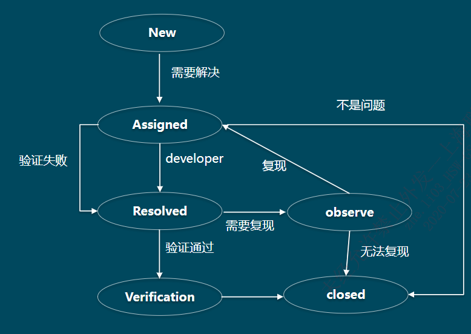
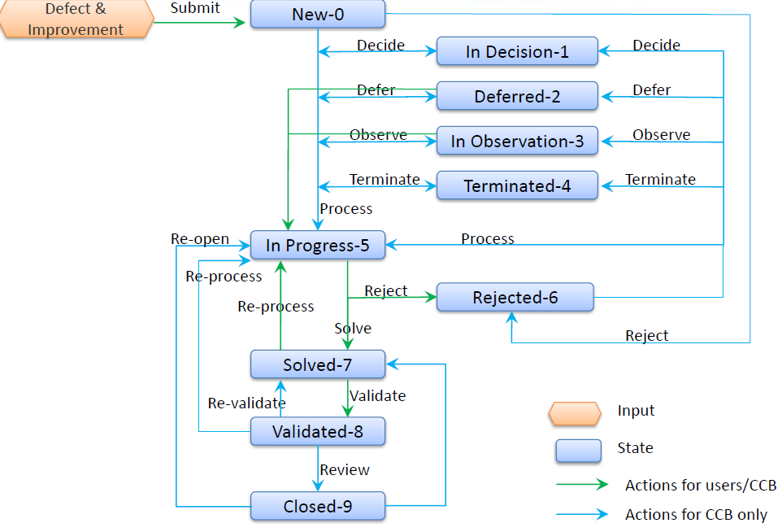

# 基础

#### Problem Priority:

0. Critical 致命
1. Major 严重
2. Normal
3. Minor

### Work Lifecycle

#### PO 产品

|  Task Design   |         SSFS          |     Description      |
| :------------: | :-------------------: | :------------------: |
|   State-New    |    Status-In work     |    需求设计与确定    |
|   State-New    | Status-To be reviewed | 需求转开发和测试评审 |
|   State-New    |    Status-Reviewed    |     需求评审通过     |
|   State-New    |    Status-Released    |     需求确定发布     |
| State-Assigned | Status-Indevelopment  | 研发针对需求进行开发 |
| State-Resolved |    Status-Resolved    |   开发完成，转测试   |
| State-Verified |     Status-Tested     |       测试完成       |
|  State-Closed  |     Status-Closed     |   需求finish，关闭   |

#### Test 测试

|  Task Testing  |       Test Case       |    Description     |
| :------------: | :-------------------: | :----------------: |
|   State-New    |    Status-In work     |   创建测试用例中   |
| State-Assigned | Status-To be reviewed |  测试用例等待评审  |
| State-Resolved |    Status-Reviewed    |      评审通过      |
|  State-Closed  |    Status-Released    | 测试用例确定并发布 |

#### Dev 开发

| Task Improvement |         Bug          |        Description        |
| :--------------: | :------------------: | :-----------------------: |
|                  | State-In observation |      偶先bug，观察中      |
|                  |   State-Terminated   |      无需解决，终止       |
|  State-Assigned  |  State-In progress   |         bug fix中         |
|                  |    State-Rejected    |          不是bug          |
|  State-Resolved  |    State-Resolved    | 开发已解决bug，转测试验证 |
|  State-Verified  |    State-Verified    |         验证通过          |

测试用例的基本要求是覆盖需求

### 格式规范

#### DIM格式

DIM(Defect and Improvement Management)

[应用名称] [DIM关键字]_DIM描述

e.g. 	[Colonoscopy] [显示/隐藏息肉]_按下显示/隐藏息肉十字线会左右跳动

#### Improvement 格式

[模块名称] [流程/阶段] [其他特殊关键字] 问题描述

e.g.	[Oncology_MI] [配准] [69SP4回归4] CT与CT配准时应用crash

#### Defect规范

1. ID
2. 标题
3. 状态: New、In Progress、Solved、Validated
4. 严重程度: 致命D、严重C、一般B、细微A
5. 紧急程度: 1、2、3
6. 可复现性：
   - No：出现一次不再出现
   - Sporadic：偶发
   - Yes：必现
7. 所属项目/模块
8. _**测试类别: SIT、SSIT、ST、UT**_
9. 指定解决人
10. 期望解决时间与关闭时间
11. 详细描述

    1. 测试环境（软硬）
    2. 复现步骤（分步）
    3. 期望结果
    4. 缺陷现象
    5. 发现日期
    6. 发现人
    7. 附件
       - 截图：UI显示不正确
       - Log：功能性的DIM需提供Log
       - _**Dump**_
       - 录屏：复杂步骤
       - 数据：特定数据产生的DIM，提供数据路径
       - 附件位置：附件太大时，放公盘
12. 测试依据：关联TestCase
13. PRA评估：是否与安全有关
14. 解决信息
15. 验证记录

#### Task规范

1. Activity: Improvement
2. ID
3. 标题Title
4. 状态：New、Assigned、Resolved、Verified
5. 紧急程度：0、1、2、3
6. 所属项目/模块
7. 指定解决人
8. 期望解决时间
9. 详细描述
   - 同Defect
10. 测试依据
11. 解决信息
12. 严重记录

### 流程

#### Bug Procedure

#### DIM处理流程

​    